# Phase 16: H4 Swing Candidate Confirmation & M15 Entry Confirmation Research Report

**Document Status:** Complete & Audited  
**Date (UTC):** 2026-09-29  
**Branch:** `develop`  
**Commit Anchor:** `f88ec44ed10065386c6888cbff23a1351e3eafb3` (Phase 15 closeout)  
**Research Status:** **REQUIRES FURTHER VALIDATION**  

---

## 1. Executive Summary & Objective

In Phase 15, dual-track research identified that intraday M15 feature engineering had reached an asymptotic ceiling (~53% balanced accuracy), crippled by round-turn trading friction consuming 28.2% of the average 1-hour move. In contrast, 4-Hour (H4) swing modeling reduced trading friction to 3.8% of the move and produced a preliminary research candidate: a Random Forest classifier predicting 8-bar (32-hour) volatility-adjusted directional returns (`direction_vol_8`), exhibiting 57.54% balanced accuracy on the single Phase 12 validation slice.

Because Phase 15 evaluated multiple horizons, timeframes, and model families, the 57.54% result was inherently vulnerable to **research-selection bias**. The objective of Phase 16 is **strictly confirmatory and diagnostic**:
1. **Candidate Freeze:** Freeze all model hyperparameters, target definitions, and feature pipelines—forbidding any hyperparameter search or threshold tuning.
2. **Chronological Walk-Forward Confirmation:** Subject the frozen candidate to a 5-fold expanding-window rolling-origin evaluation across all permitted research data (May 2024 to February 2026), enforcing an exact 8-bar (32-hour) de Prado purge gap at every boundary.
3. **Baseline Comparison:** Benchmark the candidate against Majority Class, Naive Persistence, Logistic Regression, and Extra Trees baselines.
4. **Descriptive Market Regime Analysis:** Evaluate candidate performance across volatility, trend, channel range, and session regimes.
5. **M15 Entry Confirmation Research:** Test whether point-in-time completed M15 candles can serve as an entry confirmation filter without degrading the underlying H4 signal.
6. **Information-Timing Audit:** Verify programmatically that `FEATURE TIME < DECISION TIME < OUTCOME TIME` holds without future leakage.

> [!IMPORTANT]
> **Research-Only Declaration:** This phase is strictly predictive validation. No live trading, broker connection, demo order submission, trade simulation, SL/TP parameter optimization, or equity curve backtesting has been performed.

---

## 2. Governance Locks & Invariants

All system-wide architectural safety locks were verified and maintained intact:

| Partition / System Component | Locked State | Bar Count | Date Range (UTC) | Verification Status |
| :--- | :--- | :--- | :--- | :--- |
| **Phase 11 M15 Test Partition** | **LOCKED / UNTOUCHED** | 14,988 | 2026-02-19 12:00 to 2026-09-25 23:45 | Zero access during research |
| **Phase 15 H4 Test Partition** | **LOCKED / UNTOUCHED** | 939 | 2026-02-19 12:00 to 2026-09-25 20:00 | Zero access during research |
| **Phase 15 D1 Test Partition** | **LOCKED / UNTOUCHED** | 156 | 2026-02-19 12:00 to 2026-09-25 00:00 | Zero access during research |
| **Phase 12 Intraday Baseline** | **UNCHANGED** | N/A | $\tau=0.60$, SL $1.0\times$ ATR, TP $1.5\times$ ATR | Preserved (0 trades observed) |
| **RiskEngine Authority** | **INVIOLABLE** | N/A | Pre-trade risk controls upstream of execution | Not modified or bypassed |

---

## 3. Data Used in Phase 16

Research is restricted exclusively to the pre-test chronological partition:
- **Canonical Source:** EURUSD M15 historical feed (`data/processed/eurusd_m15/eurusd_m15_processed.parquet`).
- **Research Boundary:** Start `2022-09-16 08:00:00 UTC` to Upper Cutoff `2026-02-19 10:45:00 UTC`.
- **H4 Aggregated Bars:** 5,324 total H4 research bars (4,387 Train + 937 Validation).
- **Valid Labeled Samples:** 2,321 bars with valid features and non-NaN `direction_vol_8` labels ($|R_{32\text{h}}| > 0.5 \times \sqrt{8} \times \text{ATR}_{\text{norm}}$).
- **Held-Out Test Data:** 939 H4 bars (`2026-02-19 12:00:00 UTC` onward) remained completely locked and unread.

---

## 4. Frozen Candidate Configuration

The candidate under investigation was frozen without modification:

```python
# Frozen Random Forest Hyperparameters (ai/swing/evaluation.py)
FROZEN_RF_CONFIG = {
    "n_estimators": 100,
    "max_depth": 5,
    "min_samples_leaf": 10,
    "class_weight": "balanced",
    "random_state": 42,
    "n_jobs": -1,
}
```

- **Timeframe:** 4-Hour (H4)
- **Target:** Volatility-Adjusted Direction (`direction_vol_8`)
  - Target condition: $+1.0$ if $R_8 > 0.5 \times \sqrt{8} \times \text{ATR}_{\text{norm}}$, $-1.0$ if $R_8 < -0.5 \times \sqrt{8} \times \text{ATR}_{\text{norm}}$, excluded/NaN otherwise.
- **Horizon ($H$):** 8 H4 bars = 32 hours.
- **Features:** 41 point-in-time causal swing indicators computed by `compute_swing_features(h4_df, timeframe="H4")` spanning EMAs, RSI, channel widths, return profiles, candle geometry, and temporal cyclicals.

---

## 5. Chronological Walk-Forward Methodology

To prevent overfitting to the single Phase 15 validation period, an expanding-window rolling-origin walk-forward design was implemented via [`ai/swing/walk_forward.py`](file:///home/cino/projects/ai-trading-system/ai/swing/walk_forward.py):

```mermaid
flowchart TD
    subgraph Fold 1
        T1["Train: Sep 2022 - Apr 2024 (1,094)"] --> P1["Purge 8 bars"] --> V1["Val: May 2024 - Sep 2024 (265)"]
    end
    subgraph Fold 2
        T2["Train: Sep 2022 - Sep 2024 (1,364)"] --> P2["Purge 8 bars"] --> V2["Val: Sep 2024 - Jan 2025 (234)"]
    end
    subgraph Fold 3
        T3["Train: Sep 2022 - Jan 2025 (1,602)"] --> P3["Purge 8 bars"] --> V3["Val: Jan 2025 - May 2025 (238)"]
    end
    subgraph Fold 4
        T4["Train: Sep 2022 - May 2025 (1,845)"] --> P4["Purge 8 bars"] --> V4["Val: May 2025 - Oct 2025 (237)"]
    end
    subgraph Fold 5
        T5["Train: Sep 2022 - Oct 2025 (2,086)"] --> P5["Purge 8 bars"] --> V5["Val: Oct 2025 - Feb 2026 (227)"]
    end
```



- **Initial Training Warmup:** 2,524 raw H4 bars (~1.5 years of market history from Sep 2022 to Apr 2024).
- **Out-of-Sample Period:** May 2024 to February 2026 (~21 months).
- **Evaluation Mechanism:** For each fold $k$, the model is fitted on data strictly preceding the fold's purge boundary. The model generates batch out-of-sample predictions for the validation slice. The window expands to include fold $k$'s data before fitting fold $k+1$.
- **Randomization:** Zero shuffling. No K-Fold cross-validation. Purely chronological.

---

## 6. Purge & Embargo Methodology

Because target labels use an 8-bar forward return ($H=8$, 32 hours), the label of bar $T$ uses prices up to bar $T+8$.
- **Purge Gap:** Exactly **8 H4 bars** are dropped immediately prior to the start of each validation fold (`val_start - 8`).
- **Validation Tail Purge:** The final 8 bars of each validation fold are likewise excluded from validation metrics so that validation targets never look past the fold's upper boundary.
- **Verification:**
  $$\max(T_{\text{train\_indices}}) \le T_{\text{val\_start}} - 8$$
  $$\max(T_{\text{train\_timestamp}}) < \min(T_{\text{val\_timestamp}})$$
  This guarantees that **zero future prices or target outcomes from the validation period enter the training set**.

---

## 7. Baseline Results

Four independent baselines were evaluated identically across the 5 walk-forward folds:
1. **Majority Class Baseline:** Predicts the most frequent class observed in the expanding training set.
2. **Naive Persistence Baseline:** Predicts that future 8-bar direction will match the realized direction of the preceding 8-bar return (`return_8 > 0`).
3. **Logistic Regression Baseline:** Linear classifier fitted with L2 regularization and `class_weight="balanced"` on features standardized with `StandardScaler` fitted exclusively on training data.
4. **Extra Trees Baseline:** Extremely Randomized Trees ensemble (`n_estimators=100, max_depth=5, min_samples_leaf=10, class_weight="balanced"`).

---

## 8. Walk-Forward Evaluation Results

### 8.1 Summary Across All 5 Folds

| Model | Mean Bal Acc | Median Bal Acc | Std Dev | Min Bal Acc | Max Bal Acc | Max Fold Drop | Folds >50% | Folds >55% | Mean Macro F1 |
| :--- | :--- | :--- | :--- | :--- | :--- | :--- | :--- | :--- | :--- |
| **Majority Class** | 50.00% | 50.00% | 0.00% | 50.00% | 50.00% | 0.00% | 0 / 5 | 0 / 5 | 0.3341 |
| **Naive Persistence** | 48.62% | 47.78% | 5.96% | 40.72% | 59.08% | 1.33% | 1 / 5 | 1 / 5 | 0.4851 |
| **Logistic Regression** | 51.96% | 51.35% | 2.77% | 48.38% | 56.02% | 6.08% | 3 / 5 | 1 / 5 | 0.5186 |
| **Extra Trees** | 54.17% | 54.51% | 1.67% | 51.89% | 56.05% | 3.20% | 5 / 5 | 2 / 5 | 0.5398 |
| **Random Forest (Candidate)** | **56.05%** | **55.67%** | **4.18%** | **48.90%** | **60.39%** | **4.92%** | **4 / 5** | **4 / 5** | **0.5568** |

### 8.2 Fold-by-Fold Performance Breakdown (Random Forest Candidate)

| Fold | Training Window (UTC) | Validation Window (UTC) | Train N | Val N | Accuracy | Balanced Accuracy | ROC-AUC | Macro F1 | Prec Long / Short |
| :--- | :--- | :--- | :--- | :--- | :--- | :--- | :--- | :--- | :--- |
| **1** | 2022-09-28 to 2024-04-29 | 2024-05-01 to 2024-09-06 | 1,094 | 265 | 53.21% | **48.90%** | 0.5182 | 0.4891 | 0.563 / 0.439 |
| **2** | 2022-09-28 to 2024-09-06 | 2024-09-11 to 2025-01-17 | 1,364 | 234 | 55.56% | **55.67%** | 0.5646 | 0.5555 | 0.562 / 0.548 |
| **3** | 2022-09-28 to 2025-01-17 | 2025-01-21 to 2025-05-29 | 1,602 | 238 | 60.08% | **60.39%** | 0.6141 | 0.6006 | 0.603 / 0.598 |
| **4** | 2022-09-28 to 2025-05-29 | 2025-05-30 to 2025-10-07 | 1,845 | 237 | 59.92% | **60.11%** | 0.6079 | 0.5983 | 0.638 / 0.541 |
| **5** | 2022-09-28 to 2025-10-07 | 2025-10-09 to 2026-02-18 | 2,086 | 227 | 54.19% | **55.19%** | 0.5443 | 0.5407 | 0.559 / 0.519 |

---

## 9. Temporal Robustness Analysis

1. **Baseline Outperformance:** The frozen Random Forest candidate exceeded the Majority baseline (50.00%) and Naive Persistence baseline (48.62%) across the evaluation horizon, delivering a mean balanced accuracy of **56.05%** versus 51.96% for Logistic Regression.
2. **Cross-Period Consistency:** 4 of the 5 independent out-of-sample folds achieved balanced accuracy exceeding 55.0% (peaking at 60.39% in Fold 3 and 60.11% in Fold 4).
3. **The Fold 1 Drawdown:** In Fold 1 (May 2024 to September 2024), candidate balanced accuracy dropped to **48.90%** (ROC-AUC 0.5182). This demonstrates that the candidate is **not universally invariant to market regimes** and can experience multi-month periods of below-chance performance.
4. **Degradation Magnitude:** The maximum fold-to-fold drop was **4.92%** (from 60.11% in Fold 4 down to 55.19% in Fold 5).

---

## 10. Descriptive Market Regime Analysis

Out-of-sample predictions across the 1,201 total evaluation bars were sliced across structural regimes without strategy optimization:

### 10.1 Volatility Regime (Normalized ATR-14)
- **Low ATR Volatility ($\le$ Median):** $N = 601$, Balanced Accuracy = **53.24%**, Macro F1 = 0.5274.
- **High ATR Volatility ($>$ Median):** $N = 600$, Balanced Accuracy = **55.46%**, Macro F1 = 0.5430.
- *Diagnosis:* The candidate performs 2.22% better in higher volatility conditions where directional swings have larger physical amplitude.

### 10.2 Trend Regime (`trend_regime`)
- **Strong Bullish Trend (+1.0):** $N = 376$, Balanced Accuracy = **55.73%**, Macro F1 = 0.5472.
- **Strong Bearish Trend (-1.0):** $N = 328$, Balanced Accuracy = **58.55%**, Macro F1 = 0.5852.
- **Mixed / Transition Regime ($|\text{trend}| < 1.0$):** $N = 497$, Balanced Accuracy = **50.37%**, Macro F1 = 0.4859.
- *Diagnosis:* Signal predictability is concentrated during established directional trends (55.7% to 58.5%), but collapses to coin-toss levels (50.37%) during consolidation and transition regimes.

### 10.3 Session Context (H4 Bar UTC Hour)
- **00:00 UTC (Asian Session):** $N = 200$, Balanced Accuracy = **55.08%**.
- **04:00 UTC (European Pre-Open):** $N = 200$, Balanced Accuracy = **56.62%**.
- **08:00 UTC (London Open):** $N = 201$, Balanced Accuracy = **54.21%**.
- **12:00 UTC (US Open / Overlap):** $N = 200$, Balanced Accuracy = **57.48%**.
- **16:00 UTC (London Fix / US Midday):** $N = 200$, Balanced Accuracy = **52.29%**.
- **20:00 UTC (US Afternoon):** $N = 200$, Balanced Accuracy = **51.04%**.
- *Diagnosis:* Strongest predictability occurs around major liquidity transitions (12:00 UTC US open and 04:00 UTC early Europe), with weaker performance during the afternoon drift (16:00 to 20:00 UTC).

---

## 11. M15 Entry Confirmation Research

### 11.1 Confirmation Architecture & Timing
To test whether lower-timeframe structure can filter or confirm H4 swing entries, each H4 bar completion was matched with the latest completed M15 candle:

$$\text{Decision Point } T_{\text{decision}} = T_{\text{H4\_start}} + 4\text{ hours}$$
$$\text{Latest Allowed M15 Bar } T_{\text{M15}} = T_{\text{decision}} - 15\text{ minutes} < T_{\text{decision}}$$

### 11.2 Entry Confirmation Rules
Four simple confirmation concepts were tested:
- **Base:** H4 model signal alone (no filter).
- **Confirmation A (Direction):** Requires latest closed M15 candle body to agree with H4 direction (`candle_direction == H4_pred`).
- **Confirmation B (Momentum):** Requires M15 RSI-14 to agree with H4 direction (`RSI > 50` for Long, `RSI < 50` for Short).
- **Confirmation C (Trend):** Requires M15 close relative to EMA-20 to agree (`dist_ema_20 > 0` for Long, `< 0` for Short).
- **Confirmation D (Two-of-Three):** Requires agreement on at least 2 of rules A, B, and C.

### 11.3 Confirmation Results Across 1,201 Evaluation Bars

| Configuration | Total Signals | Filtered Out (%) | Accuracy | Balanced Accuracy | Macro F1 | Precision (L / S) | Recall (L / S) |
| :--- | :--- | :--- | :--- | :--- | :--- | :--- | :--- |
| **Base (H4 Alone)** | **1,201** | **0.0%** | **53.71%** | **54.43%** | **0.5362** | 0.589 / 0.479 | 0.551 / 0.538 |
| **Confirmation A (M15 Direction)** | 559 | 53.5% | 52.24% | **53.12%** ($-1.31\%$) | 0.5223 | 0.582 / 0.460 | 0.537 / 0.525 |
| **Confirmation B (M15 Momentum)** | 544 | 54.7% | 54.04% | **54.45%** ($+0.02\%$) | 0.5392 | 0.587 / 0.485 | 0.538 / 0.551 |
| **Confirmation C (M15 Trend)** | 549 | 54.3% | 53.55% | **53.99%** ($-0.44\%$) | 0.5341 | 0.579 / 0.482 | 0.537 / 0.543 |
| **Confirmation D (Two-of-Three)** | 547 | 54.5% | 53.38% | **53.77%** ($-0.66\%$) | 0.5326 | 0.580 / 0.478 | 0.540 / 0.535 |

### 11.4 Finding on M15 Entry Filtering
**M15 entry confirmation filters do not improve the H4 signal.**
- Filtering removes **53.5% to 54.7%** of all trading opportunities.
- Directional balanced accuracy either degrades ($-1.31\%$ for Direction, $-0.66\%$ for Two-of-Three) or remains flat ($+0.02\%$ for Momentum).
- *Cause:* Retail M15 candle close conditions at the 4-hour boundary reflect high-frequency microstructure fluctuations. Requiring M15 alignment filters out high-expectancy trend reversals and pullback entries without increasing the probability of a successful multi-day swing move.

---

## 12. Information-Timing & Causality Audit

A deterministic audit verified the chronological ordering of decisions, features, and targets across sampled decision points:

| Index | H4 Bar Start (UTC) | Decision Time (UTC) | Matched M15 Bar (UTC) | Target Horizon Close (UTC) | Ordering Check |
| :--- | :--- | :--- | :--- | :--- | :--- |
| **200** | 2022-11-02 16:00 | 2022-11-02 20:00 | 2022-11-02 19:45 | 2022-11-04 04:00 | $\text{M15} < \text{Decision} < \text{Outcome}$ [PASS] |
| **500** | 2023-01-12 04:00 | 2023-01-12 08:00 | 2023-01-12 07:45 | 2023-01-13 16:00 | $\text{M15} < \text{Decision} < \text{Outcome}$ [PASS] |
| **1000** | 2023-05-09 12:00 | 2023-05-09 16:00 | 2023-05-09 15:45 | 2023-05-11 00:00 | $\text{M15} < \text{Decision} < \text{Outcome}$ [PASS] |
| **1500** | 2023-09-01 20:00 | 2023-09-02 00:00 | 2023-09-01 23:45 | 2023-09-05 08:00 | $\text{M15} < \text{Decision} < \text{Outcome}$ [PASS] |
| **2000** | 2023-12-29 00:00 | 2023-12-29 04:00 | 2023-12-29 03:45 | 2024-01-02 12:00 | $\text{M15} < \text{Decision} < \text{Outcome}$ [PASS] |
| **2500** | 2024-04-25 08:00 | 2024-04-25 12:00 | 2024-04-25 11:45 | 2024-04-26 20:00 | $\text{M15} < \text{Decision} < \text{Outcome}$ [PASS] |
| **3000** | 2024-08-21 00:00 | 2024-08-21 04:00 | 2024-08-21 03:45 | 2024-08-22 12:00 | $\text{M15} < \text{Decision} < \text{Outcome}$ [PASS] |
| **3500** | 2024-12-16 08:00 | 2024-12-16 12:00 | 2024-12-16 11:45 | 2024-12-17 20:00 | $\text{M15} < \text{Decision} < \text{Outcome}$ [PASS] |
| **4000** | 2025-04-14 12:00 | 2025-04-14 16:00 | 2025-04-14 15:45 | 2025-04-16 00:00 | $\text{M15} < \text{Decision} < \text{Outcome}$ [PASS] |
| **4500** | 2025-08-08 04:00 | 2025-08-08 08:00 | 2025-08-08 07:45 | 2025-08-11 16:00 | $\text{M15} < \text{Decision} < \text{Outcome}$ [PASS] |

**Causality Invariant Proven:** In 100% of tested decisions, matched M15 candles strictly closed at least 15 minutes prior to the H4 decision point, and the forward outcome period was strictly in the future.

---

## 13. Research-Selection Bias Discussion

It is essential to distinguish between **backtest overfitting** and **research-selection bias**:
- In Phase 15, multiple combinations of timeframes (M15, H4, D1), targets (binary vs volatility-adjusted), horizons ($H=4, 8, 12$), and model types were evaluated.
- Selecting the single highest-performing configuration ($H=8$ Vol-Adj RF at 57.54%) introduces selection bias: by picking the maximum of several stochastic trials, the expected out-of-sample performance regresses toward the family mean.
- Phase 16 mitigated this bias by **freezing** the configuration and running an expanding walk-forward test across 5 chronological periods. The observed walk-forward mean of **56.05%** is consistent with moderate signal retention, but the Fold 1 dip to 48.90% proves that selection bias had indeed flattered the Phase 15 single-split metric.

---

## 14. Data Sufficiency Assessment

- **Total Historical Coverage:** September 2022 to September 2026 (4.02 years).
- **H4 Bar Count:** 6,263 total bars (5,324 research, 939 test).
- **Adequacy Evaluation:**
  - 4 years is sufficient for high-frequency M15 research (69,959 bars).
  - For H4 swing research, 5,324 bars yields ~1,200 out-of-sample evaluation bars across 5 folds. While statistically non-trivial, 4 years spans essentially **one continuous macroeconomic regime** (the post-2022 central bank rate cycle).
  - *Recommendation:* To achieve high statistical confidence before any live deployment, historical H4 data should eventually be expanded to 10–15 years (2010–2026, ~25,000 bars) in a future data acquisition phase.

---

## 15. Limitations

1. **Non-Uniform Temporal Stability:** The candidate failed in Fold 1 (48.90%), showing vulnerability to certain consolidation regimes.
2. **Transition Regime Degradation:** Balanced accuracy drops to 50.37% when the market is not in a strong directional trend.
3. **M15 Ineffectiveness:** M15 confirmation filters do not rescue false H4 signals and instead discard valid swing setups.
4. **No Execution Realism:** This phase evaluated directional accuracy only; it did not model broker execution, slippage, overnight swaps, or spread variability under backtest conditions.

---

## 16. Definitive Phase 16 Research Classification

Based on the empirical evidence:
- The candidate demonstrates clear predictive superiority over linear (51.96%), majority (50.00%), and persistence (48.62%) baselines across 5 chronological folds.
- However, performance dropped below 50% in Fold 1, collapses in consolidation regimes (50.37%), and M15 entry confirmation failed to provide additive value.
- Furthermore, 4 years of history represents limited macroeconomic regime diversity.

**Official Classification:**
# **REQUIRES FURTHER VALIDATION**

*(The candidate remains an active research asset with demonstrated statistical signal, but is NOT validated for live deployment, demo execution, or trade simulation without broader historical coverage and regime-aware gating.)*

---

## 17. Concrete, Prioritized Next Steps (Future Phases)

1. **Phase 17 Proposal — Macro Historical Expansion:** Ingest 10–15 years of historical EURUSD data to evaluate H4 candidate stability across the 2012–2022 market cycles.
2. **Phase 18 Proposal — Regime-Aware Signal Gating:** Rather than filtering via M15 candles, gate the H4 signal based on H4 volatility and trend conditions (suppressing signals when `|trend_regime| < 1.0`).
3. **Phase 19 Proposal — Controlled Swing Backtest:** Once macro stability is verified, implement an initial low-turnover swing backtest with dynamic ATR stops and overnight swap modeling.
