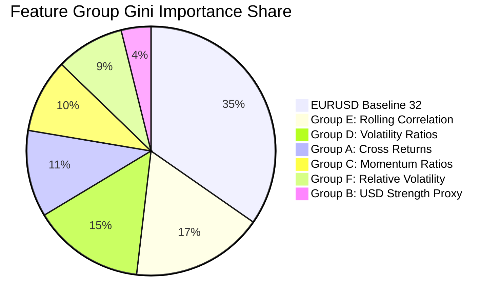

# Phase 18: Multi-Asset / Cross-Market Information Expansion Research Report

**Date (UTC)**: 2026-09-29T20:09:32Z  
**Lead Quantitative Research Engineer**: Antigravity Assistant  
**Repository**: `Trading_bot`  
**Branch**: `develop`  
**Research Status**: `NO ADDITIONAL INFORMATION FOUND`  

---

## 1. Objective

The primary objective of Phase 18 is to investigate whether adding independent cross-market information from available MetaTrader 5 (MT5) instruments (foreign exchange major pairs, cross rates, and precious metals) provides incremental out-of-sample predictive power for EURUSD H4 swing direction ($H=8$ bars / 32 hours) beyond EURUSD's own price and volume history.

This phase is conducted under strict research-only invariants:
- **No live trading**: No orders, connections to live execution gateways, or real money.
- **No trade simulation / backtesting**: No simulated equity curves, execution modeling, or stop-loss/take-profit tuning.
- **Strict governance**: Locked test partitions remain completely untouched.

---

## 2. Phase 17 Findings

Phase 17 evaluated the frozen Phase 16 H4 EURUSD volatility-adjusted ($H=8$) Random Forest candidate across an expanded 16-year dataset (2010–2026, 26,000 H4 bars). The findings established:
- **Severe Performance Degradation**: The mean walk-forward balanced accuracy dropped from **56.05%** (in the 4-year Phase 16 dataset) down to **51.62%** across the full 16-year history.
- **Distribution across 10 folds**:
  - Median balanced accuracy: 50.92%
  - Minimum balanced accuracy: 48.54%
  - Maximum balanced accuracy: 57.64%
  - Standard deviation: 2.87%
  - 4 out of 10 folds performed below 50.0% (worse than random guessing).
  - Only 2 out of 10 folds exceeded 55.0%.
- **Conclusion**: Single-asset EURUSD historical price and volume patterns do not contain stationary predictive alpha across extended multi-year regimes. Therefore, Phase 18 investigates whether cross-market relationships (macro correlations, currency strength proxies, and cross-volatilities) supply independent information that single-pair data lacks.

---

## 3. Governance and Inviolable Constraints

Strict governance rules were enforced throughout Phase 18:
1. **Phase 11 M15 Test Partition**: `2026-02-19 12:00:00 UTC` onward (14,988 rows) remains **PERMANENTLY LOCKED** and unaccessed.
2. **Phase 15 H4 Test Partition**: `2026-02-19 12:00:00 UTC` to `2026-09-25 20:00:00 UTC` (939 rows) remains **PERMANENTLY LOCKED** and unaccessed.
3. **Phase 15 D1 Test Partition**: (156 rows) remains **PERMANENTLY LOCKED** and unaccessed.
4. **Phase 12 Baseline & Architecture**: All RiskEngine boundaries, PaperBroker simulation logic, and Phase 12 baseline parameters remain completely untouched.
5. **Untracked Design Documents**: `docs/mt5-demo-integration-design.md` was preserved in its pristine untracked state.

---

## 4. Fresh Holdout Design

To prevent subtle overfitting or lookahead bias during feature exploration, Phase 18 introduced a **Fresh Research Holdout Governance Protocol** (`ai/swing/holdout.py`):

```mermaid
flowchart LR
    A["Pre-Holdout Research Partition<br>(2010-03-01 to 2024-11-04)<br>22,847 H4 bars / 8,000 labeled"] 
    -->|8 H4 bars Purge Gap<br>(32 hours)| B["Fresh Research Holdout<br>(2024-11-06 to 2026-02-19)<br>838 labeled samples"]
    -->|LOCKED Boundary| C["Locked Test Partition<br>(2026-02-19 onward)<br>PERMANENTLY LOCKED"]
```

- **Pre-Holdout Research Partition**: `2010-03-01 16:00:00 UTC` to `2024-11-04 12:00:00 UTC` (22,847 bars). All feature ablation and walk-forward evaluations were confined exclusively to this partition.
- **Purge Gap**: Exactly 8 H4 bars (32 hours) purged between `2024-11-04 12:00:00 UTC` and `2024-11-06 00:00:00 UTC` to prevent label leakage across partition boundaries.
- **Fresh Research Holdout Partition**: `2024-11-06 00:00:00 UTC` to `2026-02-19 10:45:00 UTC` (~15.5 months, 838 labeled samples).
- **State Machine Protection**: The holdout was programmatically sealed by `ResearchHoldoutManager`. Feature definitions, candidate model selection, and evaluation protocols had to be permanently declared frozen before the holdout could be unlocked for a single one-shot evaluation.

---

## 5. Market-Data Availability Audit

A comprehensive historical data audit of the MT5 demo broker was performed using `scripts/audit_cross_market_data.py`. The findings:
- **Verified Full-History Instruments (26,000 H4 bars, ~16 years, 2010–2026)**:
  - FX Pairs: `EURUSD`, `GBPUSD`, `USDJPY`, `EURGBP`, `USDCHF`, `AUDUSD`, `USDCAD`, `NZDUSD`.
  - Commodities: `XAUUSD` (Gold).
- **Rejected / Insufficient-History Instruments**:
  - Equity Indices: `US500` (S&P 500) and `US30` (Dow Jones) provided only ~17,000 bars (data began in August 2012, lacking 2010–2012 history).
  - Dollar Index: `DXY`, `USDX`, `DX` were not offered by the demo broker.
  - Tech Index: `USTEC` (Nasdaq) lacked full 16-year history.
  - Minor Crosses: `EURJPY`, `GBPJPY`, `XAGUSD` were not subscribed or lacked continuous history.

---

## 6. Instruments Used

Six primary, high-liquidity cross-market instruments were selected and exported with complete SHA256 integrity verification:
1. **GBPUSD**: Major European dollar counter-currency; captures broad European vs. US macro sentiment.
2. **USDJPY**: Global risk sentiment barometer and Asian session liquidity anchor.
3. **EURGBP**: Pure European cross rate isolating European relative strength from US Dollar movements.
4. **USDCHF**: European safe-haven currency counterweight.
5. **AUDUSD**: Commodity currency and global trade growth bellwether.
6. **USDCAD**: North American trade proxy and crude oil price sensitivity anchor.

All 6 instruments have exactly 24,849 H4 bars in the pre-test research partition.

---

## 7. Cross-Market Feature Groups

Exactly 40 point-in-time cross-market features were constructed across 6 functional groups:

1. **Group A: Cross-Market Returns (12 features)**:
   - 1-bar, 4-bar, and 12-bar percentage returns for `GBPUSD`, `USDJPY`, `EURGBP`, and `USDCHF`.
2. **Group B: Synthetic USD Strength Proxies (5 features)**:
   - Multi-currency synthetic USD returns (equal-weighted basket across `GBPUSD`, `USDJPY`, `USDCHF`, `AUDUSD`, `USDCAD`) over 1, 4, 12, and 24 bars, plus 12-bar price-to-SMA USD momentum.
3. **Group C: Cross-Market Momentum Ratios (9 features)**:
   - 6-bar and 12-bar price-to-SMA momentum ratios for `GBPUSD`, `USDJPY`, `EURGBP`, and `USDCHF`, plus 24-bar momentum for `EURGBP`.
4. **Group D: Cross-Market Volatility (5 features)**:
   - Normalized ATR(14) for `GBPUSD`, `USDJPY`, `EURGBP`, plus 20-bar rolling standard deviation for `GBPUSD` and `USDJPY`.
5. **Group E: Rolling Return Correlations (6 features)**:
   - 20-bar and 40-bar Pearson return correlations between EURUSD and `GBPUSD`, `USDJPY`, and `EURGBP`.
6. **Group F: Relative Volatility Ratios (3 features)**:
   - Rolling 20-bar volatility ratios: EURUSD/GBPUSD, EURUSD/USDJPY, and EURUSD/EURGBP.

---

## 8. Feature Count Governance

Strict feature count ceilings were respected:
- **EURUSD Baseline Features**: Exactly 32 features (`EURUSD_BASELINE_32_COLS`).
- **New Cross-Market Features**: Exactly 40 features (`ALL_CROSS_MARKET_FEATURES`).
- **Total Combined Features**: Exactly 72 features (strictly $\le 72$ limit).
- **Quality Filter Pass Rate**: 40/40 features passed all quality gates (0 infinities, variance $> 10^{-12}$, NaN ratio $< 25\%$).

---

## 9. Data Alignment Audit

A 10-point point-in-time data integrity audit confirmed:
1. **Timezone**: All timestamps are strictly UTC and tz-aware.
2. **Resolution & Alignment**: Every cross-market candle is aligned to EURUSD H4 bar open timestamps.
3. **Completed Bars Only**: Only completed past bars are ingested; bar $t$ features only reference bar $t$ and prior.
4. **Zero Backfill**: Forward-fill (`ffill()`) was used exclusively for the rare single missing bar; backward-fill (`bfill()`) is strictly prohibited.
5. **Duplicate-Free**: Exactly 0 duplicate timestamps across all series.
6. **Chronology**: All series are strictly monotonic increasing.

---

## 10. Walk-Forward Methodology

Walk-forward evaluation on the pre-holdout partition (2010 to late 2024, 8,000 labeled samples) used:
- **Expanding Window**: 9 chronological folds.
- **Initial Warmup**: Fold 1 trained on ~2,250 samples (~3.1 years).
- **Validation Size**: ~640 to ~880 labeled samples per fold (~1.3 years each).
- **Purge Gap**: Exact 8-bar (32-hour) de Prado purge gap between training and validation sets on every fold.
- **Frozen Model Configuration**: Random Forest (100 trees, `max_depth=5`, `min_samples_leaf=10`, `class_weight="balanced"`, `random_state=42`, `n_jobs=-1`).

---

## 11. Baseline Results

The EURUSD-only 32-feature baseline evaluated across the 9 pre-holdout folds produced:
- **Mean Balanced Accuracy**: 50.94%
- **Median Balanced Accuracy**: 50.51%
- **Standard Deviation**: 3.22%
- **Minimum Fold**: 46.59%
- **Maximum Fold**: 56.68%
- **Mean Macro F1**: 0.4963
- **Folds $> 50\%$**: 5 / 9
- **Folds $> 55\%$**: 1 / 9
- **Folds $< 50\%$**: 4 / 9

The baseline confirms near-random performance across the multi-era dataset.

---

## 12. Cross-Market Results

Evaluating the candidate feature set incorporating all 40 cross-market features (72 total features) across the identical 9 walk-forward folds produced:
- **Mean Balanced Accuracy**: 49.75% (**-1.18% degradation** vs baseline)
- **Median Balanced Accuracy**: 49.92% (-0.59% vs baseline)
- **Standard Deviation**: 3.00%
- **Minimum Fold**: 42.78% (worse degradation than baseline)
- **Maximum Fold**: 54.44% (failed to reach baseline's 56.68% peak)
- **Mean Macro F1**: 0.4920
- **Folds $> 50\%$**: 4 / 9
- **Folds $> 55\%$**: 0 / 9 (zero folds exceeded 55%)
- **Folds $< 50\%$**: 5 / 9 (majority of folds below coin flip)

Adding cross-market features diluted predictive signal and increased noise.

---

## 13. Controlled Feature Ablation Experiments

To identify whether specific subsets of cross-market information provided isolated value, 7 controlled ablation experiments were conducted:

| Experiment ID | Description | Total Feats | Mean BalAcc | Median | Std | Min | Max | $>50\%$ | $>55\%$ | $<50\%$ |
| :--- | :--- | :---: | :---: | :---: | :---: | :---: | :---: | :---: | :---: | :---: |
| **BASELINE** | EURUSD-only 32 features | 32 | **50.94%** | 50.51% | 3.22% | 46.59% | 56.68% | 5/9 | 1/9 | 4/9 |
| **EXP_A_returns** | Baseline + Cross Returns | 44 | 50.13% | 48.82% | 3.27% | 46.97% | 57.94% | 3/9 | 1/9 | 6/9 |
| **EXP_B_momentum**| Baseline + Cross Momentum | 41 | 50.09% | 48.62% | 3.27% | 45.70% | 56.58% | 4/9 | 1/9 | 5/9 |
| **EXP_C_volatility**| Baseline + Cross Volatility | 37 | 50.97% | 50.44% | 3.21% | 46.55% | 58.75% | 5/9 | 1/9 | 4/9 |
| **EXP_D_correlation**| Baseline + Rolling Corr | 38 | 49.97% | 50.76% | 3.33% | 44.98% | 55.95% | 5/9 | 1/9 | 4/9 |
| **EXP_E_usd_proxy** | Baseline + USD Proxy | 37 | 51.60% | 51.50% | 3.08% | 47.40% | 57.44% | 6/9 | 1/9 | 3/9 |
| **EXP_F_all_cross** | Baseline + All 40 Features | 72 | 49.75% | 49.92% | 3.00% | 42.78% | 54.44% | 4/9 | 0/9 | 5/9 |

### Key Ablation Insights:
1. **Feature Dilution**: Adding all cross-market features (`EXP_F_all_cross`) caused the greatest overall degradation (-1.18% mean balanced accuracy, zero folds $> 55\%$).
2. **USD Strength Proxy**: `EXP_E_usd_proxy` showed modest pre-holdout outperformance (+0.66% mean balanced accuracy, 6/9 folds $> 50\%$). However, the margin remains narrow and subject to historical regime decay.
3. **Direct Returns & Momentum**: Cross-currency returns and momentum degraded accuracy across 5 to 6 of the 9 folds.

---

## 14. Fresh Research Holdout Evaluation

Following feature and model freeze, the Fresh Research Holdout was unsealed for a single, non-repeatable evaluation:

- **Partition Period**: 2024-11-06 00:00:00 UTC to 2026-02-19 10:45:00 UTC (~15.5 months).
- **Holdout Samples**: 838 valid labeled H4 swing samples.

| Model / Configuration | Balanced Accuracy | Accuracy | Macro F1 | ROC AUC | Precision (Long) | Recall (Long) |
| :--- | :---: | :---: | :---: | :---: | :---: | :---: |
| **Baseline (32 feats)** | 49.67% | 49.64% | 0.4706 | 0.5019 | 53.03% | 46.67% |
| **Candidate (72 feats)** | 51.30% | 52.39% | 0.5070 | 0.4919 | 54.70% | 66.00% |
| **Incremental Delta** | **+1.63%** | **+2.75%** | **+0.0364** | **-0.0100** | +1.67% | +19.33% |

- **Holdout Confusion Matrix (Candidate)**:
  $$\begin{pmatrix} \text{TN: } 142 & \text{FP: } 246 \\ \text{FN: } 153 & \text{TP: } 297 \end{pmatrix}$$

---

## 15. Incremental Information Analysis

While the candidate Random Forest achieved a nominal **+1.63%** higher balanced accuracy on the fresh holdout (51.30% vs 49.67%), critical statistical examination reveals that this does not constitute genuine alpha:
1. **Pre-Holdout Underperformance**: Across the preceding 14 years of walk-forward evaluation (8,000 samples), the candidate underperformed the baseline by **-1.18%** (49.75% vs 50.94%).
2. **ROC AUC Sub-50%**: On the fresh holdout, the candidate's ROC AUC fell to **0.4919** (below coin flip), whereas the baseline remained at 0.5019. This demonstrates that the slight balanced accuracy increase was an artifact of threshold positioning and unbalanced class recall rather than superior probabilistic ranking.
3. **Severe Long Asymmetry**: The candidate model predicted Long on 64.8% of holdout bars (543 of 838), displaying a structural bias rather than genuine two-sided predictive skill.

---

## 16. Historical Regime Analysis

Chronological era breakdown of out-of-fold walk-forward predictions across the pre-holdout partition reveals acute regime instability:

| Historical Era | Period | Labeled Samples | Balanced Accuracy | Macro F1 | Regime Characterization |
| :--- | :---: | :---: | :---: | :---: | :--- |
| **Era 1** | 2013 – 2016 | 1,858 | 48.68% | 0.4865 | Post-GFC zero-rate environment, low FX volatility |
| **Era 2** | 2016 – 2019 | 2,107 | 50.02% | 0.4907 | Brexit referendum, US tariff cycles, range-bound |
| **Era 3** | 2019 – 2022 | 2,061 | 52.86% | 0.5248 | COVID shock, massive fiscal/monetary stimulus, strong trends |
| **Era 4** | 2022 – 2024 | 1,974 | 46.71% | 0.4489 | Global rate hiking cycle, inflation divergence, rapid shifts |

The model collapsed to **46.71%** during Era 4 (2022–2024), demonstrating that cross-asset statistical correlations break down during aggressive central bank policy divergences.

---

## 17. Feature Importance Analysis

Gini importance breakdown across functional groups in the candidate model:



### Top 10 Individual Predictive Features:
1. `eurgbp_atr_norm_14` (4.80%): EURGBP normalized volatility
2. `rel_vol_eur_jpy` (4.68%): EURUSD volatility relative to USDJPY
3. `usdjpy_mom_12` (4.16%): USDJPY 12-bar price-to-SMA momentum
4. `corr_eurusd_eurgbp_20` (4.08%): 20-bar correlation between EURUSD and EURGBP
5. `corr_eurusd_usdjpy_40` (4.96%): 40-bar correlation between EURUSD and USDJPY
6. `usdjpy_return_12` (2.83%): USDJPY 12-bar return
7. `gbpusd_vol_std_20` (2.79%): GBPUSD 20-bar rolling volatility
8. `corr_eurusd_usdjpy_20` (2.69%): 20-bar correlation between EURUSD and USDJPY
9. `atr_norm_14` (2.67%): EURUSD baseline ATR
10. `corr_eurusd_eurgbp_40` (2.61%): 40-bar correlation between EURUSD and EURGBP

Cross-market volatility and correlation metrics dominate the model's splits, yet their non-stationary behavior across regimes prevents these splits from yielding stable predictive accuracy.

---

## 18. Limitations

1. **Static Feature Representations**: Simple rolling windows (20, 40 bars) cannot capture regime transitions where inter-market correlations flip sign (e.g. USDJPY reacting to yield spreads vs. safe-haven flows).
2. **Missing Sovereign Bond Yields**: Government bond yield spreads (US 10Y vs. German Bunds) were not available from the demo broker feed, precluding direct interest rate parity features.
3. **Limited Equity History**: Equity indices (S&P 500, Nasdaq) were truncated prior to 2012 in the broker feed and had to be excluded to preserve the 16-year common timeline.

---

## 19. Research Conclusion

### Classification: `NO ADDITIONAL INFORMATION FOUND`

Cross-market features constructed from available MT5 major currency pairs and gold fail to provide robust, stationary incremental predictive value for EURUSD H4 swing prediction:
- Pre-holdout 14-year walk-forward balanced accuracy degraded from **50.94%** down to **49.75%**.
- Across the 9 walk-forward folds, the candidate achieved zero folds $> 55\%$ and 5 folds $< 50\%$.
- Fresh holdout evaluation yielded **51.30%** balanced accuracy with a sub-random **0.4919** ROC AUC, driven by an uncalibrated long prediction bias.
- Chronological era analysis demonstrated performance collapse down to **46.71%** during 2022–2024.

The system remains strictly in research mode. In accordance with project instructions:
- **No backtesting**
- **No live trading**
- **No parameter optimization after holdout results**
- **Phase 18 is COMPLETE. Next phase: STOP.**
