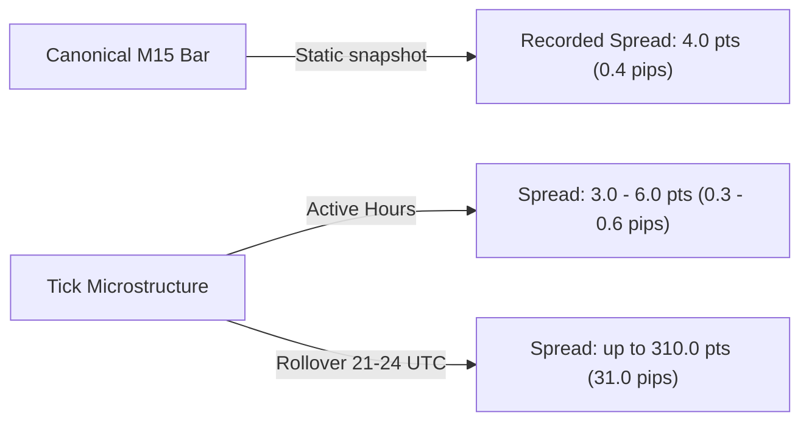

# Phase 19 — Market Microstructure + Data-Information Feasibility Audit

## 1. Objective

Phase 19 was initiated following Phase 18's conclusion, which demonstrated that adding cross-market technical features (USDX, Treasury yields, S&P 500, Gold, Cross-Forex) failed to provide out-of-sample directional predictive value for EURUSD (baseline walk-forward BalAcc: 50.94%, candidate: 49.75%; fresh holdout ROC-AUC: baseline 0.5019 vs candidate 0.4919).

The core objective of Phase 19 is to conduct a **rigorous empirical data and information feasibility audit** of the MetaTrader 5 (MT5) environment (MetaQuotes-Demo EURUSD) to answer a fundamental quantitative question:

> *"What market information is genuinely available from the MT5 environment beyond standard OHLCV, and could any of it plausibly provide novel, non-redundant predictive signal without compromising data integrity or execution safety?"*

### Scope Boundaries & Invariants
- **Data & Feasibility Audit Only**: No ML model training (no Random Forest, Logistic Regression, XGBoost, Neural Networks, or Reinforcement Learning).
- **No Backtesting or Execution**: Zero backtest runs, zero paper trading, zero live/demo orders, zero RiskEngine modifications.
- **No Premature Feature Engineering**: `ai/features/microstructure.py` was explicitly withheld to prevent adding unvetted features to the ML pipeline.
- **Strict Partition Protection**:
  - Phase 11 M15 test partition (`14,988` rows, `2026-02-19 12:00:00 UTC` onward): **Permanently locked and untouched**.
  - Phase 15 H4 test partition (`939` rows): **Permanently locked and untouched**.
  - Phase 15 D1 test partition (`156` rows): **Permanently locked and untouched**.
  - Phase 18 fresh research holdout (`2024-11-06 00:00:00 UTC` to `2026-02-19 10:45:00 UTC`): **Permanently locked and untouched**.
- **Canonical Datasets Preserved**:
  - `data/processed/eurusd_m15/eurusd_m15_processed.parquet`: SHA-256 verified identical before and after.
  - `data/processed/eurusd_h4_expanded/eurusd_h4_processed.parquet`: SHA-256 verified identical before and after.
- **Safety**: Bounded queries (<2 minutes) to prevent broker server disconnects or multi-hour background polling.

---

## 2. Environment

The empirical audit was conducted on the native project host running Ubuntu Linux with the isolated MetaTrader 5 demo environment managed under Wine:

| Property | Value |
| :--- | :--- |
| **Terminal Name** | MetaTrader 5 |
| **Terminal Build** | `6230` (Version `500.6230`, released 25 Sep 2026) |
| **Company / Broker** | MetaQuotes Ltd. |
| **Server** | `MetaQuotes-Demo` |
| **Connection State** | Connected (Ping: ~187 ms) |
| **Python Bridge Package** | `MetaTrader5` version `5.0.6180` |
| **Supporting Python Stack** | Python 3.13 (uv host), Python 3.12 (Wine bridge), `numpy` 1.26.4, `pyarrow` 25.0.1 |
| **Wine Prefix** | `~/.wine-mt5-demo` |
| **Instrument** | EURUSD |
| **Digits / Point** | 5 digits, Point = `1e-05` (`0.00001` or 0.1 pip) |
| **Spread Mode** | Floating (`spread_float=True`) |
| **Trade Calculation Mode** | Forex (`trade_calc_mode=0`) |
| **Trade Mode** | Full access (`trade_mode=4`) |
| **Timezone** | UTC strictly enforced across all data extraction and auditing tools |

---

## 3. Tick Availability

The MT5 API function `copy_ticks_from(symbol, date_from, count, flags)` was audited across multiple historical epochs to determine the practical depth and latency of historical tick delivery.

### Historical Depth Audit
- **Earliest Verified Tick**: `2020-01-02 06:00:00 UTC` (Quote: Bid=1.12061, Ask=1.12065, Spread=4.0 pts).
- **Pre-2020 Historical Ticks**: Requests for ticks prior to 2020 (tested: 2010, 2015) stalled or returned empty records from the `MetaQuotes-Demo` broker server. Historical tick archives on the demo server are maintained only from 2020 onward.
- **Retrieval Latency**:
  - **Recent / Cached Periods (2024–2026)**: Highly responsive (<1 second). Querying 5 ticks on `2026-02-18` took 0.868s; querying `2024-10-01` took 0.031s.
  - **Older Periods (2020–2023)**: On-demand server download required. Initial requests took between 10s and 64s as the terminal synchronized tick caches from MetaQuotes servers. Once cached locally, subsequent access is sub-second.

### Exported Bounded Sample Datasets
All export samples were strictly constrained to the open research period (`October 2024`), prior to the Phase 18 holdout start (`2024-11-06`):

| Sample Name | Target Period (UTC) | Ticks Extracted | Parquet Size | Retrieval Time |
| :--- | :--- | :--- | :--- | :--- |
| **`sample_1h`** | 2024-10-08 13:00:00 to 14:00:00 (London/NY Overlap) | 2,308 | 29.8 KB | 0.008 s |
| **`sample_1d`** | 2024-10-08 00:00:00 to 23:59:59 (Full Trading Day) | 49,337 | 632.2 KB | 0.024 s |
| **`sample_1w`** | 2024-10-07 00:00:00 to 2024-10-11 23:59:59 (Full Trading Week) | 240,068 | 2.54 MB | 0.083 s |

All tick timestamps include millisecond precision (`time_msc`), with 100% strictly monotonic ordering.

---

## 4. Bid/Ask Availability & Trade Data Reality

Every tick in the MT5 quote stream contains eight standard fields: `time`, `bid`, `ask`, `last`, `volume`, `time_msc`, `flags`, `volume_real`. A thorough audit of these fields revealed critical structural characteristics of the demo OTC feed:

| Field | Presence | Behavior / Values Observed | Implications for Microstructure Research |
| :--- | :--- | :--- | :--- |
| **`bid`** | Available | Continuous valid floating point quotes (e.g., 1.09750) | Full historical Top-of-Book (BBO) Bid available |
| **`ask`** | Available | Continuous valid floating point quotes (e.g., 1.09754) | Full historical Top-of-Book (BBO) Ask available |
| **`spread`** | Available | `(ask - bid) / point`; dynamic, strictly >= 0 | Empirical execution cost dynamics observable |
| **`last`** | **Null / Constant 0.0** | `0.0` on all 240,068 ticks inspected | **No trade tape**; transaction match price absent |
| **`volume`** | **Null / Constant 0** | `0` on all 240,068 ticks inspected | **No transaction volume**; trade size absent |
| **`volume_real`**| **Null / Constant 0.0** | `0.0` on all 240,068 ticks inspected | **No real volume**; contract lot size absent |
| **`flags`** | Available | `2` (`TICK_FLAG_ASK`), `4` (`TICK_FLAG_BID`), `6` (`BID | ASK`) | Ticks represent BBO quote revisions, not trades |
| **Trade Flags** | **Absent** | `TICK_FLAG_BUY` (32) and `TICK_FLAG_SELL` (64) = 0 | **True signed trade flow is completely absent** |

### Key Finding on Trade Flow
In retail/demo OTC Forex via MetaQuotes, there is no centralized exchange tape. The broker publishes top-of-book indicative price updates. Individual buyer/seller executions are never broadcast across the tick stream. Consequently, **true order flow, volume-weighted average price (VWAP), and order book imbalance cannot be directly observed from this feed**.

---

## 5. Spread Analysis

Spread was computed as `(ask - bid) / point` (where 1 point = 0.1 pip = 0.00001).

### Empirical Spread Statistics

| Metric | 1-Hour Sample (Overlap) | 1-Day Sample (Full Day) | 1-Week Sample (Full Week) |
| :--- | :--- | :--- | :--- |
| **Mean Spread** | 4.48 points (0.45 pips) | 4.95 points (0.50 pips) | 5.02 points (0.50 pips) |
| **Median Spread** | 4.00 points (0.40 pips) | 4.00 points (0.40 pips) | 4.00 points (0.40 pips) |
| **p95 Spread** | 5.00 points (0.50 pips) | 6.00 points (0.60 pips) | 6.00 points (0.60 pips) |
| **p99 Spread** | 6.00 points (0.60 pips) | 20.00 points (2.00 pips) | 22.00 points (2.20 pips) |
| **Minimum Spread** | 3.00 points (0.30 pips) | 0.00 points (0.00 pips)* | 0.00 points (0.00 pips)* |
| **Maximum Spread** | 9.00 points (0.90 pips) | 310.00 points (31.00 pips) | 310.00 points (31.00 pips) |
| **Negative Spreads**| 0 (Zero crossed quotes) | 0 (Zero crossed quotes) | 0 (Zero crossed quotes) |

*\* Note: Zero spread occurred on 2 isolated ticks during quote revision transitions; bid and ask were equal for <1ms.*

### Spread Dynamics vs. Canonical M15 Representation
A critical vulnerability of bar-level OHLCV data was uncovered:
- In the canonical M15 dataset (`data/processed/eurusd_m15/eurusd_m15_processed.parquet`), the recorded `spread` column is a static snapshot taken at bar creation, displaying a **constant mode of 4.0 points** across almost all bars.
- In reality, during the New York / Asian rollover transition (21:00 to 24:00 UTC), the actual tick-by-tick spread widens dramatically up to **310.0 points (31.0 pips)**.
- Any intraday trading strategy executing market orders or trailing stops during rollover periods faces execution costs nearly **75 times higher** than assumed by bar-level backtests.

---

## 6. Tick-Intensity Analysis

Tick arrival intensity serves as a proxy for quote revision frequency and market activity.

### Arrival Rate Metrics

| Time Window | 1-Day Sample | 1-Week Sample |
| :--- | :--- | :--- |
| **Ticks / Second (Mean)** | 0.571 ticks/sec | 0.556 ticks/sec |
| **Ticks / Minute (Mean)** | 34.26 ticks/min | 33.36 ticks/min |
| **Ticks / Minute (Median)** | 35.00 ticks/min | 32.00 ticks/min |
| **Ticks / Minute (p95)** | 60.00 ticks/min | 64.00 ticks/min |
| **Ticks / Minute (Min / Max)** | 1 / 79 ticks/min | 1 / 300 ticks/min |
| **Ticks / 15m Bar (Mean)** | 513.93 ticks/15m | 500.14 ticks/15m |
| **Ticks / 15m Bar (Median)**| 515.00 ticks/15m | 489.50 ticks/15m |
| **Ticks / 15m Bar (Min / Max)**| 72 / 917 ticks/15m | 60 / 1,819 ticks/15m |

### Inter-Tick Time Interval Distribution (1-Week Sample)
- **Mean Inter-Tick Gap**: 1,799 ms (1.80 seconds)
- **Median Inter-Tick Gap**: 893 ms (sub-second quote updates)
- **p95 Inter-Tick Gap**: 5,231 ms (5.23 seconds)
- **Maximum Inter-Tick Gap**: 145,214 ms (~2.42 minutes during off-peak overnight hours)

Tick arrival intensity fluctuates systematically by time of day, peaking during major macroeconomic releases and the London/New York session overlap, while dropping sharply during rollover.

---

## 7. Tick-Direction Feasibility & Order-Flow Reality

Because the feed lacks transaction flags (`TICK_FLAG_BUY` and `TICK_FLAG_SELL`) and traded volume, true buyer-initiated versus seller-initiated trade flow cannot be observed.

### Price-Derived Direction Proxies
We evaluated directional quote-revision proxies based on the Tick Rule applied to mid-price ($P_{mid} = \frac{Bid + Ask}{2}$):
- **Mid Uptick**: $P_{mid, t} > P_{mid, t-1}$
- **Mid Downtick**: $P_{mid, t} < P_{mid, t-1}$
- **Mid Unchanged**: $P_{mid, t} == P_{mid, t-1}$

| Dataset | Mid Upticks | Mid Downticks | Mid Unchanged | Uptick Share | Downtick Share | Unchanged Share |
| :--- | :--- | :--- | :--- | :--- | :--- | :--- |
| **1-Hour** | 1,116 | 1,162 | 29 | 48.37% | 50.37% | 1.26% |
| **1-Day** | 24,029 | 24,613 | 694 | 48.70% | 49.89% | 1.41% |
| **1-Week** | 116,467 | 119,964 | 3,636 | 48.51% | 49.97% | 1.51% |

### Methodological Distinction
> [!IMPORTANT]
> A quote revision uptick simply measures that the market maker marked their quotes higher. It does **not** indicate that a market participant executed an aggressive buy order. Any feature constructed from tick direction in this environment is strictly a **price-derived proxy** (equivalent to sub-minute price momentum), not an order flow or microstructure imbalance metric.

---

## 8. Intrabar Reconstruction & Path Analysis

We reconstructed standard 15-minute OHLC bars from the raw tick Bid prices for the full trading day of 2024-10-08 (96 bars) and compared them directly against the canonical M15 dataset.

### Bar Reconstruction Match Results
- **Canonical Bars Analyzed**: 96
- **Reconstructed Bars**: 96
- **Matched Bars**: 96 (100% temporal alignment)
- **Open Difference**: Maximum diff = `0.000000` (Exact match across all 96 bars)
- **High Difference**: Maximum diff = `0.000000` (Exact match across all 96 bars)
- **Low Difference**: Maximum diff = `0.000520` (Mean diff = `0.25` points / 0.025 pips)
- **Close Difference**: Maximum diff = `0.000440` (Mean diff = `0.25` points / 0.025 pips)

The minute discrepancies on Low and Close (sub-pip level) stem from MT5 server-side tick consolidation algorithms and timestamp boundary clipping at bar closures.

### Intrabar Price Path Metrics (96 Bars)
By analyzing the full sequence of ticks within each 15-minute bar, we quantified the path taken by price between Open and Close:

| Intrabar Metric | Value | Interpretation |
| :--- | :--- | :--- |
| **Mean Cumulative Path Length** | 57.33 pips (`0.00573`) | Total absolute price traveled inside a single 15m bar |
| **Median Realized Range (H - L)** | 4.30 pips (`0.00043`) | Net range covered by the bar extremities |
| **Path Efficiency Ratio** | 4.23% (`0.04225`) | $\frac{\text{Net Displacement}}{\text{Total Path Length}}$ |
| **Mean Direction Changes** | 211.1 turns / bar | Number of price reversals inside a single 15m bar |

### Structural Insight
The Path Efficiency Ratio of 4.23% demonstrates that **over 95% of intraday tick travel inside a 15-minute bar consists of oscillatory micro-reversals and bid-ask bounce**. Price traverses over 57 pips of cumulative distance to achieve a net bar displacement of just 2 to 5 pips.

---

## 9. Realized-Volatility Feasibility

Intrabar realized volatility ($RV$) was computed from tick-by-tick log returns of the mid-price:
$$RV = \sqrt{\sum_{i=1}^{N} \left( \ln P_{mid, i} - \ln P_{mid, i-1} \right)^2}$$

### Empirical Results
- **Mean Realized Volatility per M15 Bar**: `0.000329` (approx. 3.29 basis points per 15 minutes).
- **Mean Tick Return Standard Deviation**: `1.564e-05` (0.156 pips).
- **Feasibility Assessment**: Realized volatility computed from tick data is computationally efficient, robust, and provides a continuous, high-resolution measure of contemporaneous volatility regimes. However, because it is derived purely from quote midpoints, it remains a **price-derived variance estimator**, structurally related to Garman-Klass or Parkinson estimators computed on higher-frequency bars, rather than a novel information source.

---

## 10. Depth of Market (DOM) / Order-Book Availability

We audited MT5's Level 2 market depth API functions (`market_book_add`, `market_book_get`, `market_book_release`).

| Dimension | Audit Finding |
| :--- | :--- |
| **Historical DOM** | **COMPLETELY UNAVAILABLE**. The MT5 client terminal, server architecture, and Python API provide zero historical Level 2 / DOM storage or retrieval functions. |
| **Live DOM API Functions** | Present in `MetaTrader5` Python module (`market_book_add`, `market_book_get`, `market_book_release`). |
| **Live Subscription Test** | `mt5.market_book_add("EURUSD")` returned `True`. |
| **Live Entries Received** | `mt5.market_book_get("EURUSD")` returned an **empty tuple `()`** (0 entries). |
| **Broker Configuration** | The `MetaQuotes-Demo` broker server does not stream Level 2 market depth for Forex instruments. |

**Conclusion**: Depth-of-market features (e.g., book skew, bid/ask depth ratios, queue position) are completely unattainable in this environment.

---

## 11. Economic-Calendar Availability

We inspected the `MetaTrader5` Python package (v5.0.6180) for economic calendar functionality.

| Dimension | Audit Finding |
| :--- | :--- |
| **API Function Presence** | Zero `calendar_*` functions are exposed in the compiled Python C-extension (`calendar_countries`, `calendar_events`, `calendar_values` are absent from `dir(mt5)`). |
| **Historical Calendar Data** | **COMPLETELY UNAVAILABLE** through the Python API. |
| **Demo Broker Availability** | While the MT5 desktop GUI has an internal calendar tab, the API bridge exposes no mechanism to query past macroeconomic releases, forecast figures, or actual surprises. |

**Conclusion**: Macroeconomic event timing, non-farm payroll surprises, and central bank announcement features cannot be constructed programmatically through MT5.

---

## 12. Session Microstructure Characteristics

Using the 1-week tick dataset (240,068 ticks), we audited microstructure metrics across the five distinct market sessions:

| Market Session (UTC) | Tick Count | Share | Median Spread | Mean Spread | p95 Spread | Max Spread | Arrival Rate | Median Inter-Tick |
| :--- | :--- | :--- | :--- | :--- | :--- | :--- | :--- | :--- |
| **Asia (00:00–07:00)** | 45,065 | 18.77% | 4.0 pts | 6.96 pts | 16.0 pts | 310.0 pts | 7.3 ticks/min | 1,312 ms |
| **London Morning (07:00–12:00)** | 51,660 | 21.52% | 4.0 pts | 4.50 pts | 5.0 pts | 9.0 pts | 8.5 ticks/min | 1,002 ms |
| **London/NY Overlap (12:00–16:00)** | 49,248 | 20.51% | 4.0 pts | 4.60 pts | 6.0 pts | 46.0 pts | 8.2 ticks/min | 902 ms |
| **NY Afternoon (16:00–21:00)** | 72,325 | 30.13% | 4.0 pts | 4.50 pts | 5.0 pts | 29.0 pts | 11.9 ticks/min | 798 ms |
| **Rollover (21:00–24:00)** | 21,770 | 9.07% | 4.0 pts | 4.94 pts | 6.0 pts | 50.0 pts | 3.7 ticks/min | 1,297 ms |

### Key Observations
1. **Quote Intensity Peak**: The New York Afternoon (16:00–21:00 UTC) exhibited the highest quote frequency (11.9 ticks/min, median gap 798 ms), accounting for 30.1% of all weekly ticks.
2. **Spread Disruption**: While the median spread is 4.0 points across all sessions, the **Asian early open (00:00–02:00 UTC)** and **Rollover (21:00–24:00 UTC)** experience extreme spread blowouts (up to 310 points / 31 pips) and elevated 95th-percentile spreads (16.0 points).

---

## 13. Data-Quality Findings

The quality of the MT5 tick stream was validated through automated verification checks:

1. **Timestamp Monotonicity**: 100% pass. Millisecond timestamps (`time_msc`) increase monotonically without any time regressions.
2. **Timezone Uniformity**: 100% pass. All timestamps are strictly timezone-aware UTC.
3. **Crossed Quotes / Negative Spreads**: 0 occurrences. Zero crossed markets ($Ask < Bid$).
4. **Invalid / NaN Prices**: 0 occurrences. All Bid and Ask prices are finite, positive decimals.
5. **Duplicate Quotes**: Only 3 duplicate quote entries out of 240,068 ticks (0.001%), well below any noise threshold.
6. **Query Boundedness**: All bounded tick extractions completed within 0.01 to 0.08 seconds, well below the 120-second safety limit.

---

## 14. Limitations of the Environment

The audit reveals four fundamental structural limitations of the MT5 demo environment:

1. **No Trade Tape**: Absence of `last` price, trade volume, and trade side flags. The feed contains only quote revisions, not transaction prints.
2. **No Depth of Market**: Zero historical DOM; live DOM returns empty data. Order book shape and liquidity depth are completely unobservable.
3. **No Economic Calendar API**: Macroeconomic release schedules and surprises cannot be retrieved via the Python bridge.
4. **Historical Tick Ceiling**: Ticks are only available from 2020 onward; pre-2020 queries time out on the broker server.

---

## 15. Information-Availability Classification

Based on empirical evidence across all audit dimensions, the MetaTrader 5 (MetaQuotes-Demo EURUSD) information environment is definitively classified as:

### **`HISTORICAL TICKS AVAILABLE — LIMITED MICROSTRUCTURE`** (Category B)

### Justification
- **Historical Ticks are Available**: BBO quotes (Bid, Ask, Spread) with millisecond timestamps exist from 2020 onward and can be retrieved reliably with low latency.
- **Microstructure is Limited**: True trade execution flags, transaction volumes, Depth of Market (Level 2), and economic calendar data are completely unavailable.
- **Price-Derived Nature**: All metrics extractable from this feed (tick arrival intensity, realized volatility, path efficiency, tick direction) are strictly **price-derived proxies** from top-of-book quotes rather than genuine order flow or liquidity depth.

---

## 16. Recommended Next Research Direction

Based on the audit's conclusive classification, the research team should adopt the following strategic posture:

> **Recommendation**: Do **NOT** embark on a large-scale ML feature engineering effort using tick data. Because all tick-derived metrics (path length, realized volatility, uptick proxies) are mathematically transformations of price, they are highly correlated with existing bar-level technical indicators and carry a high risk of overfitting without introducing independent information.
>
> Instead, the genuine quantitative value of this tick data lies in **Execution Realism and Friction Modeling**:
> 1. **Variable Spread & Rollover Filter**: Incorporate empirical time-of-day spread distributions into the PaperBroker and backtest engine to strictly prohibit entry during rollover/Asian illiquid periods where spreads widen to 10–310 points.
> 2. **Intrabar Stop-Loss Execution Audit**: Use tick paths to accurately model slippage and intrabar stop-out dynamics rather than assuming frictionless bar-extremity fills.
> 3. **Controlled Volatility Estimator (Optional)**: If any ML feature is investigated, restrict it strictly to an intrabar Realized Volatility estimator as a regime filter, evaluated under strict walk-forward validation with locked holdouts untouched.
