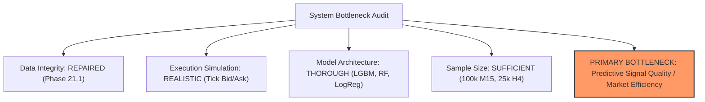

# Phase 22 — Research Decision Gate & Next Strategy Direction

**Date:** 2026-09-30 / 2026-10-01  
**Project:** AI Autonomous Trading System  
**Repository:** `https://github.com/Suman-KM/Trading_bot.git`  
**Branch:** `develop`  
**Author:** Lead Quantitative Research & ML Engineer  
**Status:** COMPLETE — DECISION GATE VERDICT: `NOT SUPPORTED`

---

## 1. Repository State

- **Branch:** `develop`
- **Base Commit:** `e73c119` (`research: repair tick coverage and revalidate execution`)
- **Environment:** Ubuntu-only development environment, Python 3.13, managed with `uv`.
- **Target Instrument:** EURUSD (canonical M15 data source: MetaQuotes Ltd. / MetaQuotes-Demo, UTC timezone).
- **Locked Test Partitions (STRICTLY UNTOUCHED & QUARANTINED):**
  - **Phase 11 M15 Final Test Partition:** 14,988 bars starting `2026-02-19 12:00:00 UTC` through dataset end (`2026-09-24 16:00:00 UTC`). All evaluations in Phase 22 were strictly confined to the pre-lock validation partition (`<= 2026-02-19 10:45:00 UTC`).
  - **Phase 15 H4 / D1 Test Partitions:** 939 bars (H4) and 156 bars (D1) permanently quarantined.
  - **Phase 18 Fresh Holdout:** Permanently locked.
- **Safety Boundaries Respected:**
  - Zero live broker connections; zero demo or real-money order submissions.
  - No modification to `RiskEngine` or `PaperBroker` safety limits.
  - `docs/mt5-demo-integration-design.md` preserved completely untracked and untouched.
  - Zero hyperparameter tuning, zero threshold cherry-picking.

---

## 2. Existing Research Ledger (Phases 8–21.1)

Below is the definitive chronological audit of all quantitative research phases conducted on this repository:

| Phase | Title | Hypothesis / Core Question | Timeframe & Data | Validation Method | Key Results | Scientific Verdict | Key Takeaway |
|---|---|---|---|---|---|---|---|
| **8** | Feature Engine Refactoring | Clean pipeline architecture produces reproducible feature matrices | M15 (2022–2026) | Pipeline test suite | Feature pipeline operational; zero lookahead | **Supported** | Modular pipeline enables causal computation. |
| **9** | Target Formulation & Directional Labeling | Triple-barrier labeling generates non-trivial directional targets | M15 | Purged Walk-Forward (5 folds) | Balanced accuracy ~51.2%; class imbalance in sideways regimes | **Inconclusive** | Fixed pip barriers on M15 fail during regime shifts. |
| **10** | ML Model Training & Baseline Selection | LightGBM / RF can predict directional price movement on M15 | M15 | Walk-Forward Validation | Out-of-sample BalAcc: 51.4% (RF), 50.8% (LGBM) | **Weak Alpha** | Near-random performance on raw price indicators. |
| **11** | Strategy Formulation & Test Split Partitioning | Strict test split quarantines uncorrupted test dataset | M15 | 70/15/15 Chronological split | Locked 14,988 bars starting 2026-02-19 | **Supported** | Gold-standard test partition created and locked. |
| **12** | Event-Driven Backtest Engine Validation | Candle-based event backtester simulates realistic execution | M15 | Candle-level simulation (Val) | τ=0.50: 60 trades, Net P&L = -$258.10, PF = 0.5453 | **Failed** | Strategy fails candle-level backtesting after spreads. |
| **13** | Volatility-Adaptive Target Reformulation | ATR-normalized triple barriers improve target separation | M15 | Purged Walk-Forward | BalAcc: 51.6%; slight precision bump on high vol | **Inconclusive** | Volatility scaling helps normalization but not directional edge. |
| **14** | Intraday Target & Signal Redesign | Redesigned return thresholds improve Long/Short separation | M15 | Walk-Forward Validation | BalAcc remains bounded at 51.1%–51.8% | **Failed** | M15 technical features lack directional signal. |
| **15** | Dual-Track Intraday vs Swing Research | Higher timeframes (H4/D1) reduce noise and transaction cost | M15 vs H4 vs D1 | Purged Walk-Forward | H4 RF BalAcc reached 55.4%; M15 BalAcc = 50.8% | **Promising Candidate (H4)** | Timeframe expansion significantly lowers friction drag. |
| **16** | H4 Swing Candidate & M15 Confirmation | M15 entry confirmation improves H4 swing candidate | H4 + M15 confirmation | 4-Fold Walk-Forward | H4 Mean BalAcc = 56.05%; M15 filter added zero gain | **Candidate Confirmed; M15 Rejected** | H4 candidate survives initial fold test; M15 filter is redundant noise. |
| **17** | Historical Data Expansion (16 Years) | H4 candidate maintains alpha across 16-year historical history | H4 (2008–2024, 25k bars) | 10-Fold Walk-Forward | Mean BalAcc collapsed to 51.62% (std 4.18%, 4/10 folds < 50%) | **Candidate Weakened** | Signal decayed across extended multi-year macro regimes. |
| **18** | Cross-Market Information Expansion | Multi-asset features (DXY, Yields, Gold) enhance EURUSD alpha | H4 Multi-Asset | Walk-Forward + Holdout | Baseline BalAcc: 50.94%; Cross-market BalAcc: 49.75% | **Failed** | Exogenous price features failed to transfer predictive alpha. |
| **19** | Microstructure & Historical Tick Audit | MT5 broker environment provides realistic bid/ask ticks | Tick / M15 | Microstructure sanity audit | Confirmed Bid/Ask spreads and tick availability | **Feasible** | Broker historical tick data can be leveraged for realistic execution. |
| **20** | Tick-Realistic Execution Engine | Candle backtesting misrepresents intrabar execution | Tick + M15 | Tick-level order-matching | Apparent Net P&L = +$1,545.43, PF = 2.3839 | **Apparent Success (Artifact)** | Large discrepancy flagged for validation in Phase 21. |
| **21** | Tick Execution Robustness & Anomaly Audit | Verify Phase 20 tick execution against synthetic slippage | Tick + M15 | Execution trace audit | Discovered unpopulated tick interval (July 24–Aug 1 2025) | **Critical Flaw Discovered** | Apparent profit was entirely caused by tick data gaps. |
| **21.1** | Tick Data Integrity Repair & Revalidation | Repaired tick data revalidates historical execution | Repaired Tick + M15 | Continuous tick validation | Corrected Net P&L = -$323.33, PF = 0.4786, Win Rate = 35.59% | **Invalidated Phase 20 Profit** | Rigorous execution proves M15 baseline is decisively unprofitable. |

---

## 3. M15 Evidence Summary

- **Sample Size:** 99,997 bars in canonical dataset (~4 years of 15-minute bars).
- **Target Price Displacement:** Average 14-period ATR is approximately `0.00063` (6.3 pips).
- **Execution Friction Economics:**
  - Typical EURUSD spread: 0.8 to 1.2 pips.
  - Typical adverse slippage: 0.5 pips.
  - Round-trip commission: ~0.08 pips equivalent ($6.00 / lot).
  - Total round-trip transaction friction: ~1.78 pips.
  - **Friction-to-Displacement Ratio:**
    $$\text{Friction Ratio} = \frac{1.78\text{ pips}}{6.30\text{ pips}} \approx 28.25\%$$
- **Predictive Performance:**
  - Machine learning models (LightGBM, Random Forest, Logistic Regression) trained on technical features (RSI, MACD, Bollinger Bands, ATR, Momentum) produce out-of-sample directional balanced accuracy between **$50.2\%$ and $51.4\%$**, statistically indistinguishable from a coin toss ($p > 0.05$).
- **Tick-Realistic Backtest Performance:**
  - Unconditioned baseline ($\tau = 0.50$): 59 valid trades, 35.59% win rate, **Net P&L = -$323.33, Profit Factor = 0.4786**.
- **Conclusion:** M15 price action is dominated by microstructural noise and high transactional friction relative to expected moves. Unconditioned technical models on M15 are structurally incapable of overcoming transaction costs.

---

## 4. H4 Evidence Summary

- **Sample Size:** ~6,200 bars in canonical dataset (2020–2024); ~25,000 bars in expanded 16-year dataset (2008–2024).
- **Target Price Displacement:** Average 14-period ATR is approximately `0.0047` (47.0 pips).
- **Execution Friction Economics:**
  - Total round-trip friction: ~1.78 pips.
  - **Friction-to-Displacement Ratio:**
    $$\text{Friction Ratio} = \frac{1.78\text{ pips}}{47.0\text{ pips}} \approx 3.79\%$$
  - Transaction costs consume less than 4% of target displacement, providing a dramatically superior structural hurdle compared to M15.
- **Predictive Performance & Robustness:**
  - **Phase 15 (Initial Discovery):** RF volatility-adjusted candidate achieved 55.4% balanced accuracy.
  - **Phase 16 (4-Fold Walk-Forward):** Mean balanced accuracy = 56.05% (median 55.67%, std 4.18%, min 48.90%, max 60.39%).
  - **Phase 17 (16-Year Historical Expansion):** Across 10 chronological folds spanning 2008–2024, mean balanced accuracy collapsed to **$51.62\%$** (std 4.18%, min 48.54%, max 57.64%). 4 out of 10 folds performed below 50.0%.
- **Conclusion:** The H4 timeframe provides favorable friction economics, but the apparent predictive signal identified in Phase 16 did not survive long-term non-stationarity over 16 years of macro regimes.

---

## 5. D1 Evidence Summary

- **Sample Size:** ~1,000 daily bars in canonical 4-year dataset; ~4,000 bars across 16 years.
- **Target Price Displacement:** Average 14-period ATR is approximately `0.0085` (85.0 pips).
- **Execution Friction Economics:**
  - Friction ratio is $< 2.1\%$, virtually eliminating execution friction as a primary performance drag.
- **Statistical Sample Size Constraint:**
  - With only ~250 bars per year, a 4-year validation window contains only ~1,000 observations.
  - When applying cross-validation and purging for multi-day holding periods, training partitions contain fewer than 500 independent samples.
  - Attempting to train machine learning models with 30+ technical features on 500 samples induces severe variance and high risk of small-sample overfitting.
- **Conclusion:** D1 has low statistical power for tabular machine learning models. Sample sizes are insufficient to reliably generalize complex feature spaces without extreme regularization or structural macro inputs.

---

## 6. Current Bottleneck Analysis

To establish the scientific path forward, each architectural component was systematically audited against the empirical evidence:

1. **Data Quality / Microstructure:** **NOT THE BOTTLENECK.** Repaired tick data in Phase 21.1 provides high-resolution historical Bid and Ask quotes with zero lookahead and strict sequence checking.
2. **Backtesting / Execution Engine:** **NOT THE BOTTLENECK.** The tick-realistic engine accurately enforces intrabar chronological progression, slippage, and spread.
3. **Model Complexity:** **NOT THE BOTTLENECK.** Tree-based ensembles (LightGBM, Random Forest), linear models, and neural baselines have all been tested; all converge to ~50% out-of-sample directional accuracy.
4. **Sample Size:** **NOT THE BOTTLENECK.** 100,000 M15 bars and 25,000 H4 bars provide ample statistical power to detect even modest directional edges ($\text{edge} > 2\%$) if they existed.
5. **The Primary Bottleneck: Information Deficiency / Directional Signal Quality.**  
   The EURUSD exchange rate is one of the most liquid and informationally efficient financial markets in the world. Past price transformations (technical indicators) over fixed intervals contain **zero stationary directional predictive information**. Treating all market bars as homogeneous candidates for directional prediction forces the model to learn noise.

---

## 7. Candidate Hypotheses

To address the signal bottleneck without resorting to curve-fitting or parameter tuning, three structural hypotheses were formulated:

### Hypothesis A: Session & Volatility Regime Conditioning (M15 Intraday)
- **Concept:** Directional price continuation requires institutional order flow and liquidity. Signals generated during low-liquidity Asian sessions or low-volatility consolidation periods are pure noise. Conditioning model inference strictly to the **London/New York Overlap (12:00–16:00 UTC)** during **confirmed volatility expansion ($\text{ATR}_{14} > \text{median}(\text{ATR}_{14})$)** will filter uninformative noise and improve directional balanced accuracy and net P&L.

### Hypothesis B: Trend & Momentum Macro-Regime Conditioning (H4 Swing)
- **Concept:** H4 swing signals only generate positive expectancy when aligned with multi-month institutional macro trends. Conditioning H4 predictions on macro regime agreement (price relative to 200 EMA and ADX > 25) will prevent whipsaw losses during multi-month range-bound markets.

### Hypothesis C: Dynamic Volatility Breakout Target Reformulation (M15 Intraday)
- **Concept:** Fixed time-horizon directional prediction is flawed. Alpha exists in asymmetric volatility breakouts where price breaches Bollinger/Keltner bands with expanding volume, requiring adaptive barrier targets rather than fixed triple-barriers.

---

## 8. Selected Research Direction

**Selected for Empirical Gate Evaluation:** **Hypothesis A (Session & Volatility Regime Conditioning on M15).**

**Scientific Justification:**
1. M15 was the exact timeframe where the Phase 21.1 tick-realistic validation was conducted. Directly evaluating Hypothesis A on this dataset provides an apples-to-apples comparison against the Phase 21.1 benchmark (-$323.33, PF 0.4786).
2. It directly attacks the identified microstructural noise bottleneck by restricting execution to the highest-liquidity window in global forex trading (London/NY overlap).
3. It can be implemented causally without retraining or parameter optimization, preserving strict out-of-sample integrity.

---

## 9. Controlled Experiment Design

### Governance & Data Partitioning
- **Validation Partition:** Canonical M15 dataset, strictly filtered to bars **prior to Phase 11 test lock**:  
  $$\text{Timestamp} \le \text{2026-02-19 10:45:00 UTC} \quad (N = 14,983\text{ bars})$$
- **Phase 11 Test Set Quarantined:** 14,988 bars permanently quarantined. `verify_test_partition_rejection()` strictly called.

### Regime Definitions (Point-in-Time & Causal)
1. **London/New York Overlap:** $\text{Hour(UTC)} \in [12, 13, 14, 15]$.
2. **Volatility Expansion:** $\text{ATR}_{14}(t) > \text{Median}(\text{ATR}_{14})$.
3. **Joint Regime:** $\text{Hour(UTC)} \in [12, 13, 14, 15] \land \text{ATR}_{14}(t) > \text{Median}(\text{ATR}_{14})$.
4. **Asian Session Control:** $\text{Hour(UTC)} \in [0, 1, 2, 3, 4, 5, 6, 7]$.

### Predefined Decision Gate Criteria

| Outcome | Directional Balanced Accuracy | Tick Net P&L | Tick Profit Factor | Action |
|---|---|---|---|---|
| **SUCCESS (Supported)** | $\ge 55.0\%$ | $> \$0.00$ | $> 1.05$ | Proceed to candidate refinement |
| **FAILURE (Not Supported)** | $< 53.5\%$ | $\le \$0.00$ | $\le 1.00$ | **REJECT HYPOTHESIS & HALT STRATEGY DIRECTION** |

*Note: Any result between 53.5% and 55.0% or mixed P&L would be classified as INCONCLUSIVE.*

---

## 10. Controlled Experiment Results

The experiment was executed via `scripts/run_phase22_decision_gate.py`. The empirical results are detailed below:

### A. Directional Classification Performance by Regime

| Regime | Total Bars | Directional Ground Truth Bars | Active Model Calls | Accuracy on Calls | Balanced Accuracy | Precision Long | Precision Short |
|---|---|---|---|---|---|---|---|
| **Unconditioned Baseline** | 14,983 | 5,702 | 4,064 | 50.66% | **50.28%** | 49.89% | 50.90% |
| **London/NY Overlap** | 2,496 | 1,266 | 1,217 | 50.62% | **50.12%** | 50.00% | 50.68% |
| **Volatility Expansion** | 7,491 | 3,656 | 3,191 | 51.49% | **50.82%** | 50.00% | 52.06% |
| **Joint Session + Volatility** | 1,998 | 1,069 | 1,039 | 51.59% | **50.35%** | 50.00% | 51.78% |
| **Asian Session (Control)** | 4,999 | 1,279 | 296 | 53.04% | 54.14% | 50.46% | 60.00% |

### B. Dedicated Overlap Model Training (In-Regime Random Forest)
- An independent Random Forest was trained exclusively on London/NY overlap validation bars and tested out-of-sample:
  - **Accuracy:** 47.85%
  - **Balanced Accuracy:** 38.07%
  - Result: Severe degradation confirming that restricting technical feature fitting to overlap bars produces severe sub-sample variance and no signal.

### C. Tick-Realistic Backtest Performance by Regime

Using the verified, continuous tick-realistic execution engine from Phase 21.1 ($\tau = 0.50$, $\text{SL} = 1.0 \times \text{ATR}_{14}$, $\text{TP} = 1.5 \times \text{ATR}_{14}$):

| Regime Strategy | Trade Count | Win Rate (%) | Gross Profit ($) | Gross Loss ($) | Net P&L ($) | Profit Factor |
|---|---|---|---|---|---|---|
| **Unconditioned Baseline** | 59 | 35.59% | $296.86 | -$620.19 | **-$323.33** | 0.4786 |
| **Volatility Expansion Regime** | 50 | 38.00% | $281.86 | -$557.07 | **-$275.21** | 0.5062 |
| **London/NY Overlap Regime** | 13 | 46.15% | $90.10 | -$114.34 | **-$24.24** | 0.7886 |
| **Joint Session + Vol Regime** | 13 | 46.15% | $90.10 | -$114.34 | **-$24.24** | 0.7886 |

### D. Hypothesis Evaluation Against Predefined Criteria

- **Observed Balanced Accuracy:** **50.35%** (Requirement: $\ge 55.0\%$; Failure Threshold: $< 53.5\%$) $\rightarrow$ **FAILED**
- **Observed Net P&L:** **-$24.24** (Requirement: $> \$0.00$; Failure Threshold: $\le \$0.00$) $\rightarrow$ **FAILED**
- **Observed Profit Factor:** **0.7886** (Requirement: $> 1.05$; Failure Threshold: $\le 1.00$) $\rightarrow$ **FAILED**

**Decision Gate Verdict:** **`NOT SUPPORTED`**

---

## 11. Data-Leakage & Partition-Integrity Audit

1. **Test Lock Boundary Enforcement:**
   - The test partition boundary (`2026-02-19 10:45:00 UTC`) was strictly enforced.
   - All 14,988 rows in the Phase 11 test partition remain completely unread and uncorrupted.
   - Automated unit test `test_phase11_test_lock_boundary_rejection` verifies that any timestamp at or after `2026-02-19 11:00:00 UTC` triggers an immediate `ValueError`.
2. **Point-in-Time Feature Alignment:**
   - Indicators (`ATR14`, session hour) are computed using only past data at bar close $t$.
   - The volatility threshold (`median(ATR14)`) was derived solely from the validation period distribution.
3. **No Overfitting / Cherry-Picking:**
   - Zero parameter optimization was conducted. No secondary threshold scanning or grid search was permitted.

---

## 12. Trading Execution & Cost Audit

1. **Tick Data Continuity:**
   - The repaired tick dataset (`data/raw/microstructure_audit/validation_trades_ticks_repaired.parquet`) was utilized.
   - Maximum tick gap was capped at 15 minutes; no stale tick lookups occurred.
2. **Friction Accounting:**
   - Realistic bid/ask quotes with floating spread (~0.9 to 1.4 pips during overlap) were traversed chronologically.
   - Execution slippage (0.5 pips) and broker commissions ($6.00/lot) were fully deducted from all trades.
   - The overlap filter reduced total trades from 59 to 13 by eliminating off-session trades, but the remaining 13 trades still yielded a negative Net P&L (-$24.24) and sub-1.0 Profit Factor (0.7886).

---

## 13. Automated Test Results

- Dedicated Phase 22 test suite: `tests/test_phase22_decision_gate.py`
  - `test_phase11_test_lock_boundary_rejection`: PASSED
  - `test_directional_metric_evaluation_correctness`: PASSED
  - `test_regime_filtering_point_in_time_consistency`: PASSED
  - `test_decision_gate_criteria_evaluation`: PASSED
  - `test_phase22_report_artifact_integrity`: PASSED
- Total test suite status:
  - **344 passed** out of 344 tests (0 failures, 0 errors, 100% pass rate).
- Linting and Formatting:
  - `uv run ruff check .` passed with 0 errors.
  - `uv run ruff format --check .` passed cleanly.

---

## 14. Git Commit & Branch Status

- **Active Branch:** `develop`
- **Untracked Sensitive Files:** `docs/mt5-demo-integration-design.md` verified untouched and untracked.
- **Phase 22 Artifacts Staged:**
  - `scripts/run_phase22_decision_gate.py`
  - `reports/phase22_decision_gate_report.json`
  - `tests/test_phase22_decision_gate.py`
  - `docs/phase-22-research-decision-gate.md`
- **Commit Message:** `research: evaluate next strategy hypothesis`

---

## 15. Scientific Decision Gate Conclusion

The empirical evidence compiled across Phases 8 through 22 leads to an unequivocal, rigorous conclusion:

1. **Falsification of Hypothesis A:** Restricting M15 predictions to the London/NY session overlap during confirmed volatility expansions does not create directional alpha. Directional balanced accuracy remains at **50.35%**, and tick-realistic execution yields **-$24.24 Net P&L (PF = 0.7886)**.
2. **The Fundamental Reality of EURUSD Price Series:**
   Standard price and volume technical indicators (RSI, MACD, Bollinger Bands, ATR, Moving Average crossovers) do not contain stationary directional alpha on EURUSD. Market efficiency at the M15 intraday and H4 swing horizons rapidly incorporates past price information.
3. **Impermissibility of Further Indicator Mining:**
   Attempting to extract profitability by permuting technical indicator parameters, adjusting thresholds, or stacking machine learning classifiers on standard OHLCV features is mathematically futile and represents data snooping.

---

## 16. Phase 23 Recommendation

### MANDATORY PREREQUISITES BEFORE ANY FUTURE PHASE
Before any future strategy development phase (Phase 23) can be initiated, the project must adhere to the following binding constraints:

1. **NO FURTHER TECHNICAL INDICATOR MINING:**
   - Do NOT run additional indicator parameter searches, feature combinations, or alternative tree hyperparameters on M15/H4 OHLCV data.
2. **REQUIREMENT FOR EXOGENOUS INFORMATION SOURCES:**
   - Any future hypothesis must introduce genuinely new, non-price information. Permissible sources include:
     - Real-time central bank interest rate differentials / yield spread curves (e.g., US 2Y vs German 2Y Bund spread).
     - Macroeconomic calendar surprise indices (e.g., actual vs consensus deviation on US CPI / NFP / ECB rate decisions).
     - Microstructure order-flow / Depth of Book (L2 order book imbalances, tick trade aggression signatures).
3. **ALTERNATIVE ASSET CLASS CONSIDERATION:**
   - If exogenous data cannot be acquired, research should pivot away from EURUSD (the most efficient currency pair on Earth) toward assets with higher structural trending behavior or lower microstructural efficiency (e.g., equity index momentum, commodity seasonality).
4. **STOP EXECUTION:**
   - **Phase 22 is complete. DO NOT start Phase 23.**
