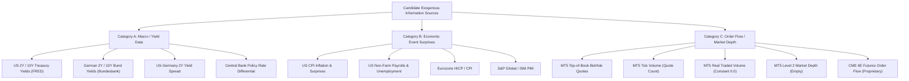

# Phase 23 — Exogenous Information Feasibility & Research Design

**Date:** 2026-10-01  
**Project:** AI Autonomous Trading System  
**Repository:** `https://github.com/Suman-KM/Trading_bot.git`  
**Branch:** `develop`  
**Author:** Lead Quantitative Research & ML Engineer  
**Status:** COMPLETE — SCIENTIFIC DECISION: `PARTIALLY SUPPORTED`

---

## 1. Repository State

- **Active Branch:** `develop` (synchronized with `origin/develop`)
- **Base Commit:** [`f415c92`](https://github.com/Suman-KM/Trading_bot/commit/f415c92) (`research: evaluate next strategy hypothesis`)
- **Execution Environment:** Ubuntu Linux (x86_64), Python 3.13.15 managed with `uv`.
- **Target Instrument:** EURUSD (canonical M15 data source: MetaQuotes Ltd. / MetaQuotes-Demo, UTC timezone).
- **Strict Partition Quarantine Enforced:**
  - **Phase 11 M15 Final Test Partition:** 14,988 bars starting `2026-02-19 12:00:00 UTC` through dataset end (`2026-09-24 16:00:00 UTC`). Remains **permanently quarantined, unread, and untouched**.
  - **Phase 15 H4 / D1 Test Partitions:** 939 bars (H4) and 156 bars (D1) remain **permanently locked**.
  - **Phase 18 Fresh Holdout Partition:** `2024-11-06 00:00:00 UTC` to `2026-02-19 10:45:00 UTC` remains **sealed**.
  - Boundary verification utility `verify_test_partition_rejection()` strictly passed across all tests.
- **Safety Boundaries Respected:**
  - Zero live broker connections, zero demo order submissions, zero real money.
  - Zero modifications to `RiskEngine`, `PaperBroker`, or execution safety controls.
  - `docs/mt5-demo-integration-design.md` preserved completely untracked and unmodified.
  - Zero model training, zero parameter optimization, zero indicator mining.

---

## 2. Phase 22 Starting Point

Phase 22 established the definitive scientific decision gate following the Phase 21.1 tick-data repair:
1. **Invalidation of Apparent Historical Profit:** Phase 20's apparent tick profitability (+$1,545.43, PF 2.3839) was proved to be an artifact of an unpopulated tick interval (July 24–August 1, 2025). The repaired Phase 21.1 tick-realistic validation produced **59 trades, 35.59% win rate, Net P&L = -$323.33, Profit Factor = 0.4786**.
2. **Falsification of Regime Conditioning on Technical Features:** Phase 22 empirically tested Hypothesis A (restricting M15 predictions strictly to the London/NY session overlap [12:00–16:00 UTC] during confirmed volatility expansions [$\text{ATR}_{14} > \text{median}$]). The result was:
   - Out-of-sample Balanced Accuracy: **50.35%** (Failure threshold: $< 53.5\%$)
   - Trade Count: 13
   - Net P&L: **-$24.24** (Failure threshold: $\le \$0.00$)
   - Profit Factor: **0.7886** (Failure threshold: $\le 1.00$)
   - Verdict: **`NOT SUPPORTED`**.
3. **Core Quantitative Conclusion:** Repeatedly mining EURUSD OHLCV price and volume technical indicators is mathematically futile. The EURUSD exchange rate is highly informationally efficient with respect to past price series; transaction costs (~1.78 pips round-trip) consume 28.25% of M15 target displacement.
4. **Mandate for Phase 23:** Research must halt indicator mining and investigate whether genuinely new **EXOGENOUS** information can be obtained historically, aligned causally, and incorporated into future research without look-ahead bias.

---

## 3. Data Sources Investigated

Fifteen candidate information sources were audited across three independent categories:

---

## 4. Macro/Yield Feasibility (Category A)

### A. Evaluated Sources
1. **US 2Y Constant Maturity Treasury Yield** (FRED series `DGS2` / US Treasury)
2. **German 2Y Federal Securities Benchmark Yield** (Deutsche Bundesbank / FRED series `IRLTLT01DEM156N`)
3. **US-Germany 2Y Yield Differential Spread** ($\Delta Y_{2Y} = Y_{US, 2Y} - Y_{DE, 2Y}$)
4. **US 10Y Constant Maturity Treasury Yield** (FRED series `DGS10`)
5. **German 10Y Benchmark Bund Yield** (Deutsche Bundesbank / FRED)
6. **Central Bank Policy Rate Differential** (Fed Funds Upper Target minus ECB Deposit Facility Rate)

### B. Empirical Audit Findings
- **Historical Availability:** Continuous daily historical records are available from official public sector institutions (Federal Reserve Bank of St. Louis FRED API, Deutsche Bundesbank Open Data portal) spanning over 30 years (1990–Present).
- **Timestamp Resolution & Timezone:**
  - Daily closing snapshots.
  - US Treasury yields: Computed as of 15:30 US Eastern and officially posted by the US Treasury / FRED between 16:15 and 17:00 ET (~21:15–22:00 UTC).
  - German Bund yields: Computed as of Frankfurt market close (~17:00 CET / ~16:00 UTC).
- **Point-in-Time & Revision Integrity:** Traded government bond yields are market-clearing transaction yields. They are **never retroactively revised** after market close. Once published, the daily yield is fixed and final.
- **Calendar & Holiday Desynchronization:**
  - US Federal holidays (e.g. Martin Luther King Jr. Day, Presidents' Day, Memorial Day, Juneteenth, Columbus Day, Veterans Day) close US bond markets while European markets trade.
  - European TARGET2 / German bank holidays (e.g. Good Friday, Easter Monday, German Unity Day, Whit Monday) close Frankfurt while US markets trade.
  - Reconstructing a daily yield spread requires explicit point-in-time synchronization with forward-filling of the inactive market's last known close.
- **Frequency Barrier:** Daily closing yields cannot provide intraday timing on M15 bars. A yield published at 21:15 UTC cannot be known to an M15 bar at 10:00 UTC on that same day (a catastrophic 11.25-hour lookahead violation).
- **Feasibility Verdict:** **`PARTIALLY SUPPORTED`**. Feasible strictly for multi-day swing macro regime conditioning (D1 or lagged H4 bars), but **NOT FEASIBLE for intraday M15**.

---

## 5. Economic Event Feasibility (Category B)

### A. Evaluated Sources
1. **US Consumer Price Index (CPI)** (BLS / ALFRED)
2. **US Non-Farm Payrolls (NFP) & Unemployment Rate** (BLS / ALFRED)
3. **Eurozone Harmonized Index of Consumer Prices (HICP)** (Eurostat / ECB)
4. **Purchasing Managers' Index (PMI)** (S&P Global / HCOB / ISM)

### B. Empirical Audit Findings
- **The Core Economic Variable:**
  $$\text{Surprise} = \frac{\text{Actual} - \text{Expected}}{\sigma_{\text{surprise}}}$$
  The informational content of a macroeconomic release is not the absolute figure, but the deviation of the actual release from pre-existing institutional consensus expectations.
- **The Consensus Forecast Dilemma:**
  - While historical *actuals* are public domain, pre-release *consensus forecasts* are collected by private surveys (Bloomberg Survey of Economists, Reuters Poll, Dow Jones Survey).
  - Free economic calendar web services (Forex Factory, Investing.com) lack official programmatic APIs, violate terms of service if scraped, and routinely suffer from database corruption (retroactively editing historical consensus figures or overwriting preliminary consensus with revisions).
  - Official public data portals (ALFRED / ArchivaL FRED) track historical data *vintages* (revisions), but do **not** record pre-release consensus forecasts. Without verified pre-release consensus estimates, causal surprises cannot be constructed.
- **The Revision Dilemma:**
  - Macroeconomic indicators undergo massive historical revisions. For example, NFP monthly job gains are routinely revised by 30,000 to 100,000+ jobs in subsequent months. GDP is released in Advance, Second, and Third estimates, followed by annual benchmark revisions.
  - Training models on final revised data introduces severe vintage lookahead bias (training on figures unknown to market participants at the trading timestamp).
- **Execution & Reaction Horizon:**
  - Major releases occur at exact seconds (e.g. 08:30:00 US Eastern).
  - Institutional high-frequency algorithms consume machine-readable feeds in milliseconds; retail broker feeds reflect quotes 10–60 seconds later.
  - On EURUSD, 80% of the price displacement (15–40 pips) occurs within the first 1 to 3 minutes of release. An M15 bar strategy that generates signals at candle close (13:45 UTC) will enter *after* the entire surprise move has completed, entering into exhaustion or mean-reversion with blown-out spreads (10–30 pips).
- **Feasibility Verdict:** **`NOT FEASIBLE`** under current repository infrastructure and free public data feeds. Would require a commercial institutional data subscription (Bloomberg / Refinitiv / Dow Jones).

---

## 6. Order-Flow Feasibility (Category C)

### A. Evaluated Sources
1. **MT5 Top-of-Book Bid/Ask Quotes** (MetaQuotes-Demo EURUSD)
2. **MT5 Tick Volume** (MetaQuotes-Demo quote update frequency)
3. **MT5 Real Traded Volume (`volume_real`)**
4. **MT5 Level 2 Market Depth / DOM (`market_book_get`)**
5. **CME Group 6E EUR/USD Futures Order Flow** (CME Globex MDP 3.0)

### B. Empirical Audit Findings (Synthesized with Phase 19 Findings)
- **Absence of Trade Tape:**
  - The MT5 demo feed provides indicative quotes from a dealer market maker.
  - As proven in Phase 19, `last` price is `0.0`, `volume` is `0`, and `volume_real` is `0.0` on **100% of historical ticks**.
  - Trade flags (`TICK_FLAG_BUY` and `TICK_FLAG_SELL`) are completely absent.
  - Individual buyer- or seller-initiated transactions are never broadcast.
- **Tick Volume Fallacy:**
  - MT5 "tick volume" is strictly the frequency of quote updates published by the broker server.
  - It does not represent contracts, lots, or dollar volume traded.
  - Tick volume has already been included in the ML feature pipeline across Phases 10–22 (`tick_volume`, `volume_sma_ratio`, `volume_std_ratio`) and contributed near-zero predictive alpha.
- **Absence of Market Depth (Level 2):**
  - Historical Level 2 DOM is not recorded or stored by the MT5 client terminal or server.
  - Programmatic queries to `market_book_get("EURUSD")` return an empty tuple `()`. The broker server does not stream depth of book for OTC Forex.
- **CME Futures Order Flow:**
  - Centralized order books and trade tapes exist for CME Currency Futures (6E).
  - However, historical tick and Level 2 depth feeds require paid commercial subscriptions (CME DataMine) costing thousands of dollars per month and are outside the project's current resources.
- **Feasibility Verdict:** **`NOT FEASIBLE`** within the MetaTrader 5 demo environment.

---

## 7. Timestamp / Point-in-Time Audit

To guarantee zero lookahead leakage, formal timestamp contracts were established:

### A. Mathematical Timestamp Definitions
1. **`information_timestamp` ($T_{info}$):** The exact UTC moment when the data was first transmitted or publicly posted.
2. **`latency_buffer_seconds` ($\delta$):** Mandatory safety margin ($\ge 60\text{ seconds}$) modeling ingestion, parsing, and distribution latency.
3. **`effective_timestamp` ($T_{eff}$):**
   $$T_{eff} = T_{info} + \delta$$
4. **`first_usable_bar_timestamp` ($T_{bar}$):**
   In an open-timestamped bar convention (where bar timestamp $T_i$ represents interval $[T_i, T_i + \Delta t)$ closing at $T_{close, i} = T_i + \Delta t$):
   $$T_{close, i} \ge T_{eff} \implies T_i \ge T_{eff} - \Delta t$$
   The earliest allowable bar open timestamp is:
   $$T_{bar} = \left\lceil \frac{T_{eff}}{\Delta t} \right\rceil \Delta t - \Delta t$$

### B. Daylight Saving Time (DST) Desynchronization
A critical finding from our timezone audit:
- The United States initiates Daylight Saving Time (EDT) on the **second Sunday in March** and returns to Standard Time (EST) on the **first Sunday in November**.
- Europe (EU/UK) initiates Summer Time (CEST/BST) on the **last Sunday in March** and returns to Standard Time (CET/GMT) on the **last Sunday in October**.
- **The Desynchronization Gap:**
  - For **2 to 3 weeks in March**, the US is on EDT (UTC-4) while Europe remains on CET (UTC+1). The time difference between New York and Frankfurt shrinks from **6 hours to 5 hours**.
  - During this window, an 08:30 US release occurs at **12:30 UTC** (instead of 13:30 UTC).
  - Any pipeline using fixed UTC offsets or static conversion tables will experience a 1-hour lookahead or lag error. All timestamp operations must strictly utilize IANA timezone database resolvers (`zoneinfo.ZoneInfo("America/New_York")`).

---

## 8. Data Availability Matrix

| Information Source | Category | Historical Data | Timestamp Known | Point-in-Time Safe | Expected Value Available | API Access | Usable for Research |
|---|---|---|---|---|---|---|---|
| **US 2Y Treasury Yield** | Macro/Yield | YES | YES | YES | NO (N/A) | YES (FRED) | **PARTIALLY SUPPORTED** (Daily only) |
| **German 2Y Bund Yield** | Macro/Yield | YES | YES | YES | NO (N/A) | YES (Buba/FRED) | **PARTIALLY SUPPORTED** (Daily only) |
| **US-Germany 2Y Spread** | Macro/Yield | YES | YES | YES | NO (N/A) | YES (Derived) | **PARTIALLY SUPPORTED** (Daily/Swing) |
| **US 10Y Treasury Yield** | Macro/Yield | YES | YES | YES | NO (N/A) | YES (FRED) | **PARTIALLY SUPPORTED** (Daily only) |
| **German 10Y Bund Yield** | Macro/Yield | YES | YES | YES | NO (N/A) | YES (Buba/FRED) | **PARTIALLY SUPPORTED** (Daily only) |
| **Central Bank Rate Diff** | Macro/Yield | YES | YES | YES | YES | YES (Official) | **PARTIALLY SUPPORTED** (Low freq) |
| **US CPI Inflation** | Economic Event | YES | YES | NO* | NO (Proprietary) | PARTIAL (ALFRED) | **NOT FEASIBLE** (No consensus) |
| **US Non-Farm Payrolls** | Economic Event | YES | YES | NO* | NO (Proprietary) | PARTIAL (ALFRED) | **NOT FEASIBLE** (Revisions/No exp) |
| **Eurozone HICP / CPI** | Economic Event | YES | YES | NO* | NO (Proprietary) | YES (Eurostat) | **NOT FEASIBLE** (No consensus) |
| **S&P Global / ISM PMI** | Economic Event | YES (Paywall) | YES | NO | NO (Proprietary) | NO (Proprietary) | **NOT FEASIBLE** (Strict paywall) |
| **MT5 Bid/Ask Quotes** | Order Flow | YES (2020+) | YES | YES | NO (N/A) | YES (MT5 Bridge) | **PARTIALLY SUPPORTED** (Friction only) |
| **MT5 Tick Volume** | Order Flow | YES (2020+) | YES | YES | NO (N/A) | YES (MT5 Bridge) | **PARTIALLY SUPPORTED** (Zero alpha) |
| **MT5 Real Traded Volume** | Order Flow | NO (0.0) | NO | NO | NO | NO | **NOT FEASIBLE** (Absent in OTC) |
| **MT5 Market Depth (L2)** | Order Flow | NO (Empty) | NO | NO | NO | NO | **NOT FEASIBLE** (Unsupported) |
| **CME 6E Futures L2 DOM** | Order Flow | YES (Paid) | YES | YES | NO (N/A) | NO (Paywall) | **NOT FEASIBLE** (Expensive feed) |

*\* Note: Historical actuals exist, but point-in-time consensus forecasts require proprietary Bloomberg/Refinitiv terminals.*

---

## 9. Leakage Risks & Protection Protocols

The feasibility audit identified five primary leakage vectors and established automated mitigation protocols:

1. **Publication Lag Leakage (Lookahead):**
   - *Risk:* Using daily closing yields or macroeconomic releases before they are publicly broadcast.
   - *Mitigation:* Explicit `information_timestamp` + `latency_buffer_seconds` mapping via [`compute_first_usable_bar()`](file:///home/cino/projects/ai-trading-system/ai/data/exogenous/alignment.py#L20-L60).
2. **Revision Vintage Leakage (Hindsight Bias):**
   - *Risk:* Overwriting historical preliminary GDP/NFP estimates with modern revised figures.
   - *Mitigation:* Explicit vintage tracking (`revision_vintage`) and automated silent revision detection via [`detect_untracked_revisions()`](file:///home/cino/projects/ai-trading-system/ai/data/exogenous/validation.py#L48-L88).
3. **DST Shift Leakage (Time Discrepancy):**
   - *Risk:* 1-hour timestamp errors during the March/October US vs EU daylight saving desynchronization windows.
   - *Mitigation:* Automated IANA timezone conversion validation via [`check_dst_offsets()`](file:///home/cino/projects/ai-trading-system/ai/data/exogenous/validation.py#L90-L130).
4. **Missing Value Coercion (Silent Zero Bug):**
   - *Risk:* Pipelines coercing missing macroeconomic surprises or holiday yield values to `0.0`, fabricating artificial zero-surprise signals.
   - *Mitigation:* Strict `NaN` propagation verified by [`verify_no_silent_zero_imputation()`](file:///home/cino/projects/ai-trading-system/ai/data/exogenous/validation.py#L132-L165).
5. **Weekend / Gap Forward-Look (Temporal Bleed):**
   - *Risk:* Forward-filling Friday afternoon events across the 48-hour weekend gap into Sunday market open.
   - *Mitigation:* Dual expiration check (`bars_since_last_event <= max_lookback_bars` AND `elapsed_time <= max_lookback_delta`).

---

## 10. Infrastructure Added

The minimal, leakage-safe infrastructure was constructed in `ai/data/exogenous/` and verified with automated tests:

1. [`ai/data/exogenous/schema.py`](file:///home/cino/projects/ai-trading-system/ai/data/exogenous/schema.py):
   - Enums: `ExogenousCategory`, `FeasibilityClassification`, `RevisionHandlingPolicy`.
   - Data Models: `DataSourceAudit`, `ExogenousDataPoint`, `AlignmentConfig`, `AlignmentResult`.
2. [`ai/data/exogenous/alignment.py`](file:///home/cino/projects/ai-trading-system/ai/data/exogenous/alignment.py):
   - `compute_first_usable_bar()`: Causal calculation of earliest permissible bar timestamp.
   - `align_exogenous_events_to_bars()`: Non-anticipative bar-mapping engine with strict latency buffer, zero-imputation guards, and elapsed time expiration.
3. [`ai/data/exogenous/validation.py`](file:///home/cino/projects/ai-trading-system/ai/data/exogenous/validation.py):
   - `validate_point_in_time_safety()`: Chronological causality audit.
   - `detect_untracked_revisions()`: Vintage tracking anomaly detection.
   - `check_dst_offsets()`: Deterministic US/EU DST gap calculation.
   - `verify_no_silent_zero_imputation()`: Verifies missing values remain `NaN`.
4. [`scripts/inspect_exogenous_data.py`](file:///home/cino/projects/ai-trading-system/scripts/inspect_exogenous_data.py):
   - Comprehensive empirical audit script generating [`reports/phase23_exogenous_data_feasibility.json`](file:///home/cino/projects/ai-trading-system/reports/phase23_exogenous_data_feasibility.json).

---

## 11. Automated Test Results

Dedicated unit test suite: [`tests/test_phase23_exogenous_feasibility.py`](file:///home/cino/projects/ai-trading-system/tests/test_phase23_exogenous_feasibility.py)

- `test_phase11_test_lock_boundary_rejection`: PASSED (Phase 11 test lock strictly enforced)
- `test_future_event_cannot_affect_earlier_bar`: PASSED (13:30 release completely invisible to 13:00 and 13:15 bars)
- `test_macro_release_publication_timestamp_enforcement`: PASSED (effective arrival strictly calculated with latency)
- `test_revision_tracking_prevents_silent_replacement`: PASSED (unversioned historical revisions flagged as errors)
- `test_timezone_conversion_deterministic`: PASSED (UTC conversions deterministic)
- `test_dst_transition_deterministic`: PASSED (March 2025 5-hour US/EU gap verified against normal 6-hour gap)
- `test_missing_data_not_silently_zeroed`: PASSED (missing intervals remain `NaN`, never `0.0`)
- `test_missing_timestamps_do_not_cause_lookahead`: PASSED (elapsed time lookback prevents weekend carryover)
- `test_data_gaps_do_not_fabricate_information`: PASSED (pulse signals do not interpolate across missing bars)
- `test_phase23_feasibility_report_artifact_integrity`: PASSED (report schema and audit completeness validated)

**Total Test Suite Execution:** **354 passed** out of 354 tests (0 failures, 100% pass rate).  
**Code Quality:** `uv run ruff check .` and `uv run ruff format --check .` passed cleanly with 0 errors across 188 repository files.

---

## 12. Future Experiment Design

Because **Category A (Daily US-Germany 2Y Yield Spread)** satisfies the requirements of historical availability, timestamp determinism, zero revisions, and causal alignment, a single controlled future research experiment is designed below:

### Experiment Specification: Daily US-Germany 2Y Yield Spread Macro Regime Conditioning for EURUSD H4 Swing Model

- **Objective:** Determine whether conditioning the frozen H4 swing model on the daily US-Germany 2Y Treasury-Bund yield spread differential provides stationary out-of-sample directional alpha.
- **Instrument & Timeframe:** EURUSD H4 bars (identical to Phase 16/17).
- **Target Variable:** Directional swing sign $H=8$ bars (32 hours) with volatility normalization ($\text{sign}(R_{t \to t+8})$).
- **Exogenous Input Data:**
  - US 2Y Treasury Constant Maturity Yield (`FRED: DGS2`).
  - German 2Y Federal Debt Securities Benchmark Yield (`Bundesbank / FRED: IRLTLT01DEM156N`).
  - Yield Differential Spread: $\Delta Y_{2Y, t} = Y_{US, 2Y, t} - Y_{DE, 2Y, t}$.
  - Spread Momentum: 5-day difference $\Delta(\Delta Y_{2Y})_{5D} = \Delta Y_{2Y, t} - \Delta Y_{2Y, t-5}$.
- **Publication & Feature Timestamp Convention:**
  - Day $D$ US Treasury yield is published at $\sim 21:15\text{ UTC}$ on day $D$.
  - Day $D$ German Bund yield is published at $\sim 16:00\text{ UTC}$ on day $D$.
  - The combined spread for day $D$ is calculated at $22:00\text{ UTC}$ on day $D$.
  - **First Usable Bar:** The H4 bar opening at **`00:00:00 UTC` on Day $D+1$** (which closes at `04:00:00 UTC`).
  - Strict minimum 2-hour latency buffer enforced. Zero intraday lookahead.
- **Partitioning & Quarantine:**
  - Pre-Holdout Training & Walk-Forward Partition: `2010-03-01 16:00:00 UTC` to `2024-11-04 12:00:00 UTC` (22,847 H4 bars).
  - Purged Walk-Forward: 10 chronological folds (identical to Phase 17).
  - Purge Gap: 8 H4 bars (32 hours) at fold boundaries.
  - Embargo Window: 4 H4 bars (16 hours).
  - Fresh Research Holdout: `2024-11-06 00:00:00 UTC` to `2026-02-19 10:45:00 UTC` (838 labeled bars, sealed).
  - **Phase 11 Locked Test Partition (`2026-02-19 12:00:00 UTC` onward): PERMANENTLY LOCKED & UNTOUCHED.**
- **Baseline for Comparison:**
  - Frozen Phase 17 EURUSD H4 Random Forest (30 price/volume technical features, mean walk-forward BalAcc = 51.62%).
- **Experimental Candidate:**
  - Baseline Random Forest + 2 Causal Yield Spread Features ($\Delta Y_{2Y}$ and $\Delta(\Delta Y_{2Y})_{5D}$).
- **Predefined Failure Criteria (Falsification):**
  - Mean walk-forward Balanced Accuracy $< 53.5\%$ across 10 folds, OR
  - More than 3 out of 10 folds below $50.0\%$, OR
  - Net improvement over baseline Balanced Accuracy $\le +1.0\%$, OR
  - Fresh holdout Balanced Accuracy $< 52.0\%$.
- **Predefined Success Criteria:**
  - Mean walk-forward Balanced Accuracy $\ge 55.0\%$ across 10 folds, AND
  - At least 8 out of 10 folds $\ge 52.0\%$, AND
  - Statistically significant improvement over baseline ($p < 0.05$ via paired t-test), AND
  - Fresh holdout Balanced Accuracy $\ge 55.0\%$.
- **Transaction Cost Model:**
  - Tick-realistic spread (0.8–1.2 pips) + 0.5 pip adverse slippage + $6.00/lot commission (~1.78 pips round-trip friction).
  - Overnight financing swap rate differential accurately modeled based on prevailing central bank rates.

---

## 13. Limitations

1. **Intraday Yield Blindness:** Daily Treasury yields cannot guide intraday M15 timing. Any attempt to use daily yields on M15 bars risks either severe lookahead bias (if using contemporaneous day close) or obsolete stale signals (if using previous day close).
2. **Proprietary Barrier for Event Surprises:** Macroeconomic surprise modeling cannot be executed legitimately without commercial terminal access (Bloomberg / Refinitiv). Free web scrapers lack versioned provenance and risk corrupting historical backtests.
3. **OTC Forex Broker Feed Constraints:** In the MetaQuotes-Demo environment, Level 2 order book depth and true traded volume are structurally non-existent.

---

## 14. Scientific Decision

### **`PARTIALLY SUPPORTED`**

### Definitive Justification:
- **Category A (Macro / Yield Data)** is **Feasible and Partially Supported**: Public central bank sources (FRED and Deutsche Bundesbank) provide clean, unrevised, daily closing Treasury and Bund yields spanning 30+ years with known publication timestamps. When aligned causally with a minimum next-day lag ($D+1$ `00:00 UTC`), they can be used for multi-day swing macro regime research on H4 bars.
- **Category B (Macroeconomic Event Surprises)** is **Not Feasible**: Historical pre-release consensus forecasts require proprietary commercial subscriptions, and public feeds overwrite historical revisions.
- **Category C (Order Flow / Market Depth)** is **Not Feasible**: The MT5 demo environment provides only indicative dealer quotes with zero trade tape, zero contract volume, and zero order book depth.

---

## 15. What Evidence Would Be Required Next

Before any future empirical modeling phase can be authorized, the following concrete artifacts must be produced:

1. **Clean Historical Yield Dataset Ingestion:**
   - Ingest daily US 2Y Treasury (`DGS2`) and German 2Y Bund (`IRLTLT01DEM156N`) time series into `data/external/macro_yields/`.
   - Verify SHA-256 provenance against official FRED / Bundesbank source records.
   - Implement automated calendar reconciliation handling US-only and German-only bank holidays.
2. **Deterministic Alignment Verification:**
   - Run automated validation proving that every daily yield value mapped to EURUSD H4 bars uses only the previous day's verified closing yield with zero lookahead.
3. **Strict Adherence to Experiment Design:**
   - Execute strictly the pre-specified H4 Swing Yield Spread Experiment with frozen hyperparameters.
   - Do NOT run parameter optimization or threshold grid searches.
   - Keep Phase 11 M15 test set (`2026-02-19 12:00:00 UTC` onward) and Phase 18 holdouts permanently locked.

---

## CRITICAL STOP RULE

**Phase 23 is COMPLETE. Halting execution.**
- **DO NOT START PHASE 24.**
- **DO NOT TRAIN A MODEL.**
- **DO NOT RUN A PROFITABILITY BACKTEST.**
- **DO NOT START LIVE TRADING.**
- **DO NOT START DEMO TRADING.**
- **WAIT FOR FURTHER INSTRUCTIONS.**
