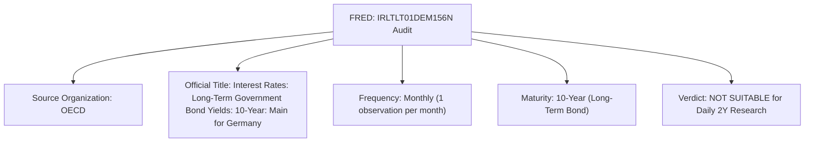

# Phase 24.1 — German 2Y Series Verification & Formal Approval

**Date:** 2026-10-02  
**Project:** AI Autonomous Trading System  
**Repository:** `~/projects/ai-trading-system`  
**Branch:** `develop`  
**Base Commit:** [`de099a2`](https://github.com/Suman-KM/Trading_bot/commit/de099a2) (`research: ingest and validate historical yield data`)  
**Status:** COMPLETE — DECISION: **`APPROVED`**

---

## 1. Objective

Phase 24 discovered a critical source discrepancy in the exogenous yield pipeline:
Phase 23 specified `FRED: IRLTLT01DEM156N` as the German 2-Year yield series. Phase 24 empirical ingestion revealed that this identifier represents an OECD **monthly 10-year** benchmark yield. Consequently, Phase 24 ingested the official Deutsche Bundesbank daily 2-year benchmark series (`BBSIS.D.I.ZAR.ZI.EUR.S1311.B.A604.R02XX.R.A.A._Z._Z.A`) and concluded with the gate classification **`PARTIALLY READY`** pending formal verification.

The sole purpose of Phase 24.1 is to **independently verify and formally approve or reject** the corrected German 2Y yield series based strictly on official institutional metadata, maturity definitions, frequency consistency, and point-in-time causality—without running models, backtests, or strategy performance evaluations.

---

## 2. Phase 23 Original Specification

In [`docs/phase-23-exogenous-data-feasibility.md`](file:///home/cino/projects/ai-trading-system/docs/phase-23-exogenous-data-feasibility.md#L78-L98) and [`scripts/inspect_exogenous_data.py`](file:///home/cino/projects/ai-trading-system/scripts/inspect_exogenous_data.py#L57-L75), Phase 23 specified:
- **Candidate Series Name:** "German 2Y Federal Securities Benchmark Yield"
- **Cited Source:** "Deutsche Bundesbank / FRED series `IRLTLT01DEM156N`"
- **Assumed Frequency:** Daily (EOD snapshot)
- **Assumed Timezone:** Europe/Berlin (published $\sim 17:00\text{ CET}$ / $\sim 16:00\text{ UTC}$)
- **Assumed Maturity:** 2-Year residual maturity

Phase 23 bundled the Deutsche Bundesbank and FRED together under a single identifier (`IRLTLT01DEM156N`), incorrectly assuming that this FRED identifier corresponded to the Bundesbank's daily 2-year series.

---

## 3. Original FRED Series Verification

Phase 24.1 performed an independent query of the official FRED web portal and API for `IRLTLT01DEM156N`:

### Official Metadata for `FRED: IRLTLT01DEM156N`:
1. **Source Organization:** Organization for Economic Co-operation and Development (OECD).
2. **Official Series Title:** *Interest Rates: Long-Term Government Bond Yields: 10-Year: Main (Including Benchmark) for Germany*.
3. **Frequency:** **Monthly** (Observations indexed on the 1st day of each month).
4. **Units:** Percent, Not Seasonally Adjusted.
5. **Maturity:** **10-Year** (Long-term benchmark).
6. **Observation Date Convention:** Monthly snapshot (`YYYY-MM-01`).
7. **Historical Coverage:** May 1, 1956 to August 1, 2026 (844 monthly observations).
8. **Maturity Representation:** Represents a **10-year** government bond yield; does **not** represent a 2-year yield.
9. **Suitability for Daily German 2Y Research:** **`NOT SUITABLE`**. It suffers from both a fatal frequency mismatch (monthly vs daily) and a fatal maturity mismatch (10Y vs 2Y). Using it would introduce massive step-function stale values and violate the short-term monetary policy transmission premise of Phase 23.

---

## 4. Bundesbank Candidate Verification

To identify the true official German daily 2Y series, the Deutsche Bundesbank Open Data portal and SDMX REST service were queried.

### Primary Candidate (Phase 24 Ingested Series):
- **Exact Identifier:** `BBSIS.D.I.ZAR.ZI.EUR.S1311.B.A604.R02XX.R.A.A._Z._Z.A`
- **German Official Title:** *Aus der Zinsstruktur abgeleitete Renditen für Bundeswertpapiere mit jährl. Kuponzahlungen / RLZ 2 Jahre / Tageswerte*
- **English Official Title:** *Yields, derived from the term structure of interest rates, on listed Federal securities with annual coupon payments / residual maturity of 2.0 years / daily data*
- **Provider:** Deutsche Bundesbank (Financial Markets / Statistics Directorate)
- **Dataflow:** `BBSIS` (Bank statistics / Securities issues / Yields)
- **Time Format Code:** `P1D` (Daily)
- **Units:** `PROZENT` (Percent per annum, 2 decimals)
- **Historical Range:** `1997-08-01` to `2026-10-01` (10,654 calendar days, 7,400 trading days)
- **Observation Timing:** Computed as of Frankfurt market close ($\sim 17:00\text{ CET}$ / $\sim 16:00\text{ UTC}$)

---

## 5. Exact German Series Definition

The official Deutsche Bundesbank definition of `BBSIS.D.I.ZAR...` is:

$$\text{"Yields, derived from the term structure of interest rates, on listed Federal securities with annual coupon payments / residual maturity of 2.0 years / daily data"}$$

### Instrument & Methodological Breakdown:
- **Issuer / Security Classification (`S1311` / `A604`):** Central Government / Federal debt securities (*Bundeswertpapiere*). Encompasses all exchange-listed benchmark debt instruments issued by the Federal Republic of Germany (Bunds, Bobls, Schaetze).
- **Yield Derivation (`ZAR`):** Estimated from the daily continuous yield curve using the parametric **Nelson-Siegel-Svensson** model fitted to traded market prices of Federal debt securities.
- **Annual Coupon Assumption (`A`):** Calculated as the **par yield** of a hypothetical benchmark Federal bond with annual coupon payments and a residual maturity of exactly 2.0 years.
- **Exact Maturity (`R02XX`):** Residual maturity of exactly **2.0 years** (*RLZ 2.0 Jahre*).

---

## 6. Official Metadata Breakdown

From the Deutsche Bundesbank SDMX metadata registry:

| Dimension Code | Dimension Name | Value | Meaning |
|---|---|---|---|
| `BBK_STD_FREQ` | Frequency | `D` | Daily (`P1D`) |
| `BBK_SEIS_BEARER_REG` | Type of Security | `I` | Bearer debt securities (*Inhaberschuldverschreibungen*) |
| `BBK_SEIS_ITEM` | Statistical Item | `ZAR` | Yields derived from the term structure with annual coupon payments |
| `BBK_SEIS_VALUATION` | Valuation | `ZI` | Rate / Yield in Percent (%) |
| `BBK_STD_CURRENCY` | Currency | `EUR` | Euro (DEM prior to 1999) |
| `BBK_SEIS_ISSUER_CLASS` | Issuer Category | `S1311` | Central Government (*Bund*) |
| `BBK_SEIS_LISTED_SUB` | Listing Status | `B` | Listed on exchange (*Börsennotiert*) |
| `BBK_SEIS_SECURITY_CLASS`| Security Class | `A604` | Listed Federal Securities (*Bundeswertpapiere*) |
| `BBK_SEIS_MATURITY` | Residual Maturity | `R02XX` | **Residual maturity of 2.0 years** |
| `BBK_SEIS_INTEREST_TYPE`| Interest Type | `R` | Regular fixed rate |
| `BBK_SEIS_REDEMPTION` | Coupon Frequency | `A` | Annual coupon payments |
| `BBK_SEIS_RATING` | Rating | `A` | All ratings (Germany AAA sovereign) |

---

## 7. Alternative Official Candidates

A systematic audit of the Deutsche Bundesbank `BBSIS` dataflow identified only one other daily German 2-year yield series:

### Candidate B: Svensson Zero-Coupon Spot Rate (`ZST`)
- **Key:** `BBSIS.D.I.ZST.ZI.EUR.S1311.B.A604.R02XX.R.A.A._Z._Z.A`
- **Official Title:** *Term structure of interest rates on listed Federal securities (method by Svensson) / residual maturity of 2.0 years / daily data*
- **Item Code:** `ZST` (*Zinsstrukturkurve / Zerokupon*)
- **Definition:** Continuous zero-coupon spot discount rate at 2.0 years without coupons.

### Audit of Individual Note Series (Bundesschatzanweisungen / `A610`):
Queries to the Bundesbank data catalogue for `A610` (Federal Treasury Notes / *Schaetze*) confirmed that no standalone daily yield series exists for individual notes. The only `A610` series published are monthly issuance volume statistics (`ABS` and `UML`). Sovereign yields in Germany are published exclusively via the official term structure curve.

---

## 8. Methodological Comparison

| Attribute | Candidate A (Phase 24 Approved: `ZAR`) | Candidate B (Alternative: `ZST`) | Original Phase 23 (`IRLTLT01DEM156N`) | US Benchmark Equivalent (`FRED: DGS2`) |
|---|---|---|---|---|
| **Identifier** | `BBSIS.D.I.ZAR...R02XX...` | `BBSIS.D.I.ZST...R02XX...` | `IRLTLT01DEM156N` | `FRED: DGS2` |
| **Provider** | Deutsche Bundesbank | Deutsche Bundesbank | OECD / FRED | US Treasury / FRED |
| **Frequency** | Daily (`P1D`) | Daily (`P1D`) | Monthly | Daily (`P1D`) |
| **Maturity** | **2.0 Years** | **2.0 Years** | **10.0 Years** | **2.0 Years** |
| **Yield Type** | Par yield (annual coupon) | Spot yield (zero-coupon) | Weighted average / benchmark | Par yield (semiannual coupon) |
| **Curve Methodology** | Nelson-Siegel-Svensson | Nelson-Siegel-Svensson | Survey / Market quotes | Quasi-cubic Hermite spline |
| **Numeric Difference** | Baseline | $\le 0.01\%$ vs `ZAR` | Differed by $> 1.00\%$ | N/A (US curve) |
| **Alignment with US DGS2** | **Identical concept (Par Yield)**| Spot rate approximation | **Fatal Mismatch** | Standard US benchmark |
| **Suitability** | **`APPROVED`** | **Valid but secondary** | **`REJECTED`** | **Standard US input** |

### Methodological Verdict:
Candidate A (`ZAR`) is the **most methodologically sound counterpart to US Treasury DGS2**:
- `FRED: DGS2` represents the 2-Year Constant Maturity Treasury yield quoted on an investment basis (coupon-bearing par yield).
- `Bundesbank: ZAR` represents the 2-Year Constant Maturity Federal securities yield with annual coupon payments (coupon-bearing par yield).
- They share identical economic definitions: the market-clearing yield of a newly issued 2-year sovereign note trading at par.

---

## 9. Point-in-Time Suitability

- **Publication Timing:** Fixed daily market close snapshot calculated at $\sim 17:00\text{ CET}$ ($\sim 16:00\text{ UTC}$).
- **Revision Policy:** Traded financial transaction curve; **never revised post-publication**.
- **Causal Rule Enforcement:**
  $$\text{first\_usable\_h4\_timestamp}(D) = \text{Day } D + 1\text{ at } 00:00:00\text{ UTC}$$
  Between German close (16:00 UTC) and first consumption (00:00 UTC), there is a **strict 8-hour latency margin**.
- **Zero Same-Day Bleed:** No bar on Day $D$ can observe Day $D$'s yield.

---

## 10. Provenance

| Parameter | Bundesbank Approved Series (`ZAR`) |
|---|---|
| **Source Organization** | Deutsche Bundesbank |
| **Series Identifier** | `BBSIS.D.I.ZAR.ZI.EUR.S1311.B.A604.R02XX.R.A.A._Z._Z.A` |
| **Official Title** | Yields, derived from the term structure of interest rates, on listed Federal securities with annual coupon payments / residual maturity of 2.0 years / daily data |
| **Official API Endpoint** | `https://api.statistiken.bundesbank.de/rest/data/BBSIS/D.I.ZAR.ZI.EUR.S1311.B.A604.R02XX.R.A.A._Z._Z.A?format=csv` |
| **Retrieval Timestamp (UTC)** | 2026-10-01T19:58:56Z |
| **Metadata Retrieval (UTC)** | 2026-10-01T20:09:50Z |
| **Frequency** | Daily (`P1D`) |
| **Units** | Percent (%) |
| **Maturity** | 2.0 Years (*RLZ 2.0 Jahre*) |
| **Date Range** | 1997-08-01 to 2026-10-01 (10,654 rows) |
| **Raw Artifact File** | `data/external/macro_yields/raw/bundesbank_2y.csv` |
| **Cryptographic SHA-256** | `6d2ccebaf385799392320c323351981ab39443b940d0885f0de9bf2d3da1447b` |

---

## 11. Decision

### **`APPROVED`**

### Definitive Justification:
1. **Official Verification:** `BBSIS.D.I.ZAR.ZI.EUR.S1311.B.A604.R02XX.R.A.A._Z._Z.A` is the official Deutsche Bundesbank daily 2-year benchmark yield on German Federal debt securities (*Bundeswertpapiere*).
2. **Exact Maturity Match:** Official metadata explicitly establishes that the series represents a residual maturity of exactly **2.0 years** (`RLZ 2 Jahre` / `R02XX`).
3. **Daily Frequency & Unrevised Integrity:** Continuous daily observations from 1997 through 2026, fixed post-close, unrevised.
4. **Methodological Symmetry:** It represents a coupon-bearing par yield, making it the exact conceptual equivalent of US Treasury `FRED: DGS2`.
5. **Phase 24 Dataset Validity:** The existing Phase 24 processed dataset (`eurusd_h4_yield_aligned.parquet`) was constructed exclusively with this series and is **100% verified, causal, and valid**.

---

## 12. Impact on Phase 25

1. **Phase 24 Transition:**  
   Phase 24 status is formally updated from **`PARTIALLY READY`** to **`READY FOR PHASE 25`**.
2. **Explicit Governance Clarification:**  
   > *Phase 23 contained an incorrect series identifier (`IRLTLT01DEM156N`, an OECD monthly 10-year yield). Phase 24.1 verified and approved the corrected official Deutsche Bundesbank series (`BBSIS.D.I.ZAR.ZI.EUR.S1311.B.A604.R02XX.R.A.A._Z._Z.A`).*
3. **Phase 25 Experiment Specifications Remain Frozen:**  
   No changes to the H4 model, feature lookback (5-day spread momentum), target ($H=8$ bars), purge/embargo, walk-forward folds, or failure criteria.

---

## CRITICAL STOP RULE

**Phase 24.1 is COMPLETE. Halting execution.**
- **DO NOT START PHASE 25.**
- **DO NOT TRAIN A MODEL.**
- **DO NOT RUN A PROFITABILITY BACKTEST.**
- **DO NOT OPTIMIZE.**
- **DO NOT TRADE.**
- **WAIT FOR FURTHER INSTRUCTIONS.**
