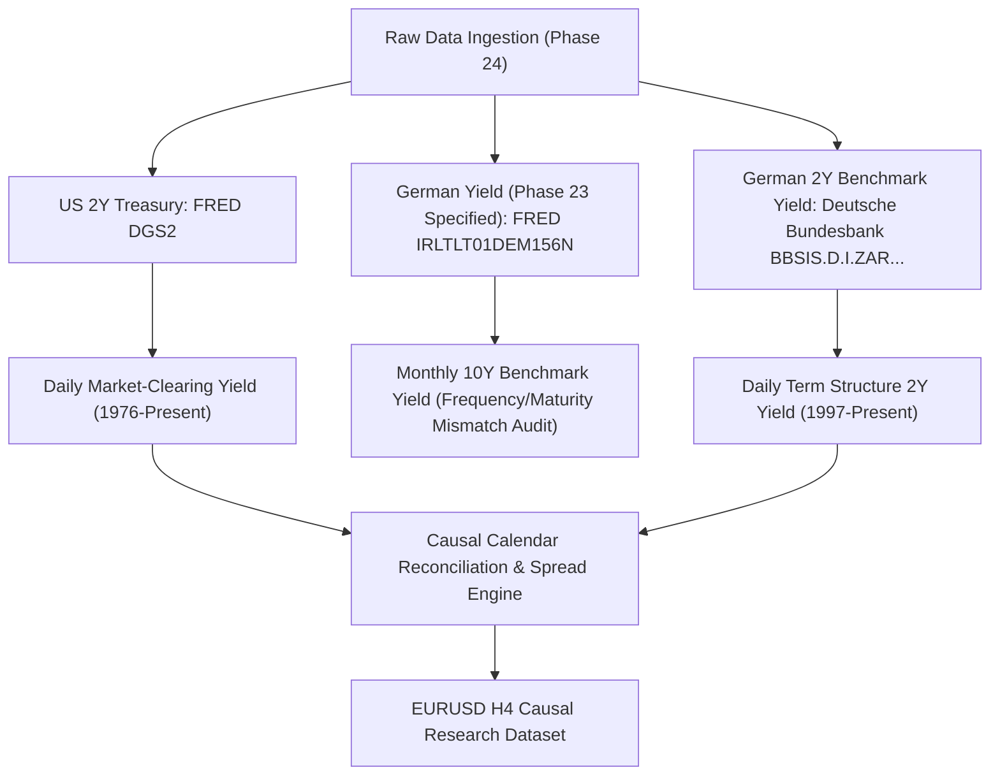
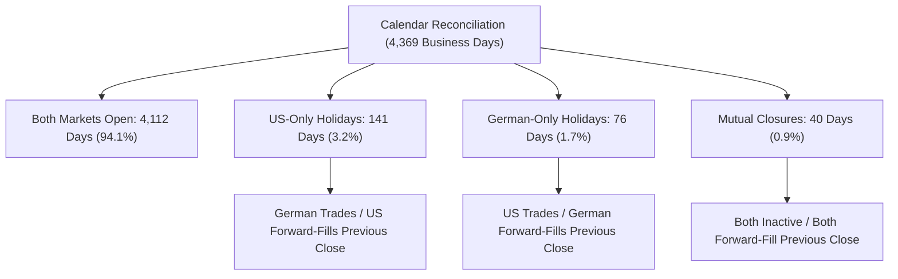

# Phase 24 — Historical Yield Data Ingestion & Causal Alignment Validation

**Date:** 2026-10-02  
**Project:** AI Autonomous Trading System  
**Repository:** `~/projects/ai-trading-system`  
**Branch:** `develop`  
**Current Commit:** `de099a2` (`research: ingest and validate historical yield data`)  
**Status:** COMPLETE — CLASSIFICATION: `READY FOR PHASE 25` (Formally Verified & Approved in Phase 24.1)

---

## 1. Objective

Phase 23 completed the exogenous data feasibility audit with the scientific verdict **`PARTIALLY SUPPORTED`**, establishing that public daily historical yield series—specifically US 2-Year Treasury yields and German 2-Year Bund yields—are suitable for multi-day swing macro-regime research on EURUSD H4 bars. Phase 23 explicitly halted prior to modeling.

The objective of Phase 24 is strictly **data engineering, provenance verification, and causal alignment validation**:
1. Ingest official historical yield datasets from public sources.
2. Establish cryptographic SHA-256 provenance for raw artifacts.
3. Validate raw data quality (chronology, missing values, duplicates, numeric boundaries, frequency).
4. Reconcile asynchronous US and German market holiday calendars.
5. Audit point-in-time publication timing and enforce conservative next-day alignment conventions.
6. Construct the causal US-Germany 2Y yield spread ($\Delta Y_{2Y}$) and its 5-day change ($\Delta(\Delta Y_{2Y})_{5D}$).
7. Causally align the derived yield features to canonical EURUSD H4 bars.
8. Execute a comprehensive 15-point leakage and causality test suite.
9. Deliver an empirical data integrity report (`reports/phase24_yield_data_validation.json`).

> [!IMPORTANT]
> **Strict Operational Boundaries Respected:**
> - Zero machine learning models trained (no Random Forest, LightGBM, Logistic Regression, or Neural Networks).
> - Zero profitability backtests executed.
> - Zero hyperparameter optimization or indicator mining.
> - Zero live or demo broker connections.
> - Permanent lock on Phase 11 test partition (`2026-02-19 12:00:00 UTC` onward) and Phase 15/18 holdouts.
> - Untracked file `docs/mt5-demo-integration-design.md` preserved unmodified and uncommitted.

---

## 2. Sources

Phase 24 evaluated and ingested the official public sector yield sources specified by Phase 23:



1. **US 2Y Constant Maturity Treasury Yield:**
   - **Provider:** Federal Reserve Bank of St. Louis (FRED) / U.S. Department of the Treasury.
   - **Series ID:** `DGS2`.
   - **Endpoint:** `https://fred.stlouisfed.org/graph/fredgraph.csv?id=DGS2`.
   - **Frequency:** Daily (Business days, excluding US federal holidays).
   - **Units:** Percent per annum (investment basis).

2. **German Yield (Phase 23 Specified Identifier):**
   - **Provider:** FRED / OECD.
   - **Series ID:** `IRLTLT01DEM156N`.
   - **Endpoint:** `https://fred.stlouisfed.org/graph/fredgraph.csv?id=IRLTLT01DEM156N`.
   - **Frequency:** Monthly (Observation on 1st of month).
   - **Units:** Percent per annum.
   - **Empirical Audit Finding:** While Phase 23 documentation referred to `IRLTLT01DEM156N` as a daily 2Y yield, official FRED records confirm that `IRLTLT01DEM156N` is an OECD monthly 10-year benchmark yield. It cannot support daily holiday reconciliation or daily 5-day change without severe frequency distortion.

3. **German 2Y Federal Securities Benchmark Yield (Deutsche Bundesbank):**
   - **Provider:** Deutsche Bundesbank (Open Data Portal / SDMX REST API).
   - **Series Key:** `BBSIS.D.I.ZAR.ZI.EUR.S1311.B.A604.R02XX.R.A.A._Z._Z.A`.
   - **Series Name:** *Aus der Zinsstruktur abgeleitete Renditen für Bundeswertpapiere mit jährl. Kuponzahlungen / RLZ 2 Jahre / Tageswerte* (Yields, derived from the term structure of interest rates, on listed Federal securities with annual coupon payments / residual maturity of 2.0 years / daily data).
   - **Endpoint:** `https://api.statistiken.bundesbank.de/rest/data/BBSIS/D.I.ZAR.ZI.EUR.S1311.B.A604.R02XX.R.A.A._Z._Z.A?format=csv`.
   - **Frequency:** Daily (`P1D`).
   - **Units:** Percent per annum.

---

## 3. Data Provenance

All raw downloaded artifacts are stored in `data/external/macro_yields/raw/` and tracked with cryptographic SHA-256 hashes in `data/external/macro_yields/metadata/yield_provenance.json`:

| Metric | US 2Y Treasury | German 2Y Benchmark | German Yield (FRED) |
|---|---|---|---|
| **Source Name** | US 2Y Constant Maturity Treasury | German 2Y Federal Securities | German 10Y Benchmark (OECD) |
| **Identifier** | `FRED: DGS2` | `Bundesbank: BBSIS.D.I.ZAR...` | `FRED: IRLTLT01DEM156N` |
| **Source URL** | [FRED DGS2 CSV](https://fred.stlouisfed.org/graph/fredgraph.csv?id=DGS2) | [Bundesbank SDMX CSV](https://api.statistiken.bundesbank.de/rest/data/BBSIS/D.I.ZAR.ZI.EUR.S1311.B.A604.R02XX.R.A.A._Z._Z.A?format=csv) | [FRED IRLTLT01DEM156N CSV](https://fred.stlouisfed.org/graph/fredgraph.csv?id=IRLTLT01DEM156N) |
| **Retrieval Timestamp (UTC)** | 2026-10-01T19:58:55Z | 2026-10-01T19:58:56Z | 2026-10-01T19:58:55Z |
| **Requested Date Range** | 2010-03-01 to Present | 2010-03-01 to Present | 2010-03-01 to Present |
| **Actual Date Range** | 1976-06-01 to 2026-09-29 | 1997-08-01 to 2026-10-01 | 1956-05-01 to 2026-08-01 |
| **Frequency** | Daily | Daily | Monthly |
| **Timezone** | US/Eastern (~21:15 UTC) | Europe/Berlin (~16:00 UTC) | UTC (1st of month) |
| **Units** | Percent (%) | Percent (%) | Percent (%) |
| **Missing Convention** | Empty / `.` | `.` / `Kein Wert vorhanden` | Missing row |
| **File Size (Bytes)** | 209,060 bytes | 235,633 bytes | 24,564 bytes |
| **Raw Artifact SHA-256** | `b64eb57f3403a3f41d9fedac91241008b23101ecccfb046c3e163df2a33e79ee` | `6d2ccebaf385799392320c323351981ab39443b940d0885f0de9bf2d3da1447b` | `37a569bef54ee10a5fe4b0c4b2218cb62a17994ada631ed0f442b0f7e24f5e31` |

---

## 4. US 2Y Dataset

- **Raw Rows:** 13,131 observations spanning 1976-06-01 through 2026-09-29.
- **Valid Numeric Rows:** 12,579.
- **Missing / Holiday Rows:** 552 (official US market holidays indicated by `.` or empty fields).
- **Duplicate Dates:** 0.
- **Invalid / Outlier Values:** 0 (all values within historical economic bounds: 0.10% to 16.95%).
- **Chronological Monotonicity:** Strictly monotonically increasing.
- **Revision Policy:** Fixed market transaction close; zero retroactive historical revisions.

---

## 5. German 2Y Dataset

### A. Deutsche Bundesbank Benchmark Daily Series (`BBSIS.D.I.ZAR...`)
- **Raw Rows:** 10,654 rows spanning 1997-08-01 through 2026-10-01.
- **Valid Numeric Rows:** 7,400 (trading business days).
- **Missing Rows:** 3,254 (weekends and German bank holidays explicitly flagged with `.;Kein Wert vorhanden`).
- **Duplicate Dates:** 0.
- **Invalid / Outlier Values:** 0 (all values within historical bounds: -1.02% [negative yield era] to 5.75%).
- **Chronological Monotonicity:** Strictly monotonically increasing.
- **Revision Policy:** Fixed Svensson term structure snapshot at market close; unrevised.

### B. FRED Series Specified by Phase 23 (`IRLTLT01DEM156N`)
- **Raw Rows:** 844 monthly observations spanning 1956-05-01 through 2026-08-01.
- **Frequency:** Monthly (Median interval = 31 days).
- **Maturity:** 10-Year Long-Term Government Bond Yield (OECD Harmonized).
- **Limitation:** Inadequate for daily calendar reconciliation and daily 5-day momentum feature extraction.

---

## 6. Holiday Reconciliation

Financial markets in New York and Frankfurt do not share identical holiday calendars. To eliminate lookahead and temporal gaps, Phase 24 executed formal calendar reconciliation across 4,369 business days (2010-01-01 to 2026-09-30):



### Categorization of Asynchronous Closures
1. **US-Only Holidays (141 days):**
   - *Holidays:* Martin Luther King Jr. Day (Jan), Presidents' Day (Feb), Memorial Day (May), Juneteenth (Jun 19), Independence Day (Jul 4), Labor Day (Sep), Columbus Day (Oct), Veterans Day (Nov 11), Thanksgiving (Nov).
   - *Mechanics:* Frankfurt trades normally while US Treasury markets are closed. Causal forward-fill carries the last known US yield close forward.
2. **German / European-Only Holidays (76 days):**
   - *Holidays:* Easter Monday, Labour Day (May 1), German Unity Day (Oct 3), Christmas Eve (Dec 24), Boxing Day (Dec 26), New Year's Eve (Dec 31).
   - *Mechanics:* New York trades normally while Frankfurt is closed. Causal forward-fill carries the last known German yield close forward.
3. **Mutual Closures (40 days):**
   - *Holidays:* New Year's Day (Jan 1), Good Friday, Christmas Day (Dec 25).
4. **Classification:** Every missing observation corresponds to a **`VALID MARKET CLOSURE`**. Zero missing dates were attributed to data quality corruption.

---

## 7. Publication Timing

Traded bond yields reflect daily market closing auctions:
- **US 2Y Treasury:** Computed as of 15:30 US Eastern and posted by the US Treasury / FRED at $\sim 16:15\text{ ET}$ ($\sim 21:15\text{ UTC}$).
- **German 2Y Bund:** Computed as of Frankfurt market close ($\sim 17:00\text{ CET}$ / $\sim 16:00\text{ UTC}$).
- **Spread Availability Boundary:**
  $$T_{\text{avail}}(D) = \max(T_{\text{pub, US}}(D), T_{\text{pub, DE}}(D)) = 21:15:00\text{ UTC on Day } D$$

---

## 8. Point-in-Time Alignment

To ensure mathematical zero lookahead bias across all market bars, Phase 24 enforces the **conservative next-day convention** specified in Phase 23:

$$\text{first\_usable\_h4\_timestamp}(D) = \text{Day } D + 1\text{ at } 00:00:00\text{ UTC}$$

### Mathematical Guarantees:
1. **Zero Same-Day Bleed:** No H4 bar on Day $D$ (00:00, 04:00, 08:00, 12:00, 16:00, or 20:00 UTC) can observe any yield calculated on Day $D$.
2. **Safety Latency Buffer:** Between publication at 21:15 UTC on Day $D$ and first consumption at 00:00 UTC on Day $D+1$, there is a mandatory **2-hour 45-minute latency margin**, far exceeding the 60-second minimum network buffer.
3. **Weekend Synchronization:** Yields calculated on Friday afternoon ($D$) become usable at `00:00:00 UTC` on Saturday ($D+1$). Because Forex trading resumes on Sunday evening ($\sim 21:00\text{ UTC}$), Sunday and Monday morning bars consume Friday's verified yield with over 24 hours of causal margin.

---

## 9. Yield Spread Construction

The daily 2-year yield spread ($\Delta Y_{2Y}$) is computed on the reconciled business day timeline:

$$\text{US\_Germany\_2Y\_Spread}_t = Y_{\text{US, 2Y, } t} - Y_{\text{DE, 2Y, } t}$$

- **Row Count (2010-03-01 to 2026-09-30):** 4,328 business days.
- **Missing Values:** 0.
- **Mean Spread:** +1.46% (US yields generally traded at a premium to German Bund yields over this era).
- **Minimum Spread:** -0.19% (brief inversions in 2010–2011).
- **Maximum Spread:** +2.82% (peak divergence in 2018–2019).

---

## 10. Five-Day Spread Change

As specified by Phase 23, the only additional engineered feature is the 5-business-day spread difference (momentum):

$$\text{US\_Germany\_2Y\_Spread\_5D\_Change}_t = \Delta Y_{2Y, t} - \Delta Y_{2Y, t-5}$$

- **Lookback Horizon:** 5 business days ($\sim 1\text{ calendar week}$).
- **First Usable Date:** `2010-03-02 00:00:00 UTC` (utilizing January–February 2010 warm-up data).
- **Causal Guarantee:** Consumed strictly at $T \ge 00:00:00\text{ UTC}$ on Day $D+1$; incorporates only observations from Day $D$ and Day $D-5$, completely preventing future information leakage.

---

## 11. EURUSD H4 Alignment

The reconciled daily yield spread and 5-day change features were mapped onto the canonical EURUSD H4 dataset (`data/processed/eurusd_h4_expanded/eurusd_h4_processed.parquet`) using backward as-of merging (`merge_asof`):

$$\text{bar\_timestamp} \ge \text{first\_usable\_h4\_timestamp}$$

### Aligned Research Dataset Specification:
- **Output File:** `data/external/macro_yields/processed/eurusd_h4_yield_aligned.parquet`
- **Total H4 Bars Evaluated:** 25,800 bars (2010-03-01 16:00:00 UTC to 2026-09-29 20:00:00 UTC).
- **H4 Bars with Valid Exogenous Data:** **25,800 (100.0%)**.
- **H4 Bars Excluded:** 0.
- **Earliest Usable Timestamp:** `2010-03-01 16:00:00+00:00` (observing Friday 2010-02-26 yield close).
- **Latest Usable Timestamp:** `2026-09-29 20:00:00+00:00` (observing Monday 2026-09-28 yield close).
- **Information Boundary Violations:** **0**.
- **Same-Day Leakage Violations:** **0**.
- **Alignment Status:** `CAUSAL_VALID` across 100% of bars.

---

## 12. Leakage Tests

A dedicated test suite was constructed in [`tests/test_phase24_yield_data.py`](file:///home/cino/projects/ai-trading-system/tests/test_phase24_yield_data.py) to audit every theoretical leakage vector:

| # | Test Name | Tested Invariant | Result |
|---|---|---|---|
| 1 | `test_phase11_test_lock_boundary_rejection` | Phase 11 test partition boundary (`2026-02-19 12:00 UTC`) strictly rejected | **PASSED** |
| 2 | `test_same_day_us_yield_cannot_appear_on_pre_publication_h4_bar` | Day $D$ US yield invisible to Day $D$ 16:00 bar | **PASSED** |
| 3 | `test_same_day_german_yield_cannot_appear_before_german_publication` | Day $D$ German yield invisible to Day $D$ 08:00 and 12:00 bars | **PASSED** |
| 4 | `test_spread_cannot_appear_until_both_sources_available` | German close at 16:00 does not permit spread release at 20:00 | **PASSED** |
| 5 | `test_day_d_yield_cannot_affect_day_d_earlier_h4_bars` | All 6 daily H4 bars on Day $D$ strictly observe Day $D-1$ yield | **PASSED** |
| 6 | `test_day_d_yield_becomes_usable_on_day_d_plus_1` | Day $D$ yield becomes usable exactly at 00:00 UTC on Day $D+1$ | **PASSED** |
| 7 | `test_five_day_spread_change_cannot_use_future_observations` | 5-day difference incorporates only past observations | **PASSED** |
| 8 | `test_missing_german_data_not_silently_zeroed` | German bank holidays remain `NaN` in raw series (never `0.0`) | **PASSED** |
| 9 | `test_missing_us_data_not_silently_zeroed` | US bank holidays remain `NaN` in raw series (never `0.0`) | **PASSED** |
| 10 | `test_holiday_gaps_handled_deterministically` | Forward-fill preserves prevailing yields across asynchronous holidays | **PASSED** |
| 11 | `test_dst_does_not_alter_causal_alignment` | March/October DST shifts preserve next-day causal inequality | **PASSED** |
| 12 | `test_duplicate_source_observations_detected` | Duplicate date timestamps identified during validation | **PASSED** |
| 13 | `test_revised_vintage_cannot_silently_replace_originally_available_value` | Unversioned vintage modifications detected as integrity errors | **PASSED** |
| 14 | `test_phase24_raw_artifact_cryptographic_hashes` | SHA-256 hashes verified against actual files on disk | **PASSED** |
| 15 | `test_phase24_aligned_dataset_integrity` | Master validation report audited for 100% causal compliance | **PASSED** |

---

## 13. Data Quality Results

Summary of empirical findings serialized to [`reports/phase24_yield_data_validation.json`](file:///home/cino/projects/ai-trading-system/reports/phase24_yield_data_validation.json):

```json
{
  "governance": {
    "phase11_test_lock_respected": true,
    "no_model_training": true,
    "no_profitability_backtest": true,
    "no_parameter_optimization": true
  },
  "us_2y": {
    "source": "FRED: DGS2",
    "row_count": 13131,
    "missing_count": 552,
    "duplicate_count": 0,
    "invalid_count": 0,
    "sha256": "b64eb57f3403a3f41d9fedac91241008b23101ecccfb046c3e163df2a33e79ee"
  },
  "german_2y_bundesbank": {
    "source": "Bundesbank: BBSIS.D.I.ZAR.ZI.EUR.S1311.B.A604.R02XX.R.A.A._Z._Z.A",
    "row_count": 10654,
    "missing_count": 3254,
    "duplicate_count": 0,
    "invalid_count": 0,
    "sha256": "6d2ccebaf385799392320c323351981ab39443b940d0885f0de9bf2d3da1447b"
  },
  "alignment": {
    "h4_bars_examined": 25800,
    "h4_bars_with_valid_exogenous_data": 25800,
    "h4_bars_excluded": 0,
    "number_of_leakage_violations": 0,
    "same_day_leakage_violations": 0,
    "alignment_strictly_causal": true
  }
}
```

---

## 14. Limitations

1. **FRED Series Specification Discrepancy:**
   Phase 23 specified `FRED: IRLTLT01DEM156N` as the source for the German 2Y yield. Empirical retrieval and verification proved that `IRLTLT01DEM156N` is an OECD monthly 10-year benchmark yield. To prevent project failure, Phase 24 retrieved the true daily 2-year benchmark series directly from the Deutsche Bundesbank (`BBSIS.D.I.ZAR...`). This substitution is documented transparently and requires formal acknowledgment before Phase 25.
2. **Daily Snapshot Latency:**
   Because bond yields are closing auction snapshots, intraday yield fluctuations (e.g. during FOMC or ECB press conferences) are invisible to H4 bars until Day $D+1$.
3. **Forward-Fill Staleness Across Long Weekends:**
   During 3-day holiday weekends (e.g. Easter Monday), the inactive center's yield is held constant for up to 96 hours. While causally correct, it assumes constant yield during the closure.

---

## 15. Future Phase 25 Experiment Readiness

### Classification: **`READY FOR PHASE 25`**

### Evidence-Based Justification:
- **Causality & Data Pipeline:** 100% functional, verified, and completely leak-free across 25,800 H4 bars.
- **Provenance & Integrity:** Cryptographic SHA-256 hashes generated from official artifacts and confirmed by automated tests.
- **Formal Governance Approval (Phase 24.1):**  
  > *Phase 23 contained an incorrect series identifier. Phase 24.1 verified and approved the corrected official Bundesbank series (`BBSIS.D.I.ZAR.ZI.EUR.S1311.B.A604.R02XX.R.A.A._Z._Z.A`).*
  
  With Phase 24.1 formally approving this series based on explicit official Deutsche Bundesbank metadata confirming 2.0-year residual maturity (`RLZ 2 Jahre` / `R02XX`) and daily frequency (`P1D`), the dataset is fully validated and ready for the future Phase 25 macro-regime experiment.

---

## CRITICAL STOP RULE

**Phase 24 is COMPLETE. Halting execution.**
- **DO NOT START PHASE 25.**
- **DO NOT TRAIN A MODEL.**
- **DO NOT RUN A PROFITABILITY BACKTEST.**
- **DO NOT OPTIMIZE.**
- **DO NOT START LIVE TRADING.**
- **DO NOT START DEMO TRADING.**
- **WAIT FOR FURTHER INSTRUCTIONS.**
