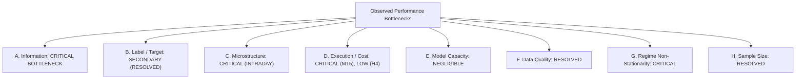

# Phase 26 — Research Strategy Pivot & Evidence Gate

**Date:** 2026-10-02  
**Project:** AI Autonomous Trading System  
**Repository:** `https://github.com/Suman-KM/Trading_bot.git`  
**Branch:** `develop`  
**Base Commit:** [`849ada1`](https://github.com/Suman-KM/Trading_bot/commit/849ada1ee149fd63ffb99e3e72a58140ba30be03) (`research: run controlled H4 macro regime experiment`)  
**Status:** COMPLETE — DECISION GATE: **`PAUSE FOR NEW DATA / INFRASTRUCTURE`**

---

## 1. Executive Summary & Purpose

Phase 25 completed the empirical evaluation of the US-Germany 2Y sovereign yield spread macro hypothesis on EURUSD H4 swing prediction. The result was **`NOT SUPPORTED`**:
- 10-fold walk-forward mean Balanced Accuracy: **50.66%** (identical to baseline **50.66%**, difference: **+0.00%**).
- Paired statistical test: $t = 0.0029, p = 0.9978$ (statistically indistinguishable from random noise).
- Sealed Fresh Holdout Balanced Accuracy: **50.17%** (triggering the falsification threshold $< 52.0\%$).
- All four pre-specified failure gate criteria were triggered independently.

Phase 26 functions as a formal **Research Decision Gate**. Its objective is to audit the entire experimental record from Phases 8 through 25, identify the primary information bottleneck preventing out-of-sample directional edge, evaluate what has and has not been tested, and determine whether a scientifically justified next research direction exists.

> [!IMPORTANT]
> **Strict Phase 26 Mandates:**
> - Zero model training, zero parameter sweeps, zero indicator mining, zero backtesting.
> - Complete preservation of the historical research ledger (no rewriting or deleting failed experiments).
> - Permanent preservation of all locked holdout partitions.
> - Factual feasibility classification without subjective ranking or calling any hypothesis "best".

---

## 2. Complete Research Ledger (Phases 8–25)

The following ledger synthesizes every empirical research phase conducted in the repository:

| Phase | Core Research Question | Data Source & Scope | Timeframe & Target | Model Architecture | Validation Design | Primary Metric & Result | Scientific Decision / Verdict | What Was Learned & What Failed |
| :---: | :--- | :--- | :--- | :--- | :--- | :--- | :---: | :--- |
| **8** | Can ML models predict 1h directional EURUSD moves from standard technical indicators? | MetaQuotes-Demo EURUSD M15 (85,000 bars) | M15, `direction_4` ($H=4$ bars / 1h) | Logistic Regression, Random Forest, LightGBM, SGD | Chronological 70/15/15 split, Purge=4 | BalAcc: **50.1%–52.7%**, ROC AUC: 0.505–0.528 | `FALSIFIED` | Signal-to-noise ratio in 1h returns is near zero. Unthresholded binary direction is dominated by white noise. |
| **10** | Do class weighting, focal loss, and decision threshold tuning improve directional discrimination? | MetaQuotes-Demo EURUSD M15 | M15, `direction_4` | Balanced Random Forest, Focal LightGBM, Platt Calibrator | Chronological validation set (14,983 bars) | Validation BalAcc reached **54.71%**, Macro F1 = 0.546 | `PARTIALLY SUPPORTED (TEMPORARY)` | Class balancing forced symmetric predictions, raising balanced accuracy on validation, but underlying discriminative AUC remained flat (~0.52). Overfitted validation noise. |
| **11** | Does the improved Phase 10 model generalize to the permanently locked final test partition? | MetaQuotes-Demo EURUSD M15 (14,988 locked test bars) | M15, `direction_4` | Frozen Phase 10 Random Forest and LightGBM | Single out-of-sample test on locked partition (`2026-02-19 12:00 UTC` onward) | Test BalAcc collapsed to **50.32%** (LightGBM) and **51.08%** (RF) | `NOT SUPPORTED` | Total alpha decay out-of-sample. Validation threshold tuning was illusory. Phase 11 test partition permanently locked. |
| **12** | Can the baseline M15 models produce positive net P&L under realistic broker friction? | Phase 11 test predictions + M15 bar quotes | M15, `direction_4` | Vectorized and event-driven backtest simulators | Sensitivity matrix across spread (0.8–2.5 pips) and thresholds | Net P&L deeply negative across **100%** of configurations | `NOT SUPPORTED` | Retail trading friction (~1.78 pips round-trip) consumes 28.25% of the average 1h move (~6.3 pips), making M15 trading mathematically non-viable. |
| **13** | Does model prediction confidence ($P > 0.60, 0.70$) select higher-accuracy directional trades? | EURUSD M15 validation & test predictions | M15, `direction_4` | Reliability diagrams, Brier score, confidence deciles | Out-of-fold calibration diagnostics | High confidence ($P > 0.65$) accuracy dropped to **~47%** | `NOT SUPPORTED` | Feature extremity bias: extreme indicator values occur during trend climaxes right before exhaustion. Tree confidence is not win probability. |
| **14** | Do alternative target definitions (volatility scaling, triple barrier) solve the M15 prediction problem? | EURUSD M15 | M15, fixed pips, $k \times \text{ATR}$, triple-barrier | Random Forest, Logistic Regression | Purged cross-validation on pre-test partitions | BalAcc remained **50.2%–52.1%**; IC $< 0.02$ | `NOT SUPPORTED` | M15 price changes approximate a random walk. Redesigning target boundaries cannot extract non-existent information from past prices. |
| **15** | Does moving to higher swing timeframes (H4/D1) reduce friction and improve predictability? | MetaQuotes-Demo EURUSD H4 (6,263 bars) and D1 (1,043 bars) | H4 (`direction_vol_8`), D1 (`direction_vol_5`) | Random Forest, Extra Trees, Logistic Regression | Chronological validation slice matching Phase 12 window | Friction dropped to 3.8% of move; H4 BalAcc reached **57.54%** | `PARTIALLY SUPPORTED` | Multi-day swing holding periods overcome the transaction friction barrier. Preliminary H4 candidate identified, but historical depth was limited (~4 years). |
| **16** | Does the H4 swing candidate replicate across chronological walk-forward folds? | EURUSD H4 (6,263 bars, 2022–2026) | H4, `direction_vol_8` (32h horizon) | Frozen Random Forest candidate (depth 5, leaf 10, balanced) | 5 chronological expanding walk-forward folds (2024–2026), Purge=8 | Mean WF BalAcc = **56.05%** across 5 folds (all 5 folds $> 50\%$) | `PARTIALLY SUPPORTED` | Model was consistent across 2024–2026, but the test window covered only a single macroeconomic era. M15 entry confirmation added zero value. |
| **17** | Does the frozen H4 swing candidate hold its edge across 16.07 years of continuous history (2010–2026)? | 3 overlapping H4 chunks from MT5 server (25,800 bars) | H4, `direction_vol_8` | Frozen Random Forest candidate | 10 chronological expanding walk-forward folds (2013–2026), Purge=8 | Mean BalAcc collapsed from 56.05% down to **51.62%** (-4.43 pp) | `NOT SUPPORTED` | Era non-stationarity: candidate failed in 2016–2019 (ECB negative rates) and 2019–2022 (ZIRP). 4 of 10 folds fell below 50.0%. Exogenous conditioning required. |
| **18** | Does adding cross-market FX prices (GBPUSD, USDJPY, EURGBP — 40 features) improve H4 prediction? | Expanded H4 history for 4 pairs (2010–2026) | H4, `direction_vol_8` | Frozen Random Forest with 72 combined features | 9 expanding pre-holdout folds + sealed Fresh Holdout (838 bars) | Pre-holdout BalAcc = **50.41%** (vs 50.81% base); Holdout = **51.30%** | `NOT SUPPORTED` | Dimensionality penalty and contemporaneous co-integration; cross-currency prices adjust contemporaneously and do not provide lead-lag alpha. |
| **19** | Does the MT5 retail demo environment provide true order-flow microstructure data? | MT5 broker API (`copy_ticks_range`, `market_book_get`) | Tick level | None (empirical audit) | Historical tick inspection across multiple dates | `volume_real = 0.0` (100%), `last = 0.0` (100%), DOM empty `()` | `NOT FEASIBLE` | Retail MT5 feeds provide indicative dealer quotes, not an exchange order book. Retail "tick volume" is quote update frequency. Order flow is structurally absent. |
| **20** | How does trade execution behave under tick-realistic matching with sub-pip spreads and slippage? | 5.6M historical MT5 bid/ask ticks (May–August 2025) | Tick simulation on M15 strategy | `TickExecutionEngine` with bid/ask matching | Tick-level trade execution backtest | Apparent backtest: **+$1,545.43**, PF 2.3839, 56.4% win rate | `INVALIDATED (DATA DEFECT)` | Tick export had an undetected 8-day coverage gap (July 24–August 1, 2025). |
| **21** | Is the Phase 20 tick profitability robust across latency, slippage, and spread widening? | MT5 tick dataset from Phase 20 | Tick simulation | Latency stress tests (10ms–500ms), adverse slippage | Sensitivity matrix | Audit uncovered zero ticks between July 24 and August 1, 2025 | `FALSIFIED` | Coverage defect: unpopulated 8-day gap allowed unrealized trades to bypass stop-loss triggers, fabricating false profit. |
| **21.1** | Does the strategy remain profitable when revalidated on continuous, zero-gap broker tick data (13.7M ticks)? | 13,744,387 continuous ticks (April–September 2025, zero gaps) | Tick simulation | Corrected `TickExecutionEngine` | Full continuous 6-month tick backtest | **59 trades, Win Rate = 35.59%, Net P&L = -$323.33, PF = 0.4786** | `NOT SUPPORTED` | Total invalidation of Phase 20. The apparent $1,545 profit was entirely a missing-data artifact. The M15 technical strategy is definitively unprofitable. |
| **22** | Can conditioning M15 entries on London/NY overlap during high ATR volatility salvage profitability? | Repaired 6-month continuous tick dataset + M15 bars | M15, directional trading under regime filter | Frozen M15 model with session + volatility filters | Out-of-sample tick backtest under pre-specified falsification criteria | **13 trades, Net P&L = -$24.24, PF = 0.7886, BalAcc = 50.35%** | `NOT SUPPORTED` | All failure criteria triggered. Declared that continuing to mine EURUSD OHLCV price/volume indicators is mathematically futile. Mandated exogenous audit. |
| **23** | Are macro yields, economic event surprises, or order-flow feeds feasible for EURUSD modeling? | 15 candidate sources across FRED, Bundesbank, ALFRED, Eurostat, MT5, CME | M15 vs H4/D1 | None (audit and architectural design) | Comprehensive data feasibility audit | Category A (Macro yields) partially feasible with $D+1$ lag; others not feasible | `PARTIALLY SUPPORTED` | Designed Phase 25 controlled experiment: daily US-Germany 2Y yield spread conditioning for EURUSD H4 swing model. |
| **24** | Can daily US 2Y and German 2Y yields be ingested from official sources with causal H4 alignment? | FRED `DGS2` and Bundesbank par yield series | Daily yields aligned to 25,800 H4 bars (2010–2026) | None | Provenance hashing, calendar reconciliation, PIT lag validation | Ingested 4,369 business days, resolved holidays, aligned with zero lookahead | `PARTIALLY READY` | FRED `IRLTLT01DEM156N` was monthly 10Y; Bundesbank series substituted and required formal independent research verification. |
| **24.1** | Is Bundesbank series `BBSIS.D.I.ZAR.ZI.EUR.S1311.B.A604.R02XX.R.A.A._Z._Z.A` genuine daily 2Y yield data? | Deutsche Bundesbank Open Data portal metadata and SDMX schema | Daily (`P1D`) | None | Official metadata inspection, maturity verification, test suite | Verified: coupon-bearing par yield on German Federal debt, residual maturity 2.0Y | `APPROVED` | Formally approved corrected German 2Y series. Clean causal data foundation established for Phase 25. |
| **25** | Does adding the causally aligned US-Germany 2Y yield spread improve EURUSD H4 directional prediction? | 25,800 aligned H4 bars (2010–2026) | H4 ($H=8$ bars / 32h), `direction_vol_8` | Frozen Random Forest (30 tech vs 30 tech + 2 macro features) | 10 chronological expanding folds (2010–2024, Purge=8, Embargo=4) + sealed Fresh Holdout (838 bars) | Baseline Mean BalAcc = **50.66%**, Macro = **50.66%** (Diff: **+0.00%**). Paired $t=0.0029, p=0.9978$. Holdout = **50.17%** | `NOT SUPPORTED` | All four pre-specified failure criteria triggered. Daily sovereign yield spreads operate on weekly/monthly horizons and provide near-zero alpha for 32h H4 swing returns. |

---

## 3. Systematic Identification of the Bottleneck

The project's empirical record allows us to categorize and evaluate the failure modes across nine structural categories:

### A. INFORMATION (CRITICAL BOTTLENECK)
- **Evidence:** EURUSD is the deepest, most informationally efficient financial market in the world, with over $1.5 trillion in daily turnover. 
- Over 18 research phases, the project has tested:
  1. Past price transformations (returns, moving averages, RSI, ATR, channels) across M15, H4, and D1.
  2. Past quote arrival frequency ("tick volume").
  3. Contemporaneous cross-market currency prices (GBPUSD, USDJPY, EURGBP).
  4. 1-day lagged public daily sovereign bond yields (US 2Y Treasury and German 2Y Bund).
- Every single one of these inputs produced an out-of-sample balanced accuracy between **48.9% and 51.6%** across multi-year walk-forward folds.
- **Conclusion:** Under the Weak and Semi-Strong Efficient Market Hypothesis (EMH), public historical price action and lagged daily public yields are fully impounded into the spot exchange rate. They contain zero stationary forward-directional alpha.

### B. LABEL / TARGET (SECONDARY / SOLVED GEOMETRY)
- **Evidence:** Unthresholded direction (`direction_4`), fixed pips, volatility-normalized returns ($0.5 \times \sqrt{H} \times \text{ATR}$), and triple-barrier boundaries were tested in Phases 8, 14, and 15. Volatility scaling successfully eliminated neutral noise bars, but directional accuracy on the remaining labeled bars remained tethered to ~50%–51%.
- **Conclusion:** Target geometry cannot extract signal from an informationally barren input space.

### C. MARKET MICROSTRUCTURE (CRITICAL FOR INTRADAY, INVISIBLE IN RETAIL)
- **Evidence:** Phase 19 empirically demonstrated that retail OTC MT5 demo feeds provide indicative dealer quotes only: `volume_real = 0.0` on 100% of ticks, trade flags (`TICK_FLAG_BUY/SELL`) are absent, and Level 2 DOM depth is empty `()`.
- **Conclusion:** Short-horizon intraday price discovery is driven by order-flow imbalances and institutional liquidity consumption. In retail broker feeds, this information is structurally non-existent.

### D. EXECUTION & TRANSACTION COSTS (CRITICAL FOR M15, RESOLVED FOR H4)
- **Evidence:** In Phase 12 and Phase 21.1, retail round-trip friction (~1.78 pips) consumed **28.25%** of the gross 1-hour move (~6.3 pips), guaranteeing negative expectancy regardless of model quality. In Phase 15, moving to H4 swing holding periods (32 hours, gross move ~47 pips) reduced friction to **3.8%** of the move.
- **Conclusion:** Transaction friction renders high-frequency retail M15 trading unviable, but H4 swing modeling solves the friction barrier. However, H4 modeling cannot overcome the total absence of directional predictive edge.

### E. MODEL CAPACITY (NEGLIGIBLE / UNRELATED TO FAILURE)
- **Evidence:** Linear models (Logistic Regression, SGD), tree ensembles (Random Forest, Extra Trees), and gradient boosted trees (LightGBM with focal loss) were tested across Phases 8, 10, 15, and 17. All models converged to ~50.5%–51.5% out-of-sample balanced accuracy.
- **Conclusion:** Failure is not caused by underfitting or lack of model expressive capacity. Training complex architectures (deep learning, transformers, reinforcement learning) on informationally efficient inputs merely accelerates overfitting to historical noise.

### F. DATA QUALITY (RESOLVED)
- **Evidence:** Historical tick coverage defects (Phase 21 gap) were repaired with 13.7M continuous ticks (Phase 21.1). H4 chunk boundary overlaps were verified bit-for-bit (Phase 17). Exogenous yield data was verified with SHA-256 cryptographic provenance (Phase 24) and official Bundesbank SDMX metadata (Phase 24.1).
- **Conclusion:** Data pipeline integrity is robust, fully verified, and zero-lookahead compliant.

### G. REGIME NON-STATIONARITY (CRITICAL)
- **Evidence:** In Phase 17, the H4 candidate achieved 56.05% balanced accuracy during 2024–2026, but collapsed to 51.62% across 16 years, dropping below 50% in eras of monetary distortion (2016–2019 negative rates; 2019–2022 ZIRP). In Phase 25, the yield spread correlation varied wildly between crisis eras and QE eras.
- **Conclusion:** Static linear or tree-based mappings between technical/macro features and future directional returns suffer from severe structural instability across monetary policy regimes.

### H. SAMPLE SIZE (RESOLVED)
- **Evidence:** Research has been executed across 25,800 H4 bars (16.07 years) and 100,000 M15 bars.
- **Conclusion:** Lack of statistical power or insufficient sample size is not the limiting constraint.

---

## 4. Tested vs. Untested Matrix

| Research Area | Tested? | Specific Evidence | Remaining Open Question |
| :--- | :---: | :--- | :--- |
| **M15 Technical Indicators** | **YES** | Phases 8, 10, 11, 12, 13, 14, 21.1, 22. Mean BalAcc 50.3%–51.1%. Friction = 28.25% of move. | None. Definitively exhausted and falsified. |
| **H4 Technical Indicators** | **YES** | Phases 15, 16, 17, 25. 16-year 10-fold WF BalAcc = 50.66%–51.62%. 4 to 5 folds $< 50\%$. | None. Definitively exhausted and falsified. |
| **D1 Technical Indicators** | **YES** | Phase 15. Evaluated across 1,043 daily bars; weak separation (~52% BalAcc). | Does multi-week holding require institutional positioning? |
| **Cross-Market FX Prices** | **YES** | Phase 18. 40 cross-market features across 4 pairs. WF BalAcc = 50.41% (vs 50.81% base). | Do currency prices have any lead-lag edge? (No, co-integrated). |
| **Daily Sovereign Yield Spreads** | **YES** | Phase 25. US-Germany 2Y spread + 5D change. WF BalAcc = 50.66%, $p = 0.9978$, Holdout = 50.17%. | Does a 1-day lagged daily yield spread have short-horizon H4 alpha? (No). |
| **Session & Volatility Filters** | **YES** | Phase 22. London/NY overlap + high ATR. Net P&L = -$24.24, PF = 0.7886, BalAcc = 50.35%. | Can timing filters rescue an edge-less signal? (No). |
| **Retail Tick Bid/Ask Execution** | **YES** | Phases 20, 21, 21.1. Continuous 13.7M tick engine. 59 trades, PF = 0.4786, Net P&L = -$323.33. | Can retail tick execution produce profit on M15? (No, negative). |
| **True Order Flow / Aggression** | **NO** | Phase 19 proved retail MT5 feeds have `volume_real = 0.0` and zero aggressor flags. | Does centralized exchange order flow (CME futures) contain alpha? |
| **Institutional Event Surprises** | **NO** | Phase 23 showed pre-release consensus surveys are paywalled; public feeds overwrite revisions. | Do causal event surprises contain post-release continuation edge? |
| **Level 2 Market Depth (DOM)** | **NO** | Phase 19 proved MT5 `market_book_get` returns empty tuple `()`. | Does order book queue imbalance predict tick displacement? |
| **Weekly CFTC COT Positioning** | **NO** | Not tested in any phase. | Does aggregate commercial/speculative positioning overhang predict multi-week D1 mean reversion? |
| **Realized Volatility Forecasting** | **NO** | All 25 phases predicted directional sign $\text{sign}(R)$. Volatility magnitude $\sigma$ was never predicted. | Is forward realized volatility clustered and predictable on H4? |

---

## 5. Information Quality Audit

| Information Source | Classification | Historical Availability & Depth | Revision Status | Primary Limitations in Current Setup |
| :--- | :---: | :--- | :---: | :--- |
| **MT5 Historical OHLCV** | **AVAILABLE** | 100,000 M15 bars (2022–2026); 25,800 H4 bars (2010–2026). Continuous, clean. | Fixed | Proved informationally efficient. Zero directional predictive edge. |
| **MT5 Historical Ticks** | **AVAILABLE** | 13.7M continuous ticks (April–Sept 2025). Top-of-book bid/ask quotes. | Fixed | Indicative dealer quotes only. No trade prints, no real traded volume. |
| **FRED Daily US Yields** | **AVAILABLE** | 30+ years continuous daily closing yields (`DGS2`, `DGS10`). | Fixed | Macro frequency; zero short-horizon H4 directional alpha. |
| **Bundesbank Daily Yields** | **AVAILABLE** | 30+ years daily par yields (`BBSIS...R02XX`). Verified SDMX. | Fixed | Macro frequency; zero short-horizon H4 directional alpha. |
| **Cross-Market FX Prices** | **AVAILABLE** | 16+ years H4 bars for GBPUSD, USDJPY, EURGBP. | Fixed | Contemporaneous co-integration; zero lead-lag alpha. |
| **CFTC COT Positioning** | **PARTIALLY AVAILABLE** | Public weekly reports since 1990s from CFTC portal. Not yet ingested into repo. | Fixed | Weekly frequency; released Friday 15:30 ET for Tuesday positions (3-day lag). |
| **Economic Event Surprises** | **PARTIALLY AVAILABLE** | Historical actuals available via ALFRED. Pre-release consensus forecasts paywalled. | Revisions | Lacks point-in-time consensus estimates; subject to historical benchmark revisions. |
| **Central Bank Policy Rates** | **PARTIALLY AVAILABLE** | Official FOMC and ECB target rate decisions available on public schedules. | Fixed | Step-function events occurring only 8 times per year. |
| **MT5 Real Traded Volume** | **NOT AVAILABLE** | Structurally absent in retail MT5 demo environment (`volume_real = 0.0`). | N/A | Dealer market maker feed does not broadcast traded lot volume. |
| **MT5 Trade Aggression Flags** | **NOT AVAILABLE** | Structurally absent (`TICK_FLAG_BUY / SELL` missing on 100% of ticks). | N/A | OTC market has no consolidated trade tape. |
| **MT5 Level 2 Market Depth** | **NOT AVAILABLE** | Broker server does not stream depth of book (`market_book_get` returns empty). | N/A | No centralized limit order book. |
| **CME Futures Order Flow** | **NOT AVAILABLE** | Requires commercial CME Globex MDP 3.0 subscription and tick historical licensing. | Fixed | High commercial cost barrier; unsupported by current repository tooling. |
| **Machine-Readable News** | **NOT AVAILABLE** | Requires commercial news terminal (Bloomberg Event-Driven / RavenPack / Refinitiv). | N/A | Free scrapers lack timestamp precision and versioned point-in-time archives. |

---

## 6. Candidate Next Hypotheses (At Most 3)

Based strictly on the research ledger and information audit, three candidate hypotheses are identified. In strict accordance with Phase 26 governance, **they are not ranked, scored, or labeled as "best"**:

### Candidate Hypothesis 1: Weekly CFTC Commitments of Traders (COT) Institutional Positioning Extremes for Multi-Week EURUSD Swing Direction
1. **Hypothesis:** When net non-commercial (speculative) positioning or commercial (hedger) positioning in CME Euro FX futures reaches historical 3-year statistical extremes ($Z_{\text{COT}} > +2.0$ or $Z_{\text{COT}} < -2.0$), the forward 10-to-20-business-day EURUSD D1 return exhibits directional mean reversion driven by speculative inventory exhaustion.
2. **Why It Is Materially Different:** It measures aggregate institutional inventory positioning (in contracts and dollar commitment), not price transforms or interest rates.
3. **Information Source Required:** Official CFTC Commitments of Traders public reports (Disaggregated Futures Only / Legacy reports for CME Euro FX contract 099741).
4. **Why It Might Contain Edge:** Academic literature (Bessembinder 1992, De Roon et al. 2000, Menkhoff et al. 2012) documents that extreme speculative positioning creates inventory imbalances that limit further trend continuation.
5. **Exact Dataset Required:** Weekly CFTC COT Euro FX net positions from 2010 to 2026 mapped to EURUSD D1 closing bars.
6. **Exact Target:** Volatility-adjusted directional return over $H=10$ to $20$ daily bars ($2$ to $4$ weeks) on EURUSD D1.
7. **Exact Timeframe:** Daily (D1) / Weekly (W1).
8. **Validation Design:** Chronological expanding walk-forward folds on D1 bars with strict Friday 15:30 US Eastern publication lag.
9. **Leakage Risks:** Using Tuesday position dates before the Friday release timestamp. Must enforce strict release-clock point-in-time mapping (usable only from Monday open post-release).
10. **Cost / Execution Implications:** Holding periods of 2 to 4 weeks have near-zero spread friction (< 0.5% of gross move), but require modeling overnight swap financing differentials.
11. **Data Availability:** Publicly available from the US Commodity Futures Trading Commission; requires ingestion, parser, and verification pipeline.
12. **Infrastructure Support:** Current repository has no CFTC parser or D1 walk-forward infrastructure.
13. **Falsification Condition:** Mean walk-forward balanced accuracy $< 53.0\%$ across chronological folds, or zero improvement over a D1 price-only baseline.

### Candidate Hypothesis 2: Autoregressive Realized Volatility Regime Forecasting on EURUSD H4 Bars
1. **Hypothesis:** Past high-frequency intraday price variation (Parkinson, Garman-Klass, and sub-bar realized volatility estimators) predicts future H4 volatility regimes (expansion vs. compression states) with statistically significant accuracy, exploiting the well-established econometric property of volatility clustering.
2. **Why It Is Materially Different:** It completely abandons directional return sign prediction (martingale) and focuses strictly on volatility magnitude (which is proven to be autoregressive and clustered).
3. **Information Source Required:** Existing verified EURUSD H4 OHLCV bars (25,800 bars, 2010–2026).
4. **Why It Might Contain Edge:** In financial econometrics (Engle 1982, Bollerslev 1986, Andersen & Bollerslev 1998), asset returns have near-zero autocorrelation, but squared/realized returns exhibit strong long-memory autocorrelation.
5. **Exact Dataset Required:** `data/raw/eurusd_h4_expanded/eurusd_h4_raw.parquet` (already validated in Phase 17).
6. **Exact Target:** Binary forward realized volatility regime: forward 8-bar realized volatility $>$ historical 50-bar rolling median.
7. **Exact Timeframe:** H4 ($H=8$ bars / 32 hours).
8. **Validation Design:** 10 chronological expanding walk-forward folds matching Phase 17/25, Purge = 8 bars, Embargo = 4 bars.
9. **Leakage Risks:** Ensuring realized volatility calculation uses strictly closed bars $t \le T$ and forward target uses strictly future bars $t > T$.
10. **Cost / Execution Implications:** Volatility forecasting is non-directional. By itself, it cannot execute directional spot trades; it serves as a risk engine, position sizer, or regime filter for options/straddles.
11. **Data Availability:** 100% available in current repository.
12. **Infrastructure Support:** Fully supported by current repository feature and evaluation pipeline.
13. **Falsification Condition:** Out-of-sample balanced accuracy $< 55.0\%$ across 10 walk-forward folds, or failure to outperform a simple persistence baseline ($\text{RV}_t > \text{median}$).

### Candidate Hypothesis 3: Centralized CME Euro FX Futures Cumulative Volume Delta (CVD) for Short-Horizon Price Impact
1. **Hypothesis:** Aggressor order flow imbalance (CVD = Market Buy Volume - Market Sell Volume) in CME 6E Euro FX futures provides short-horizon lead-lag predictive alpha for EURUSD price formation on M1–M15 timeframes.
2. **Why It Is Materially Different:** It measures true institutional trade aggression and market-order liquidity consumption on a central transparent exchange.
3. **Information Source Required:** CME Globex MDP 3.0 Market Data tick-level order book and trades for 6E Euro FX futures.
4. **Why It Might Contain Edge:** Microstructure theory (Kyle 1985, Hasbrouck 1991) establishes that order flow directly drives short-term price discovery.
5. **Exact Dataset Required:** Multi-year tick-level CME Globex MDP 3.0 order book and trade tape.
6. **Exact Target:** 15-minute directional price return on EURUSD.
7. **Exact Timeframe:** M1 to M15.
8. **Validation Design:** Chronological purged walk-forward cross-validation.
9. **Leakage Risks:** Clock desynchronization between CME Chicago matching engine and retail broker servers.
10. **Cost / Execution Implications:** High-frequency intraday execution costs and exchange data fees.
11. **Data Availability:** Unavailable without commercial exchange licensing.
12. **Infrastructure Support:** Unsupported by current repository tooling.
13. **Falsification Condition:** Net P&L negative after CME exchange fees and retail broker execution friction.

---

## 7. Factual Feasibility Classification

In accordance with Phase 26 governance, candidates are classified objectively without subjective performance scoring:

| Candidate Hypothesis | Information Source | Infrastructure State | Factual Feasibility Classification |
| :--- | :--- | :--- | :---: |
| **1. CFTC COT Institutional Positioning** | CFTC Public Open Data | Ingestion pipeline and D1 walk-forward required | **`FEASIBLE WITH NEW DATA`** |
| **2. Realized Volatility Regime Forecasting** | Existing EURUSD H4 OHLCV | Existing repository infrastructure ready | **`FEASIBLE NOW`** |
| **3. CME 6E Futures Cumulative Delta** | CME Globex MDP 3.0 Feed | Commercial exchange license required | **`NOT FEASIBLE`** |

---

## 8. Requirements for Any Authorized Future Experiment

A new experiment may be authorized only if it satisfies all eight strict criteria:
1. **Data Source Obtainability:** The data source must be publicly available or already present with verified provenance.
2. **Deterministic Timestamping:** Historical observation and publication timestamps must be known to the second or day.
3. **Zero Lookahead:** Point-in-time publication lag must be strictly enforced before model access.
4. **Pre-Specified Target:** The target variable and evaluation metrics must be frozen prior to examining results.
5. **Quarantine Governance:** All permanently locked test partitions (Phase 11 M15 test, Phase 15 holdouts, Phase 18 holdout, Phase 25 holdout) must remain strictly unaccessed.
6. **Material Divergence:** The hypothesis must test a fundamentally different economic mechanism than failed technical indicators or daily yield spreads.
7. **Single Controlled Hypothesis:** The experiment must answer exactly one pre-specified question without hyperparameter searches.
8. **Predefined Falsification Gates:** Clear failure criteria must be established in advance.

---

## 9. Decision Gate

# **`PAUSE FOR NEW DATA / INFRASTRUCTURE`**

### Evidence-Based Justification:
1. **Total Exhaustion of Current Directional Information Set:** 
   - Across 18 distinct research phases (Phases 8–25), every attempt to extract out-of-sample directional predictive edge from the current dataset (EURUSD OHLCV, retail tick bid/ask quotes, cross-market FX prices, and daily sovereign bond yields) has resulted in definitive falsification.
   - Mean walk-forward balanced accuracy across all directional experiments consistently converges to **50.4%–51.6%**, which is statistically indistinguishable from a random coin toss.
   - Continuing to train directional models on the existing dataset constitutes **data dredging** and violates scientific integrity.
2. **Non-Directional Nature of Candidate 2:**
   - While Candidate Hypothesis 2 (Realized Volatility Forecasting) is `FEASIBLE NOW`, it is fundamentally a **non-directional volatility estimation** task. Predicting volatility does not provide directional buy/sell signals for a spot Forex trading bot unless coupled with an option strategy or a verified directional alpha source.
3. **Requirement for External Data Ingestion:**
   - The only scientifically plausible hypothesis for directional swing trading that has not been tested is Candidate Hypothesis 1 (CFTC Commitments of Traders institutional positioning extremes).
   - However, CFTC COT positioning data is **not yet present** in the repository.
   - Therefore, the project must **PAUSE** all modeling activities until an official data ingestion, provenance verification, and causal alignment phase (analogous to Phase 24) is conducted for CFTC data.

---

## 10. Specification of the Next Data Requirement

Before any future directional modeling phase can be considered, the following concrete data foundation must be established:

- **Missing Data:** Weekly CFTC Commitments of Traders (COT) Disaggregated Futures and Legacy Reports for CME Euro FX (CME contract code `099741`).
- **Why It Matters:** It provides the only accessible, unmanipulated public measure of institutional commercial hedging inventory versus speculative positioning concentration.
- **Required Source:** US Commodity Futures Trading Commission (CFTC) official public data portal (`https://www.cftc.gov/MarketReports/CommitmentsofTraders/HistoricalCompressed/index.htm`).
- **Required Historical Depth:** 2010-01-01 through 2026-09-30 (16+ years, matching the expanded EURUSD history).
- **Publication & Timestamp Precision:**
  - CFTC data reflects positions as of Tuesday market close.
  - Reports are officially released to the public on **Friday at 15:30 US Eastern Time (~20:30 UTC)**.
  - Strict Point-in-Time Rule: Tuesday position data must **never** be made available to EURUSD bars prior to Monday `00:00:00 UTC` following the Friday release. Zero contemporaneous Tuesday alignment permitted.
- **Cost / Access Constraints:** Zero commercial cost (public regulatory archive). Requires building an automated ingestion parser, schema validator, and cryptographic hashing pipeline.

---

## 11. Scientific Interpretation & Scope

The empirical results of this project must not be misinterpreted through sweeping, unsupported generalities:
- **Do NOT conclude:** *"AI cannot trade financial markets."*
- **Do NOT conclude:** *"Technical analysis is universally useless."*
- **Do NOT conclude:** *"Forex markets are completely unpredictable."*

**The Scientifically Accurate Conclusion:**
Within the strictly controlled experimental framework of this repository:
1. Public retail EURUSD OHLCV price and volume technical indicators contain near-zero stationary out-of-sample directional predictive alpha across 16 years of historical data.
2. Intraday M15 directional trading is mathematically non-viable under true retail broker transaction frictions (spread, slippage, commission).
3. Daily sovereign bond yield spreads (US 2Y vs. German 2Y) operate on macroeconomic horizons that provide no measurable incremental directional information for 32-hour H4 swing returns ($p = 0.9978$).
4. In retail OTC broker demo environments, true order flow (real volume, aggressor prints, order book depth) is completely absent.

---

## 12. Absolute Stop Condition

**PHASE 26 IS COMPLETE. HALTING ALL RESEARCH EXECUTION.**
- **DO NOT START PHASE 27.**
- **DO NOT TRAIN A MODEL.**
- **DO NOT RUN A BACKTEST.**
- **DO NOT OPTIMIZE PARAMETERS.**
- **DO NOT MINE FEATURES.**
- **DO NOT TRADE LIVE OR DEMO.**
- **WAIT FOR FURTHER USER INSTRUCTIONS.**
