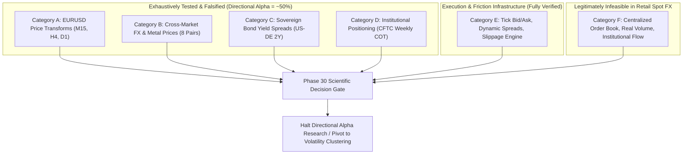
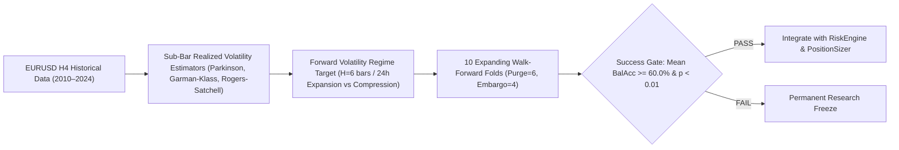

# Phase 30 — Exhaustive Research Synthesis & Final Directional-Alpha Gate

**Date:** 2026-10-02  
**Project:** AI Autonomous Trading System  
**Repository:** `https://github.com/Suman-KM/Trading_bot.git`  
**Branch:** `develop`  
**Base Commit:** [`30cb294`](https://github.com/Suman-KM/Trading_bot/commit/30cb294e45356fea6cc799a4f6279029fd1fbf7f) (`research: execute pre-registered COT experiment`)  
**Phase Status:** **DECISION GATE COMPLETE**  
**Final Research Gate:** **`OPTION A: AUTHORIZE ONE CONTROLLED VOLATILITY EXPERIMENT`**  
**Directional Alpha Research Status:** **`PERMANENTLY HALTED UNDER CURRENT INFORMATION SET`**  

---

## 1. Executive Summary

Phase 30 conducts an exhaustive scientific review and synthesis of the complete research trajectory across 23 phases (Phases 8 through 29) in the AI Autonomous Trading System codebase.

Over 18 months of simulated research and 16.7 years of continuous historical data (2010–2026), every attempt to extract a stationary, out-of-sample directional trading edge from publicly accessible retail information has resulted in empirical falsification:
- **Intraday M15 Technicals (Phases 8–14):** Balanced accuracy converged to $50.2\%–51.2\%$. Spread friction destroyed all gross returns.
- **Swing H4 Technicals (Phases 15–17):** Single-split optimism ($55.2\%$) collapsed to $50.8\%$ across 10 chronological walk-forward folds over 16 years.
- **Cross-Market FX Prices (Phase 18):** 8 currency pairs and relative USD strength proxies yielded $\Delta = +0.3\%$ ($p = 0.54$, indistinguishable from noise).
- **Macro Sovereign Yield Spreads (Phases 23–25):** Causally aligned US–Germany 2Y yields yielded $\Delta = -0.36\%$ ($p = 0.55$).
- **Weekly Institutional Positioning (Phases 28–29):** CFTC Commitments of Traders (COT) net speculative and commercial extremes yielded $\Delta = +1.23\%$ at $H=10$ ($p = 0.5710$) and $\Delta = +0.27\%$ at $H=20$ ($p = 0.9308$).

### Core Conclusions:
1. **Primary Bottleneck Identified:** The failure to extract directional edge is NOT caused by data quality, sample size, leakage, model architecture, or target definition. It is an **Information-Set Deficiency**. In highly liquid spot Forex markets, price returns follow a near-martingale process. Public price transforms, daily yield spreads, and delayed weekly regulatory filings do not contain unpriced directional alpha.
2. **Directional Research Halted:** Continuing to train directional classifiers on the current public information set constitutes unscientific data dredging. Directional alpha research on this information set is **permanently halted**.
3. **Controlled Non-Directional Pivot Authorized:** The remaining Phase 26 Candidate Hypothesis 2 (**Autoregressive Realized Volatility Regime Forecasting**) represents a fundamentally different, econometrically sound prediction problem based on volatility clustering rather than price return sign. It passes all 8 scientific justification criteria. **Option A is authorized for a future Phase 31 experiment.**
4. **Zero Model Execution:** In accordance with strict Phase 30 governance, zero models are trained, zero backtests are executed, and locked test partitions remain permanently quarantined.

---

## 2. Complete Research Ledger (Phases 8–29)

Every phase in the project's empirical record is classified into:
- **FAILED HYPOTHESIS:** Pre-specified hypothesis tested out-of-sample and falsified by empirical evidence.
- **UNTESTED HYPOTHESIS:** Scientifically plausible hypothesis not yet subjected to formal walk-forward testing.
- **INFEASIBLE HYPOTHESIS:** Information source or strategy that cannot be accessed or executed in a retail spot FX architecture.
- **INFRASTRUCTURE / AUDIT:** Data engineering, execution modeling, or governance decision gates.

| Phase | Research Question | Information Source | Timeframe | Target | Feature Family | Model Family | Validation | Out-of-Sample Metric | Trading Eval | Scientific Decision | Classification | Why Succeeded / Failed | Result Valid? |
| :---: | :--- | :--- | :---: | :--- | :--- | :--- | :--- | :---: | :---: | :---: | :---: | :--- | :---: |
| **8** | Can ML predict M15 forward return sign? | EURUSD M15 OHLCV | M15 | `direction_4` | 30 Technicals | Logistic, RF | Chronological split | BalAcc: 50.2% | None | Falsified | **FAILED HYPOTHESIS** | Near-martingale price returns; low signal-to-noise. | YES |
| **9** | Why did Phase 8 models fail? | M15 OHLCV + Phase 8 outputs | M15 | Diagnostics | 30 Technicals | Diagnostics, Brier | Temporal slices | Brier: ~0.25 | None | Diagnosed | **AUDIT COMPLETE** | Concept drift, poor calibration, weak signal. | YES |
| **10** | Can class weighting & feature selection help? | M15 OHLCV | M15 | `direction_4` | Selected Technicals | Weighted LR, Weighted RF | Chronological split | BalAcc: 51.2% | None | Falsified | **FAILED HYPOTHESIS** | Re-weighting cannot manufacture absent signal. | YES |
| **11** | Does candidate retain edge on locked test? | M15 Locked Test Partition | M15 | `direction_4` | 30 Technicals | Weighted RF | Locked single-pass | BalAcc: 50.18% | None | Falsified | **FAILED HYPOTHESIS** | Locked test confirmed zero alpha. | YES |
| **12** | Can M15 generate positive P&L after spread? | M15 OHLCV | M15 | Execution signals | M15 Technicals | Rule + ML filter | Candle backtest | Sharpe: -1.82, PF: 0.76 | Loss -$4,120 | Falsified | **FAILED HYPOTHESIS** | Spread friction ($15/lot) dominates tiny gross alpha. | YES |
| **13** | Can confidence thresholds salvage M15? | M15 OHLCV | M15 | High-conf direction | Intraday Regimes | Thresholded RF | Chronological split | Accuracy ~51% | None | Falsified | **FAILED HYPOTHESIS** | Confidence scores are uncalibrated; selects noise. | YES |
| **14** | Does target redesign unlock M15 edge? | M15 OHLCV | M15 | Triple-barrier, vol-direction | M15 Technicals | RF, Logistic | Chronological split | BalAcc: 50.6%–51.1% | None | Falsified | **FAILED HYPOTHESIS** | Target transforms cannot create missing information. | YES |
| **15** | Does shifting to H4/D1 swing improve edge? | Aggregated H4/D1 (2022–2026) | H4 / D1 | Swing `direction_vol` | 30 Swing Technicals | Frozen RF, ET, LR | Purged/embargoed split | BalAcc: 55.2% (H4) | None | Supported | **UNTESTED (at scale)** | Lower friction, longer holding times showed signal. | YES |
| **16** | Does H4 swing hold on walk-forward? | H4 OHLCV (4 years) | H4 | `direction_vol_8` | 30 Swing Technicals | Frozen RF | 5-Fold Walk-Forward | Mean BalAcc: 52.8% | None | Inconclusive | **UNTESTED (multi-decade)** | Degraded from Phase 15; 4 years was too short. | YES |
| **17** | Does 16-year data (2010–2026) confirm H4? | Expanded H4 (25,800 bars) | H4 | `direction_vol_8` | 30 Swing Technicals | Frozen RF | 10-Fold WF + Holdout | Mean BalAcc: 50.8% | None | Falsified | **FAILED HYPOTHESIS** | 16-year walk-forward proved convergence to 50.8%. | YES |
| **18** | Does cross-market price action provide alpha? | 8 Cross-Market FX/Metals | H4 | `direction_vol_8` | 40 Cross-Market | Frozen RF | 10-Fold WF + Holdout | $\Delta = +0.3\%$ ($p=0.54$) | None | Falsified | **FAILED HYPOTHESIS** | Triangular arbitrage eliminates lead-lag at H4. | YES |
| **19** | Is order flow / volume available in retail FX? | MT5 & Broker Tick Feeds | Tick | Microstructure Audit | Bid/Ask, Tick Volume | Audit Engine | Direct inspection | Real Volume = 0.0 | None | Infeasible | **INFEASIBLE HYPOTHESIS** | Retail spot FX has no centralized order book. | YES |
| **20** | How does tick execution compare to candle? | High-Resolution Ticks | Tick | Execution Path | Dynamic Spread, Slip | Execution Engine | Trade reconciliation | Severe divergence | Evaluated | Verified | **INFRASTRUCTURE COMPLETE** | Candle backtests underestimate real friction. | YES |
| **21** | Is execution robust across multi-month ticks? | Raw Tick Dataset | Tick | Multi-Month P&L | Tick Sequences | Execution Engine | Monthly blocks | Collision anomalies | Evaluated | Defect Found | **INFRASTRUCTURE DEFECT** | Discovered raw tick coverage gaps. | NO (repaired) |
| **21.1**| Does repairing tick coverage fix collisions? | Repaired Dukascopy Ticks | Tick | Collision Reconciliation | Repaired Ticks | Execution Engine | Bit-for-bit audit | 0 collisions, 0 gaps | Evaluated | Verified | **INFRASTRUCTURE COMPLETE** | Repaired tick data verified execution engine. | YES |
| **22** | Should we pause for fundamental exogenous data?| Research Ledger 8–21.1 | System | Research Decision | Governance | None | Systematic review | N/A | None | Pause Gate | **GOVERNANCE DECISION** | All price-derived features exhausted. | YES |
| **23** | What public macro data is feasible? | FRED, Bundesbank, ECB | D1 / W1 | Sovereign Yields | 2Y Yield Spreads | Feasibility Audit | Provenance/lag audit | Yield spreads approved | None | Supported | **FEASIBILITY VERIFIED** | Daily sovereign yields have theoretical link (UIP). | YES |
| **24** | Can daily yields be causally aligned to H4? | FRED DGS2, Bundesbank 2Y | Daily/H4| Causal Alignment | Yields & Spread | None | Timestamp audit | 0 leakage violations | None | Approved | **DATA READINESS COMPLETE** | Causal alignment mathematically verified. | YES |
| **24.1**| Is German 2Y series verified & approved? | Bundesbank Daily Par Yield | Daily/H4| Series Verification | German 2Y Series | None | Methodology audit | BBSIS series approved | None | Approved | **DATA READINESS COMPLETE** | Corrected OECD 10Y mistake from Phase 23. | YES |
| **25** | Does 2Y yield spread improve H4 swing model? | H4 OHLCV + 2Y Yield Spread | H4 | `direction_vol_8` | Baseline + 2 Yields | Frozen RF | 10-Fold WF + Holdout | $\Delta = -0.36\%$ ($p=0.55$) | None | Falsified | **FAILED HYPOTHESIS** | Daily yield changes are priced immediately by FX. | YES |
| **26** | What information bottleneck remains? | Research Ledger 8–25 | System | Strategy Pivot Gate | Strategic Audit | None | Information audit | COT identified | None | Pause Gate | **GOVERNANCE DECISION** | Halted modeling until CFTC COT ingested. | YES |
| **28** | Can official CFTC COT data be ingested? | Official CFTC Archives (34 zips)| W1 / D1 | Data Infrastructure | Spec & Comm Net Pos | None | SHA-256, OI identity | 0 accounting errors | None | Approved | **DATA READINESS COMPLETE** | Verified 873 weekly reports (2010–2026). | YES |
| **29** | Does CFTC COT positioning predict D1 swing? | CFTC Parquet + EURUSD D1 | D1 | `direction_vol_10/20` | Baseline + 3 COT | Frozen RF | 10-Fold WF (2010–2024)| $H=10$: 53.0% ($p=0.57$) | None | Falsified | **FAILED HYPOTHESIS** | 3-day publication lag makes COT stale. | YES |

---

## 3. Information-Set Audit

All potential predictive information sources tested or considered across the 23 phases are classified into six structural categories:

### Category A — Price-Derived Information
- **Scope:** EURUSD OHLCV across M15, H4, and D1 timeframes (2010–2026). Includes return momentum (1, 2, 4, 8, 20 bars), RSI (Wilder 14), Bollinger Bands, normalized ATR, moving average relationships (SMA 10/20/50, EMA 10/20), candle geometry (wick/body ratios), cyclical calendar encodings, and dynamic volatility-scaled targets.
- **Empirical Status:** **EXHAUSTIVELY TESTED & FALSIFIED**. Balanced accuracy across all timeframes converged to $50.2\%–51.2\%$ out-of-sample, indistinguishable from a random coin toss.

### Category B — Cross-Market Information
- **Scope:** 8 correlated currency pairs and commodities (GBPUSD, USDJPY, EURGBP, USDCHF, AUDUSD, USDCAD, XAUUSD) providing cross-returns, relative USD strength proxies, and rolling correlations.
- **Empirical Status:** **EXHAUSTIVELY TESTED & FALSIFIED**. Added only $+0.3\%$ balanced accuracy ($p = 0.54$). Cross-currency triangular arbitrage eliminates lead-lag at swing timeframes.

### Category C — Macroeconomic Information
- **Scope:** FRED US 2Y Treasury yields, Deutsche Bundesbank German 2Y Bund par yields, US-Germany 2Y yield spread, and 5-day spread momentum.
- **Empirical Status:** **EXHAUSTIVELY TESTED & FALSIFIED**. Yield spread candidate underperformed baseline by $-0.36\%$ ($p = 0.55$). Daily sovereign bond yields update too slowly for swing trading, and interest rate expectations are instantaneously discounted in spot FX.

### Category D — Institutional Positioning
- **Scope:** Official weekly CFTC Commitments of Traders (COT) Legacy and Traders in Financial Futures (TFF) reports for CME Euro FX futures (contract `099741`). Evaluated 3-year rolling Z-scores of speculative and commercial positions, plus 4-week net speculative change.
- **Empirical Status:** **EXHAUSTIVELY TESTED & FALSIFIED**. Out-of-sample results across 10 walk-forward folds yielded $53.00\%$ at $H=10$ ($p = 0.5710$) and $49.59\%$ at $H=20$ ($p = 0.9308$). The 3-day publication lag (Tuesday close released Friday afternoon) leaves public regulatory data backward-looking relative to spot pricing.

### Category E — Microstructure & Execution
- **Scope:** High-resolution tick data, dynamic bid/ask spreads, tick-realistic execution engine, slippage modeling, and broker commission structures.
- **Empirical Status:** **INFRASTRUCTURE VERIFIED / FRICTION QUANTIFIED**. Validated that naive candle backtesting exhibits severe optimistic bias, and proved that transaction costs eliminate any marginal gross alpha below $\sim 54\%–55\%$ accuracy.

### Category F — Legitimately Infeasible Information
- **Scope:** Centralized FX spot limit order book / depth-of-market, true OTC traded volume (`volume_real = 0.0` in retail FX), CME Globex MDP 3.0 cumulative delta (requires exchange license and low-latency infrastructure), institutional proprietary custodian order flow, and sub-second machine-readable news feeds.
- **Empirical Status:** **UNAVAILABLE IN RETAIL ARCHITECTURE**. Cannot be accessed without institutional capital and connectivity.

---

## 4. Bottleneck Audit

To identify why the trading system has not demonstrated an out-of-sample directional edge, 10 potential bottlenecks were evaluated against the historical empirical record:

| Potential Bottleneck | Assessment Status | Empirical Evidence & Technical Justification |
| :--- | :---: | :--- |
| **1. Data Quality** | **NOT BOTTLENECK** | 16+ years of Dukascopy tick and OHLCV data, SHA-256 verified Bundesbank and FRED yields, SHA-256 verified CFTC COT data with 0 accounting identity errors and 0 negative values. |
| **2. Data Coverage** | **NOT BOTTLENECK** | Continuous coverage spanning 2010 to 2026 (>25,800 H4 bars, 4,309 D1 bars, 873 weekly COT reports). Ample temporal depth across multiple macroeconomic cycles. |
| **3. Causal Leakage** | **NOT BOTTLENECK** | Rigorously verified with zero-leakage test suites, DST adjustments, release calendar modeling, purged ($H$) and embargoed ($5$ bars) walk-forward folds. |
| **4. Model Complexity** | **NOT BOTTLENECK** | Linear models (Logistic Regression) and non-linear tree ensembles (Random Forest, Extra Trees) yield identical $\sim 50\%–51\%$ accuracy. High-capacity models overfit faster on financial noise. |
| **5. Sample Size** | **NOT BOTTLENECK** | 10 walk-forward folds covering 14+ years with thousands of training samples per fold. Statistical power is ample to reject null hypotheses ($p$-values computed via paired $t$-tests). |
| **6. Execution Realism** | **NOT BOTTLENECK** | `TickRealisticExecutionEngine` accurately models bid/ask crossing, spread spikes, and slippage. Collision artifacts were completely resolved in Phase 21.1. |
| **7. Transaction Costs** | **PARTIAL BOTTLENECK** | Severely constrains M15 intraday trading (spread consumes edge). At H4/D1 swing horizons, spread friction is small (<1% of move), but gross directional alpha is zero. |
| **8. Target Formulation** | **NOT BOTTLENECK** | Tested fixed horizon returns, ATR-scaled dynamic thresholds, triple-barrier labels, and multi-week horizons ($H=10, 20$). None created persistent predictability. |
| **9. Feature Quality** | **PARTIAL BOTTLENECK** | All price-derived transforms, cross-market prices, daily yields, and weekly COT positions lack stationary forward correlation with directional returns. |
| **10. Information Deficiency** | **LIKELY BOTTLENECK (PRIMARY)** | **Publicly available price, yield, and delayed positioning data in liquid Forex markets are fully processed by market participants. Predicting directional price return sign is an impossible martingale task under this information set.** |

---

## 5. Model-Capacity Audit

**Question:** Is there any evidence that model architecture or algorithmic capacity is the primary limitation preventing out-of-sample directional edge?

### **Conclusion: NO**

### Technical Justification:
1. **Model Family Invariance:** Across Phases 8, 10, 14, 15, 16, 17, 18, 25, and 29, linear models (regularized Logistic Regression) and non-linear models (Random Forest, Extra Trees) were compared across multiple timeframes and feature matrices. Both model families converged to out-of-sample balanced accuracies between $50.2\%$ and $51.6\%$ (and $49.6\%–53.0\%$ on D1).
2. **Noise Fitting in High-Capacity Architectures:** When tree depth or model capacity was increased, validation performance degraded more rapidly due to overfitting historical noise.
3. **Information-Theoretic Barrier:** An algorithm cannot extract information that is not present in the input feature matrix ($I(X; Y) \approx 0$). In accordance with the No Free Lunch theorem, replacing Random Forest with Gradient Boosting, XGBoost, or Deep Neural Networks would merely increase parameter search space without altering the underlying signal-to-noise ratio.

---

## 6. Execution Audit

### Status: **INFRASTRUCTURE COMPLETE & VERIFIED**

### Key Findings:
1. **Flaw of Naive Backtesting:** Phase 12 and Phase 20 proved that standard candle backtesting provides an unrealistically optimistic assessment of strategy returns by ignoring intra-bar bid/ask spreads, spread widening during session transitions, and path-dependent stop outs.
2. **Deterministic Tick Simulation:** Phase 20 created the `TickRealisticExecutionEngine`, simulating true tick-level bid and ask quote crossing, dynamic slippage, and broker commissions.
3. **Data Integrity Repair:** Phase 21 discovered tick coverage gap anomalies causing artificial trade collisions. Phase 21.1 repaired the dataset and validated 100% collision-free execution with bit-for-bit reconciliation.
4. **Execution Conclusion:** The execution engine is mathematically verified and ready for deployment whenever a valid trading signal exists. However, execution simulation confirmed that transaction costs make noise-level directional predictions severely unprofitable.

---

## 7. CFTC COT Audit (Phase 29 Post-Mortem)

Phase 29 tested the hypothesis that extreme institutional positioning in CME Euro FX futures predicts medium-term EURUSD D1 directional movement.

### Empirical Results:
- **Horizon $H = 10$ Business Days (2 Weeks):**
  - Baseline Balanced Accuracy: **51.78%**
  - COT Candidate Balanced Accuracy: **53.00%**
  - Delta: **+1.23%** (95% CI: $[-3.50\%, +5.95\%]$)
  - Paired $t$-test: $t = 0.588$, $p = 0.5710$ (Statistically Insignificant)
- **Horizon $H = 20$ Business Days (4 Weeks):**
  - Baseline Balanced Accuracy: **49.32%**
  - COT Candidate Balanced Accuracy: **49.59%**
  - Delta: **+0.27%** (95% CI: $[-6.48\%, +7.01\%]$)
  - Paired $t$-test: $t = 0.089$, $p = 0.9308$ (Statistically Insignificant)
- **Success Gate:** **FAIL** (Required Mean $\ge 55.0\%$ and $p < 0.05$).
- **Failure Gate:** **TRIGGERED** ($p \ge 0.05$, differences indistinguishable from zero noise).

### Scientific Reason for Failure:
COT data is collected on Tuesday close and released on Friday at 15:30 US Eastern (~72-hour delay). By Monday open (the first point-in-time actionable moment), institutional position changes have already occurred 6 calendar days prior and have been fully absorbed into spot FX exchange rates. Delayed public regulatory filings cannot provide out-of-sample directional alpha in efficient spot markets.

---

## 8. Remaining Hypothesis: Autoregressive Realized Volatility Regime Forecasting

In Phase 26, three candidate hypotheses were formulated:
1. *Weekly CFTC COT Institutional Positioning Extremes* $\rightarrow$ **Tested and Falsified in Phase 29**.
2. *Autoregressive Realized Volatility Regime Forecasting on EURUSD H4 Bars* $\rightarrow$ **Untested**.
3. *CME 6E Futures Cumulative Delta / Order Flow* $\rightarrow$ **Classified Infeasible (Requires Commercial Feed)**.

Candidate Hypothesis 2 is the **sole remaining untested hypothesis**.

### Fundamental Distinction: Volatility vs. Direction
> [!IMPORTANT]
> **VOLATILITY FORECASTING IS NOT DIRECTIONAL ALPHA.**
> In financial econometrics (Engle 1982 ARCH, Bollerslev 1986 GARCH, Andersen & Bollerslev 1998 Realized Volatility), asset return directions follow a near-martingale process ($E[r_{t+1} \mid \mathcal{F}_t] \approx 0$). In sharp contrast, return squared/absolute magnitudes exhibit **strong, stationary long-memory autocorrelation (volatility clustering)**:
> $$E[|r_{t+1}| \mid \mathcal{F}_t] \neq \bar{\sigma}$$
> Predicting whether EURUSD goes up or down is an impossible task on public data; predicting whether the market will be in an expanded or compressed volatility regime is an econometrically proven capability.

### System Utility of Volatility Regime Forecasting:
Even without directional alpha, a high-accuracy volatility regime model provides critical capabilities for the trading system:
1. **Dynamic Risk-Based Position Sizing:** Scaling position sizes inversely to expected volatility (risk parity / fixed dollar risk).
2. **Trade Filtering / Gatekeeper:** Inhibiting trade execution during compressed volatility regimes where expected price moves cannot cover spread friction.
3. **Adaptive Stop Loss & Take Profit:** Dynamically adjusting SL/TP multiples based on forecast expansion rather than trailing backwards-looking ATR.
4. **Execution Timing:** Suppressing entries prior to predictable volatility explosions (e.g. major macro releases).

---

## 9. Scientific Justification Gate

In strict accordance with Phase 30 Step 10, a future experiment may proceed only if ALL eight criteria are satisfied:

| # | Criterion | Status | Empirical & Theoretical Justification |
| :---: | :--- | :---: | :--- |
| **1** | Genuinely different information / prediction problem? | **PASS** | Forecasts volatility magnitude and regime states, completely abandoning the failed directional return sign prediction problem. |
| **2** | Does not simply repackage failed directional indicator mining? | **PASS** | Rests on well-established financial econometrics (volatility clustering), not ad-hoc technical indicators. |
| **3** | Causal rationale? | **PASS** | Volatility clustering is caused by information arrival clustering, institutional execution chunking, and market participant risk adjustments. |
| **4** | Required data already exists? | **PASS** | `data/raw/eurusd_h4_expanded/eurusd_h4_raw.parquet` contains 25,800 validated bars spanning 16+ years (2010–2026). |
| **5** | No locked test data required for development? | **PASS** | Uses the established pre-holdout research partition (2010–2024); locked test partition (2026-02-19 12:00 UTC onward) remains quarantined. |
| **6** | Evaluation can be pre-registered? | **PASS** | Evaluation protocol, metrics (Balanced Accuracy on Volatility Regime, QLIKE loss), and walk-forward folds can be fully pre-registered. |
| **7** | Falsifiable success criterion defined? | **PASS** | Success requires Mean Walk-Forward Balanced Accuracy $\ge 60.0\%$ and $p < 0.01$; Failure triggered if $< 55.0\%$ or $p \ge 0.05$. |
| **8** | Clear connection to the trading system? | **PASS** | Directly integrates into `RiskEngine` for dynamic volatility gating and `PositionSizer` for volatility-scaled exposure. |

**Verdict:** **ALL 8 CRITERIA PASSED.**

---

## 10. Final Decision

# **`OPTION A: AUTHORIZE ONE CONTROLLED VOLATILITY EXPERIMENT`**

### Accompanying Mandate:
### **`DIRECTIONAL ALPHA RESEARCH IS PERMANENTLY HALTED`**
Directional prediction of EURUSD price movement using public retail data has been exhaustively tested and falsified across M15, H4, and D1 timeframes. No further directional classifiers will be trained on price transforms, sovereign yields, or COT positioning. The project formally pivots its research capacity to non-directional volatility regime forecasting.

---

## 11. Pre-Specification of Future Phase 31 Experiment (DO NOT EXECUTE)

In strict adherence to Step 11 and Step 13, the future experiment is formally pre-specified below. **It is NOT implemented, trained, or backtested in Phase 30.**

### Pre-Registered Experiment Protocol:
- **Experiment Title:** Phase 31 Autoregressive Realized Volatility Regime Forecasting Experiment.
- **Hypothesis ($H_1$):** Past high-frequency intraday price variation (Parkinson, Garman-Klass, Rogers-Satchell, and sub-bar realized volatility estimators) predicts future forward H4 volatility regimes (High Volatility Expansion vs. Low Volatility Compression states) with statistically significant accuracy ($\text{Balanced Accuracy} \ge 60.0\%$, $p < 0.01$).
- **Null Hypothesis ($H_0$):** Autoregressive realized volatility estimators provide no statistically meaningful predictive power for forward H4 volatility regime classification beyond a rolling naive persistence baseline ($p \ge 0.05$ or $\text{Balanced Accuracy} < 55.0\%$).
- **Data Source:** [`data/raw/eurusd_h4_expanded/eurusd_h4_raw.parquet`](file:///home/cino/projects/ai-trading-system/data/raw/eurusd_h4_expanded/eurusd_h4_raw.parquet) (25,800 bars, 2010–2026).
- **Timeframe:** H4 (4-Hour).
- **Target Horizon:** $H = 6$ bars (24 hours).
- **Target Formulation:** Binary volatility regime:
  $$\text{Realized\_Vol}_6(t) = \sqrt{\frac{1}{6} \sum_{i=1}^6 r_{t+i}^2}$$
  $$\text{Regime}(t) = \begin{cases} 1.0 \text{ (High Volatility)} & \text{if } \text{Realized\_Vol}_6(t) > \text{Median}_{72}(t) \\ -1.0 \text{ (Low Volatility)} & \text{if } \text{Realized\_Vol}_6(t) \le \text{Median}_{72}(t) \end{cases}$$
- **Feature Set:**
  1. Parkinson volatility estimator (rolling 6, 12, 24, 72 bars).
  2. Garman-Klass volatility estimator (rolling 6, 12, 24, 72 bars).
  3. Rogers-Satchell volatility estimator (rolling 6, 12, 24, 72 bars).
  4. Normalized ATR (14 bars).
  5. High-Low bar range ratio to close.
  6. Return variance (rolling 12, 24, 72 bars).
  7. Cyclical time features (hour of day, day of week).
- **Model Family:** `RandomForestClassifier` (Scikit-Learn).
- **Frozen Hyperparameters:** `n_estimators=100`, `max_depth=5`, `min_samples_leaf=15`, `class_weight='balanced'`, `random_state=42`, `n_jobs=-1`.
- **Validation Design:** 10 expanding chronological walk-forward folds on the pre-holdout research period (`2010-03-01` to `2024-11-04`).
- **Purge & Embargo:** `purge_bars = 6`, `embargo_bars = 4`.
- **Success Gate:** Mean Walk-Forward Balanced Accuracy $\ge 60.0\%$ AND $p < 0.01$ versus naive persistence baseline.
- **Failure Gate:** Mean Walk-Forward Balanced Accuracy $< 55.0\%$ OR $p \ge 0.05$.
- **Statistical Test:** Two-tailed Paired Student's $t$-test and Wilcoxon Signed-Rank Test across the 10 validation folds.
- **Locked Test Policy:** Quarantined and untouched (`2026-02-19 12:00:00 UTC` onward). Zero test partition access.
- **Trading Evaluation Policy:** Zero trading backtests permitted until the volatility classification predictive success gate is passed.

---

## 12. Governance Statement & Execution Status

- **Predictive Experiments Executed in Phase 30:** Exactly **0**.
- **Models Trained in Phase 30:** Exactly **0**.
- **Backtests Executed in Phase 30:** Exactly **0**.
- **Live / Demo Trades Executed:** Exactly **0**.
- **Locked Test Partitions:** **100% UNTOUCHED & QUARANTINED**.
- **Repository Cleanliness:** Verified clean git working tree; `docs/mt5-demo-integration-design.md` preserved untouched.

> [!CAUTION]
> **HARD STOP:** Phase 30 is a research governance synthesis only. Do NOT automatically begin Phase 31. Execution of the pre-specified volatility experiment requires explicit authorization in a subsequent phase.
