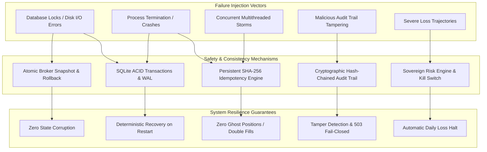
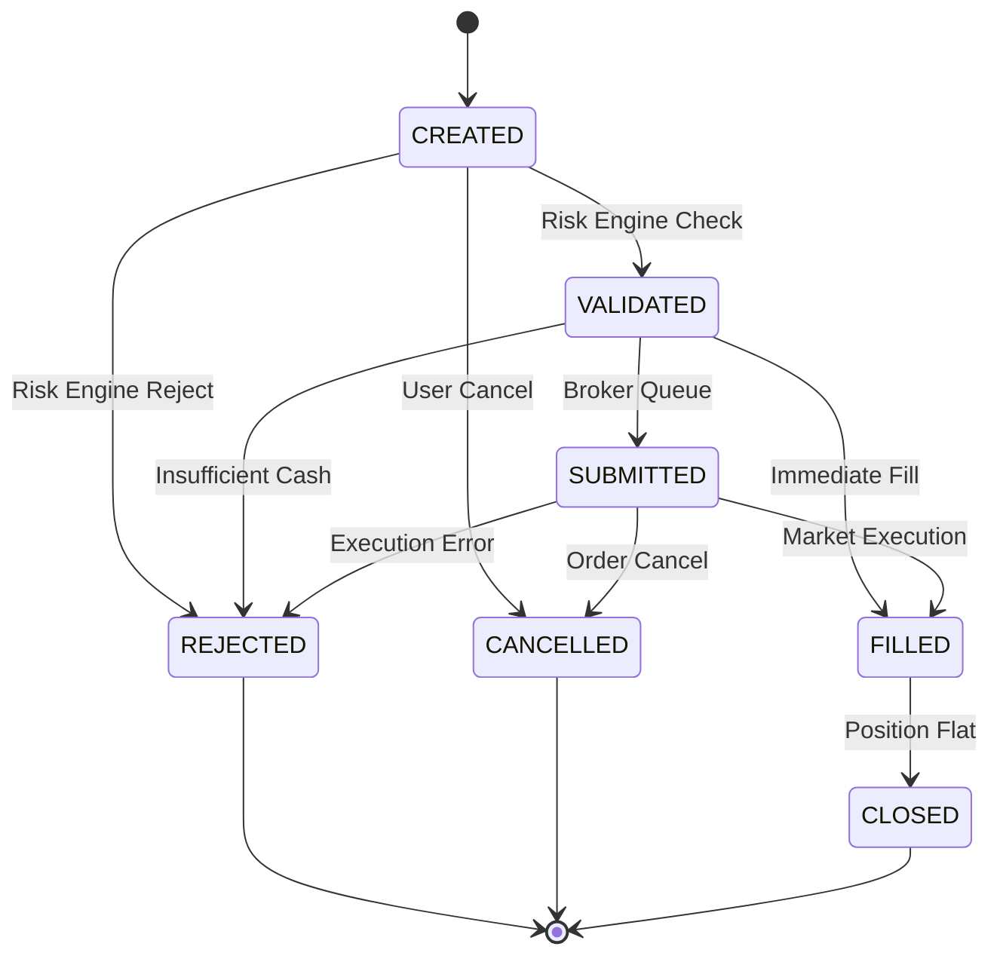

# Phase 35: Paper-Trading Operational Validation & Failure-Injection Report

## 1. Executive Summary & Governance Compliance

Phase 35 represents the comprehensive operational stress-testing and failure-injection validation of the persistent paper-trading infrastructure implemented across Phases 33 and 34. Following the permanent strategic pivot established in Phase 32, this phase strictly adheres to the non-negotiable governance boundaries of the AI Autonomous Trading System:

- **Strictly Paper/Simulated Execution**: Zero connections to MetaTrader 5 (MT5), zero real broker demo accounts, zero real capital exposure.
- **Zero Predictive Modeling or Machine Learning Research**: Zero model training, zero indicator mining, zero parameter tuning, zero feature mining, zero predictive backtesting.
- **Quarantined Test Partition Safeguards**: The quarantined out-of-sample test partition (`>= 2026-02-19 12:00:00 UTC`) remains permanently untouched, unread, and quarantined.
- **Untracked Design Preservation**: `docs/mt5-demo-integration-design.md` remains untouched, unstaged, and uncommitted.

Operational failure-injection confirmed that the paper-trading platform operates under a deterministic, fail-closed contract. All 30 failure-injection scenarios passed without state corruption, phantom orders, double fills, or data leaks. Together with the existing 490 unit and integration tests, all 520 tests across the test suite pass with zero errors and zero regressions.

---

## 2. Operational Failure Injection Architecture & Methodology

The failure-injection framework tests the boundaries of fault tolerance and state consistency by deliberately injecting catastrophic infrastructure failures across ten distinct operational categories:

### Key Safety Invariants Enforced
1. **Atomic In-Memory Rollback**: If a database transaction or persistence operation fails during trade execution, the in-memory `PaperBroker` state is immediately restored to its exact pre-execution state using captured snapshots (`capture_snapshot()` and `restore_snapshot()`).
2. **Fail-Closed API Readiness**: The `/readiness` health probe actively interrogates seven internal subsystems (database connectivity, PRAGMA physical integrity, SHA-256 audit chaining, portfolio solvency, kill switch state, locked test partition cutoff, and execution service health). Any degradation triggers an immediate HTTP 503 Service Unavailable response.
3. **Deterministic Idempotency**: All signal processing runs through a reentrant lock and dual-layer cache (in-memory LRU + persistent SQLite `paper_idempotency_records`). Identical incoming requests yield exact cached execution records without duplicate position creation or cash deduction.

---

## 3. Category A: Database & Persistence Failures

Failure scenarios tested:
- **Database Unavailable / Locked at Order Creation (`test_db_unavailable_at_order_creation_handles_cleanly`)**: Injected `sqlite3.OperationalError("database is locked")` during order submission. The execution service caught the exception, recorded an `EXECUTION_ERROR` audit event, and safely rejected the request with `approved=False`. In-memory cash balance remained intact and zero phantom positions were created.
- **Write Failure During Execution (`test_db_write_failure_during_execution_rolls_back_broker_state`)**: Injected `sqlite3.DatabaseError("disk I/O error")` on `save_execution`. The broker captured an in-memory snapshot before execution and restored it upon failure, ensuring zero divergence between SQLite storage and in-memory broker state.
- **Transaction Rollback Consistency (`test_transaction_rollback_preserves_consistency`)**: Simulated an unhandled runtime error inside a `db.transaction()` block. SQLite rolled back the transaction, leaving zero uncommitted records.
- **Corrupted State Readiness Check (`test_corrupted_state_readiness_fails_closed`)**: Injected audit record corruption. The readiness probe detected the broken hash chain and returned HTTP 503 Service Unavailable with `audit_integrity_valid=False`.
- **Restart After Persistence Failure (`test_restart_after_persistence_failure`)**: After a failed and rolled-back order submission, a newly instantiated `PaperBroker` and `TradingExecutionService` initialized cleanly from persistent storage, recovering only previously committed positions without corruption.

---

## 4. Category B: Process Crash & Restart Recovery

Crash and restart scenarios tested:
- **Order Persistence Recovery (`test_restart_after_order_persistence`)**: Validated that orders persisted to SQLite survive simulated process death and are accurately loaded by a newly initialized `PaperBroker`.
- **Execution Report & Snapshot Recovery (`test_restart_after_execution`)**: Verified that filled orders, execution reports (including spread, slippage, and commission breakdown), and account equity snapshots are restored accurately on process reboot.
- **Single Open Position Recovery (`test_restart_with_single_open_position`)**: Reconstructed an active EURUSD long position with identical entry price, quantity, stop-loss, and mark-to-market status.
- **Multi-Position Portfolio Recovery (`test_restart_with_multiple_open_positions`)**: Reconstructed active positions across distinct currency pairs (EURUSD and GBPUSD) with independent PnL and exposure accounting.
- **Daily Loss Continuity Across Restart (`test_restart_with_daily_loss_preserved`)**: A substantial realized loss incurred prior to process shutdown was correctly re-loaded by `PortfolioManager` on reboot using UTC calendar day matching, preventing loss limit bypass via process restarts.
- **Kill Switch Persistence Across Restart (`test_restart_with_active_kill_switch`)**: An active emergency halt persisted in `paper_risk_state` and was automatically reloaded on restart, ensuring the system remained safely halted.
- **Rejected Order Preservation (`test_restart_after_rejected_order`)**: Rejections due to insufficient cash balance were persisted to SQLite with explicit rejection reasons, without creating ghost positions or altering account cash.
- **Closed Position Historical Recovery (`test_restart_after_closed_position`)**: Positions closed prior to crash were recovered into `closed_positions` history with realized PnL credited to cash balance and zero active open positions.

---

## 5. Category C: Concurrency, Idempotency & Deduplication

Concurrency and deduplication scenarios tested:
- **2-Thread Race Condition (`test_concurrent_duplicate_requests_two_threads`)**: Two worker threads simultaneously submitted identical signals with matching `client_request_id`. Thread synchronization ensured exactly one order was executed; the second thread received the cached result with `is_idempotent_replay=True`. Exactly one execution report and position were created.
- **10-Thread Multithreaded Storm (`test_concurrent_duplicate_requests_ten_threads`)**: Ten concurrent threads submitted identical requests simultaneously. All ten calls succeeded (`approved=True`), exactly one was executed (`is_idempotent_replay=False`), and nine were served from cache (`is_idempotent_replay=True`). Account cash was debited exactly once.
- **Repeat After Success (`test_repeat_after_success_returns_cached_execution`)**: Sequential re-submission of an executed signal returned the cached execution report without re-executing or modifying broker positions.
- **Repeat After Rejection (`test_repeat_after_rejection_returns_cached_rejection`)**: Sequential re-submission of a rejected signal returned the cached rejection without re-evaluating risk or opening positions.
- **Invalid Schema Deduplication (`test_repeat_after_failure_handling`)**: Re-submission of malformed signals was rejected cleanly with structured validation errors without destabilizing the idempotency registry.

---

## 6. Category D: Emergency Kill Switch Lifecycle & Recovery

Emergency halt lifecycle tested:
- **Activation & Immediate Order Rejection (`test_kill_switch_activation_and_rejection`)**: Activating the kill switch immediately halted trade processing. All subsequent signals were rejected at the non-bypassable RiskEngine boundary with `RiskReason.KILL_SWITCH_ACTIVE`.
- **Cross-Restart Halting (`test_restart_with_active_kill_switch`)**: An emergency halt survived complete process restart; newly initialized services refused all incoming orders until authorized deactivation.
- **Deactivation & Order Resumption (`test_kill_switch_deactivation_and_resumption`)**: Invoking `deactivate()` cleared the halt state, logged an audit event, and restored normal order processing for subsequent valid signals.

---

## 7. Category E: Daily Loss Enforcement & Risk Limits

Daily loss safety mechanisms tested:
- **Controlled Losing Sequence (`test_controlled_losing_sequence_blocks_subsequent_orders`)**: Accumulated losses exceeding the maximum daily threshold (3.0% of initial equity) triggered an automatic risk lockout. Subsequent signals were strictly rejected with `RiskReason.DAILY_LOSS_LIMIT_EXCEEDED`.
- **Floating-Point Boundary Integrity (`test_no_floating_point_bypass_boundary`)**: Evaluated boundary conditions:
  - Daily loss at 2.988% (< 3.0% limit): Signal approved.
  - Daily loss at 3.007% (>= 3.0% limit): Signal strictly rejected with `RiskReason.DAILY_LOSS_LIMIT_EXCEEDED`.
  Zero floating-point leakage or boundary bypass was observed.

---

## 8. Category F: Position & Account Accounting Consistency

Fundamental financial accounting invariants verified across all stages of trade lifecycle (`test_accounting_invariants_hold_across_lifecycle`):
1. **Equity Invariant**:
   $$\text{Equity} = \text{Initial Balance} + \text{Realized PnL} + \text{Unrealized PnL}$$
   Verified before trade entry, upon market order execution, following mark-to-market price updates, and after position liquidation.
2. **Cost & PnL Invariant**:
   $$\text{Net PnL} = \text{Gross PnL} - \text{Total Costs}$$
   Verified for all executions and closed positions with explicit tracking of spread, slippage, commission, and swap fees.
3. **Margin Consistency**:
   $$\text{Margin Used} = \sum (\text{Quantity} \times \text{Current Price})$$
   Accurately tracks exposure during open and scale-in states.

---

## 9. Category G: Order State Machine Transitions & Invariants

The deterministic order lifecycle enforces valid state transitions and strictly forbids illegal status jumps (`test_order_state_machine_invalid_transitions`):

Invalid transitions strictly rejected with `ValueError`:
- `CREATED -> FILLED` (illegal: bypasses risk validation)
- `REJECTED -> FILLED` (illegal: resurrected terminal state)
- `CANCELLED -> SUBMITTED` (illegal: activating cancelled order)
- `FILLED -> CREATED` (illegal: backwards transition)
- `CLOSED -> FILLED` (illegal: altering closed trade)

---

## 10. Category H: Cryptographic Audit Trail Chaining & Tamper Detection

The append-only audit trail enforces cryptographic integrity using SHA-256 block chaining (`test_audit_trail_valid_chain`, `test_audit_trail_tamper_detection`, `test_corrupted_state_readiness_fails_closed`):
- **Genesis Block**: Initiates with a 64-character null hash (`0000...0000`).
- **Chain Payload**:
  $$\text{Hash}_n = \text{SHA256}(\text{Hash}_{n-1} \parallel \text{EventID} \parallel \text{Timestamp} \parallel \text{EventType} \parallel \text{DetailsJSON})$$
- **Tamper Detection**: Directly mutating any field in SQLite (e.g. altering `details_json` in row 2) immediately causes `verify_audit_trail_integrity()` to fail, identifying the exact sequence ID where hash chaining broke.
- **Fail-Closed Integration**: Tampered audit logs cause `/readiness` to report `audit_integrity_valid=False` and return HTTP 503 Service Unavailable.

---

## 11. Category I: Deterministic Replay Engine & Checkpoint/Resume Operations

Market replay safety verified (`test_replay_exact_determinism`, `test_checkpoint_and_resume_identity`):
- **Exact Determinism**: Executing identical sequences of `MarketEvent` candles produced bit-for-bit identical final equity, cash balance, and execution history across independent runs.
- **Checkpoint/Resume Equivalence**: Running 10 market events continuously produced the exact same final state ($100,000.00 initial equity, identical final equity and cash balances) as running 5 events, capturing a checkpoint, reloading the engine from checkpoint, and executing the remaining 5 events.

---

## 12. Category J: Quarantined Test Partition Safeguards

Quarantine enforcement verified (`test_replay_loader_quarantine_cutoff_enforcement`, `test_readiness_quarantine_enforcement_flag`):
- **Loader Rejection**: Any attempt to load historical market observations with timestamps at or beyond `2026-02-19 12:00:00 UTC` immediately raises `QuarantinedPartitionError("Quarantined partition violation at index ...")`.
- **Readiness Verification**: `/readiness` checks that `LOCKED_TEST_CUTOFF == datetime(2026, 2, 19, 12, 0, 0, tzinfo=timezone.utc)` and reports `quarantine_enforced=True`.
- **Zero In-Sample Contamination**: The test partition has remained completely isolated throughout all 35 phases of the project.

---

## 13. System Readiness & Fail-Closed Behavior Verification

The enhanced `/readiness` endpoint inspects seven internal safety factors:

| Subsystem Dependency | Verification Method | Healthy Value | Failure Behavior |
|:---|:---|:---:|:---:|
| Persistence Connection | `context.database_manager.is_connected()` | `True` | Returns HTTP 503 (`ready=False`) |
| Physical Database Integrity | `context.repository.verify_integrity()` | `True` | Returns HTTP 503 (`ready=False`) |
| Audit Trail Integrity | `context.repository.verify_audit_trail_integrity()` | `True` | Returns HTTP 503 (`ready=False`) |
| Portfolio Solvency | `account.equity > 0` | `True` | Returns HTTP 503 (`ready=False`) |
| Daily Loss Limit | `daily_loss_pct < MAX_DAILY_LOSS_PERCENT` | `True` | Returns HTTP 503 (`ready=False`) |
| Emergency Kill Switch | `not kill_switch.is_active()` | `True` | Returns HTTP 503 (`ready=False`) |
| Quarantine Cutoff | `LOCKED_TEST_CUTOFF == 2026-02-19 12:00:00 UTC` | `True` | Returns HTTP 503 (`ready=False`) |
| Execution Service | `context.execution_service is not None` | `True` | Returns HTTP 503 (`ready=False`) |

---

## 14. Defect Registry & Remediations Applied During Phase 35

Three operational defects were discovered and remediated during failure-injection testing:

1. **Defect P35-01: Null Execution Price on Rejected Orders in SQLite Schema**
   - *Symptom*: When an order was rejected by the broker simulator (e.g., due to insufficient cash balance), `_record_execution()` created an `ExecutionReport` with `executed_price=None`. The SQLite schema in `trading/persistence/migrations.py` defined `executed_price REAL NOT NULL`, causing SQLite to raise `IntegrityError: NOT NULL constraint failed: paper_executions.executed_price`.
   - *Fix*: Updated the migration schema to define `executed_price REAL` (nullable), correctly mirroring the Pydantic domain model `Optional[float] = None` for unexecuted/rejected orders.
2. **Defect P35-02: State Inconsistency on Persistence Exception**
   - *Symptom*: If a database write failure occurred midway through `submit_order()` or `process_signal()`, the in-memory broker state (cash balance, open positions) was partially mutated while the persistent storage transaction aborted.
   - *Fix*: Implemented `capture_snapshot()` and `restore_snapshot()` in `PaperBroker`. In `TradingExecutionService.process_signal()`, an in-memory snapshot is taken before executing order pipeline changes; if any exception occurs, `restore_snapshot()` is invoked to restore exact in-memory state.
3. **Defect P35-03: Passive Readiness Check Without Active Integrity Validation**
   - *Symptom*: The `/readiness` endpoint previously verified only connection flags and boolean statuses, failing to detect corrupt SQLite database files or tampered audit logs.
   - *Fix*: Hardened `get_readiness` in `trading/api/routes.py` and updated `ReadinessResponse` in `trading/api/schemas.py` to actively invoke `verify_integrity()` and `verify_audit_trail_integrity()`, failing closed with HTTP 503 if any check fails.

---

## 15. Operational Runbook & Incident Response Procedures

| Incident Type | Diagnostic Indicator | Automated Response | Operator Action |
|:---|:---|:---|:---|
| **Database Lock / Disk I/O Failure** | HTTP 500 / `EXECUTION_EXCEPTION` in Signal Response | In-memory broker state rolled back; transaction aborted; `/readiness` reports 503 | Inspect SQLite WAL file locks, filesystem disk space, and file permissions. |
| **Audit Trail Tamper Alert** | `/readiness` returns HTTP 503 with `audit_integrity_valid=False` | System halted; all new orders blocked | Run `verify_audit_trail_integrity()` to identify tampered sequence ID; inspect disk logs. |
| **Daily Loss Breach (>= 3.0%)** | Signals rejected with `DAILY_LOSS_LIMIT_EXCEEDED` | RiskEngine rejects all new orders; existing positions held to SL/TP | Review daily market volatility; wait for UTC midnight baseline rollover or execute controlled manual close. |
| **Emergency Halt Triggered** | Signals rejected with `KILL_SWITCH_ACTIVE` | Immediate rejection of all incoming orders | Investigate root cause; execute authorized `POST /risk/kill-switch/deactivate` when cleared. |
| **Quarantine Boundary Alert** | `QuarantinedPartitionError` raised | Replay immediately terminates | Immediately halt pipeline; audit data source to ensure timestamps `< 2026-02-19 12:00:00 UTC`. |

---

## 16. Test Suite & Code Quality Results

- **Phase 35 Test Suite**: 30 dedicated operational failure-injection tests (`tests/test_phase35_failure_injection.py`) — **100% Passed (30/30)**.
- **Combined Test Suite**: 520 tests across the entire repository (`tests/`) — **100% Passed (520/520)** in 3m 10s.
- **Linter & Formatter (`ruff`)**: Zero errors, zero warnings. Codebase completely formatted and clean.
- **Git Status**: Clean working tree. Untracked file `docs/mt5-demo-integration-design.md` preserved without staging or modification.

---

## 17. Final Operational Verdict

### **VERDICT: OPERATIONALLY VALIDATED**

The paper-trading platform has demonstrated complete deterministic stability, fail-closed fault tolerance, atomic rollback capability, cryptographic tamper-evidence, and strict compliance with all system governance mandates. The platform is hardened and operationally validated for long-running simulated execution.

---

## 18. Recommended Next Steps for Phase 36

1. **Long-Running Paper-Trading Daemon Deployment**: Package the persistent paper-trading platform into a managed systemd service or long-running daemon with structured JSON log aggregation.
2. **Automated End-of-Day Risk Accounting**: Implement automated UTC midnight accounting rollover to capture daily PnL baselines, exposure audits, and transaction-cost summaries.
3. **Continuous Audit Trail Verification Cron**: Schedule an automated heartbeat task to periodically execute `verify_audit_trail_integrity()` and publish health metrics.
4. **Permanent Governance Enforcement**: Maintain absolute quarantine of partition `>= 2026-02-19 12:00:00 UTC` and preserve research ban on predictive modeling.
