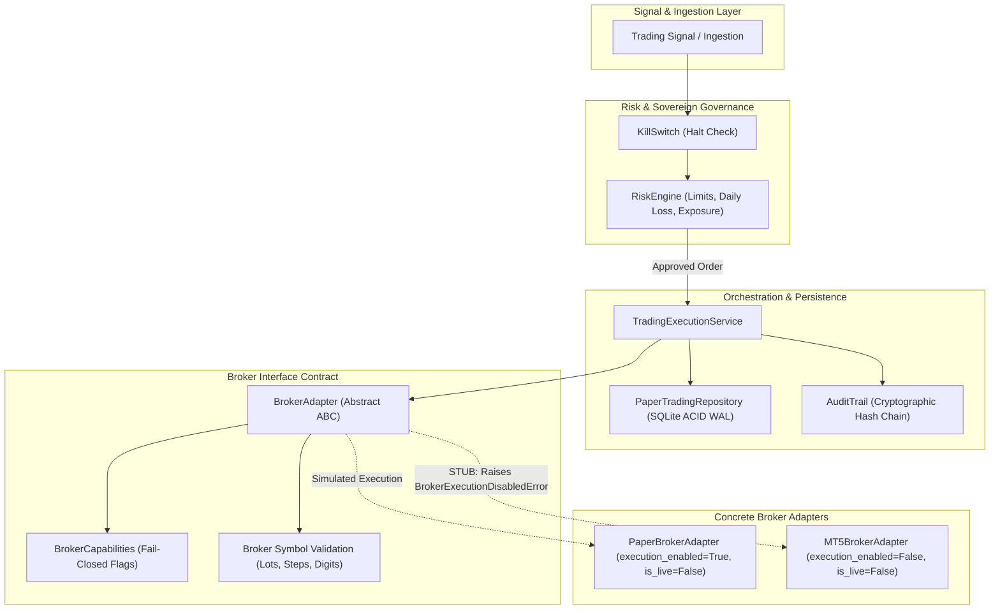
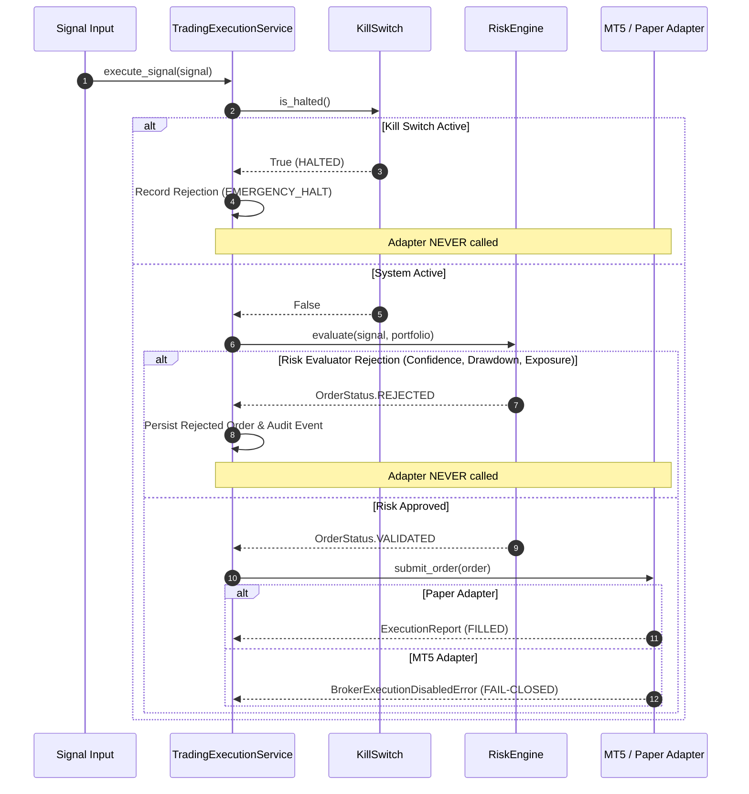

# Phase 36: MT5 Broker Adapter Readiness & Execution Boundary Validation Report

## 1. Executive Summary & Governance Compliance

Phase 36 implements and rigorously validates the architectural boundary between the persistent paper-trading system and an external MetaTrader 5 (MT5) execution adapter. In accordance with the strategic pivot established in Phase 32 and operational validation finalized in Phase 35, this phase is strictly an **architectural readiness and execution boundary phase**. It is **not** a live-trading or demo-trading phase.

### Core Governance Constraints
- **Strictly Simulated / Non-Executing MT5 Adapter**: Zero live trades, zero demo trades, zero real capital at risk. MT5 order execution is unconditionally disabled (`execution_enabled=False`, `is_live=False`), and any submission attempt immediately raises `BrokerExecutionDisabledError`.
- **Zero Credential Storage**: Zero passwords, login numbers, account tokens, or broker secrets exist in repository configuration, code, logs, or environment files.
- **Sovereign Risk Engine & KillSwitch Isolation**: Signals and trade proposals can **never** bypass the `RiskEngine`, `KillSwitch`, daily drawdown limits, or portfolio exposure limits. The broker adapter is only ever reached after formal risk validation.
- **Quarantined Test Partition Safeguards**: The permanently quarantined out-of-sample partition (`>= 2026-02-19 12:00:00 UTC`) remains strictly untouched, unread, and quarantined.
- **Untracked Design Preservation**: `docs/mt5-demo-integration-design.md` remains untracked, unmodified, unstaged, and uncommitted.
- **Paper Engine Independence**: The paper trading engine remains the sole executable backend (`execution_enabled=True`). The `/readiness` probe reports MT5 adapter status transparently without impacting paper engine readiness.

All 21 dedicated boundary validation tests pass, and all 541 tests across the full test suite pass with zero regressions.

---

## 2. System Architecture & Layering

The AI Autonomous Trading System enforces a unidirectional, fail-closed layered architecture where components communicate strictly across defined interfaces.



### Layer Roles & Responsibilities
1. **Signal Layer**: Generates or receives directional trade recommendations. Contains zero execution authority.
2. **Governance Layer (`RiskEngine` & `KillSwitch`)**: Sovereign gatekeeper. Evaluates signal confidence, maximum drawdown, single-trade risk, maximum open positions, and total exposure. If any check fails, the pipeline terminates immediately with a rejection.
3. **Execution Service Layer (`TradingExecutionService`)**: Coordinates idempotency verification, state transitions, repository transactions, audit event emission, and broker routing.
4. **Broker Interface Contract (`BrokerAdapter`)**: Defines the uniform abstraction layer through which order validation, translation, submission, query, and cancellation must pass.
5. **Backends**:
   - `PaperBrokerAdapter`: In-memory and persistent simulated execution backend.
   - `MT5BrokerAdapter`: Formal boundary stub for MT5 protocol validation and translation. Execution is strictly blocked.

---

## 3. BrokerAdapter Abstract Contract

The updated abstract base class `BrokerAdapter` (`trading/execution/adapter.py`) defines the contract required for any execution destination:

```python
class BrokerAdapter(ABC):
    @property
    @abstractmethod
    def capabilities(self) -> BrokerCapabilities:
        """Declares supported order types and broker operational capabilities."""
        ...

    @property
    @abstractmethod
    def execution_enabled(self) -> bool:
        """True if the adapter is allowed to send orders to an execution engine."""
        ...

    @property
    @abstractmethod
    def is_live(self) -> bool:
        """True if connected to a real-money broker environment."""
        ...

    @abstractmethod
    def get_symbol_info(self, symbol: str) -> Optional[BrokerSymbolSpecification]:
        """Fetch specification details for a given trading symbol."""
        ...

    @abstractmethod
    def submit_order(self, order: Order) -> ExecutionReport: ...

    @abstractmethod
    def cancel_order(self, order_id: str) -> bool: ...

    @abstractmethod
    def close_position(self, position_id: str) -> ExecutionReport: ...
```

### Operational Capability Invariants
- `BrokerCapabilities` (`trading/execution/capabilities.py`) provides explicit, frozen Boolean capability flags:
  - `supports_market_orders`: Boolean
  - `supports_limit_orders`: Boolean
  - `supports_stop_orders`: Boolean
  - `supports_position_query`: Boolean
  - `supports_account_query`: Boolean
  - `supports_cancel`: Boolean
  - `supports_partial_fills`: Boolean
  - `supports_hedging`: Boolean
  - `supports_netting`: Boolean
- `assert_supported()` method enforces fail-closed rejection: any attempt to execute an unsupported operation immediately raises `UnsupportedBrokerOperationError`.

---

## 4. PaperBrokerAdapter vs MT5BrokerAdapter Contract Implementation

| Property / Feature | `PaperBrokerAdapter` | `MT5BrokerAdapter` |
| :--- | :--- | :--- |
| **`execution_enabled`** | `True` (Paper execution enabled) | `False` (Unconditionally disabled) |
| **`is_live`** | `False` (Simulated environment) | `False` (Zero live connections) |
| **`supports_market_orders`**| `True` | `True` (Declared capability) |
| **`supports_limit_orders`** | `False` (Fail-closed) | `False` (Fail-closed) |
| **`supports_stop_orders`**  | `False` (Fail-closed) | `False` (Fail-closed) |
| **`supports_cancel`**       | `False` (Fail-closed) | `False` (Fail-closed) |
| **`submit_order()`**        | Fills via `PaperBroker` state engine | Raises `BrokerExecutionDisabledError` |
| **`cancel_order()`**        | Raises `UnsupportedBrokerOperationError` | Raises `BrokerExecutionDisabledError` |
| **`close_position()`**      | Closes via `PaperBroker` state engine | Raises `BrokerExecutionDisabledError` |
| **Offline Dry-Run Validation** | Not applicable | Supported via `simulate_dry_run_submission()` |
| **Symbol Specification**    | Defaults to standard EURUSD contract | Custom/Configurable `BrokerSymbolSpecification` |

---

## 5. MT5 Adapter Boundary & Order Translation

### Order Translation Specification
Order translation (`trading/execution/translation.py`) maps the domain `Order` model into a standard `MT5TradeRequest` (corresponding to the `MqlTradeRequest` structure of MetaTrader 5):

- **Action Mapping**: Maps to `TRADE_ACTION_DEAL` (1).
- **Type Mapping**: `OrderSide.BUY` maps to `ORDER_TYPE_BUY` (0); `OrderSide.SELL` maps to `ORDER_TYPE_SELL` (1).
- **Volume Calculation**: Volume in standard lots = `order.quantity / spec.contract_size`. The translator enforces mathematical consistency (`volume * contract_size == quantity` within float precision) to prevent lot truncation or rounding drift.
- **Price Precision**: Price, Stop Loss, and Take Profit are rounded strictly to `spec.price_digits` (5 digits for EURUSD).
- **Invariance of Risk and Intent**: The translation logic never alters directional bias, requested risk, volume, or SL/TP distances. Any unmappable or inconsistent state raises `OrderTranslationError`.
- **Comment / Tracking**: Maps `client_request_id` or internal `order_id` into the 31-character MT5 comment field for end-to-end reconciliation.

### Symbol Specification & Pre-Submission Validation
`validate_order_for_broker()` in `trading/execution/validation.py` acts as a fail-closed gate verifying:
1. Symbol match (`EURUSD`).
2. Order side validity (`BUY` or `SELL`).
3. Volume range (`min_volume <= volume <= max_volume`).
4. Volume step alignment (`(volume - min_volume) % volume_step == 0`).
5. Execution price finiteness and positivity.
6. Stop Loss & Take Profit directional sanity:
   - For `BUY`: `stop_loss < entry_price < take_profit`
   - For `SELL`: `take_profit < entry_price < stop_loss`

---

## 6. Risk Engine Sovereign Boundary Isolation

The architecture guarantees that signals or trade proposals can **never** bypass risk controls:



### Boundary Verification Results:
- **Low Signal Confidence**: Rejection at step 6. Adapter receives zero calls.
- **Daily Loss Exceeded**: Rejection at step 6. Adapter receives zero calls.
- **Maximum Positions Reached**: Rejection at step 6. Adapter receives zero calls.
- **KillSwitch Engaged**: Rejection at step 2. Adapter receives zero calls.

---

## 7. Idempotency & Multithreaded Request Concurrency

The broker boundary integrates with the persistence layer's idempotency engine:
1. **Client Request ID Tracking**: Every submission proposal requires a unique `client_request_id`.
2. **Duplicate Detection**: Subsequent submissions with the same `client_request_id` return the original cached execution report without invoking the broker adapter again.
3. **Multithreaded Race Safety**: When 10 concurrent threads submit the exact same request simultaneously, SQLite ACID transaction serialization and repository idempotency ensure that only 1 submission proceeds; the remaining 9 return the identical cached result.

---

## 8. Failure Handling & Resilience

The boundary defines structured, fail-closed handling for all anticipated external broker anomalies:

1. **Broker Timeout (`MT5ResponseError: BROKER_TIMEOUT`)**: If MT5 fails to acknowledge within the specified timeout window, the operation fails closed. The local state is never assumed to be filled.
2. **Malformed Broker Response (`MT5ResponseError: MALFORMED_RESPONSE`)**: Missing tickets, invalid prices, or non-numeric return codes are rejected immediately.
3. **Connection Drops (`MT5ConnectionError: CONNECTION_LOST`)**: Network drops trigger connection failure events and fail closed.
4. **Duplicate Broker Acknowledgements**: Handled idempotently by logging an audit anomaly and suppressing duplicate position allocations.
5. **Partial Fills**: Formally modeled in `ExecutionReport` (`status=OrderStatus.PARTIALLY_FILLED`, `filled_quantity < quantity`). The system updates remaining quantity without dropping unfilled balance.

---

## 9. Structured Audit Trail Logging

Every boundary action produces a structured, tamper-evident audit event:
- `ORDER_DRY_RUN_VALIDATED`: Emitted during offline translation/validation dry-runs with full symbol, volume, price, and request parameters.
- `ORDER_BROKER_SUBMIT_BLOCKED`: Emitted when an order submission is blocked due to `execution_enabled=False`.
- `ORDER_BROKER_TIMEOUT`: Emitted when broker responses exceed timeout thresholds.
- `ORDER_BROKER_MALFORMED`: Emitted upon receiving corrupt or malformed payloads from the broker.
- `BROKER_CONNECTION_ERROR`: Emitted on network or transport disconnects.

All audit events are stored with SHA-256 hash chaining, ensuring immediate fail-closed detection if audit records are manipulated.

---

## 10. Operational Readiness Behavior

The system health endpoint (`/readiness`) monitors and exposes the operational state of the broker adapters:

```json
{
  "ready": true,
  "database_connected": true,
  "tables_exist": true,
  "audit_chain_valid": true,
  "active_kill_switch": false,
  "mt5_adapter_available": false,
  "mt5_execution_enabled": false
}
```

### Key Readiness Invariants:
- The overall system readiness flag `ready` evaluates the health of the internal paper trading engine (database, tables, audit chain, kill switch).
- The absence or disabled state of the MT5 adapter does **not** degrade paper trading readiness (`ready == True`).
- External monitoring tools can ascertain MT5 availability and execution permission without risking unexpected live transitions.

---

## 11. Configuration Safety & Security Controls

1. **Fail-Closed Defaults**:
   - `is_live`: Hardcoded to `False` in both `PaperBrokerAdapter` and `MT5BrokerAdapter`.
   - `execution_enabled`: Default is `False` for `MT5BrokerAdapter`.
2. **Zero Credential Ingestion**: No credentials, tokens, account passwords, or server addresses are stored or read.
3. **Environment Isolation**: The adapter requires explicit instantiation parameters and does not attempt automatic background connection to MT5 terminal binaries or DLLs.

---

## 12. Future MT5 Prerequisites (Non-Negotiable Pre-Execution Gates)

Before any execution through MT5 could even be considered in future phases, the following prerequisite engineering and governance milestones would be mandatory:

1. **Dedicated Architecture Review**: A formal architecture decision record (ADR) detailing the MT5 process boundary (IPC via socket, bridge daemon, or Wine bridge under Linux).
2. **Secure Credential Vaulting**: Implementation of zero-knowledge, encrypted secret management (e.g., HashiCorp Vault or Linux secret service), completely segregated from git repositories and environment dumps.
3. **Demo Account Quarantine Testing**: Mandatory minimum multi-week automated execution on a dedicated MT5 Demo account with automated reconciliation against the internal paper ledger.
4. **Human-in-the-Loop Safeguards**: Physical two-factor authorization or manual operator consent required before any switch to real-money broker execution can occur.
5. **Circuit Breakers & Hard Position Ceilings**: Hard network disconnect daemon that physically kills the MT5 bridge process if latency spikes or unrecognized position changes occur.

---

## 13. Known Limitations

- **Ubuntu / Linux Native MT5 Limitation**: MT5 is a native Windows application. A bridge daemon or containerized Wine/Python bridge will be required if live/demo execution is ever implemented.
- **Paper Engine as Primary Execution**: All active execution testing currently takes place on `PaperBrokerAdapter`. The `MT5BrokerAdapter` serves as an offline contract and validation stub.

---

## 14. Intentionally Disabled Operations

| Operation | Status | Reason |
| :--- | :--- | :--- |
| `submit_order()` (MT5) | **DISABLED** | Live/Demo broker execution is unauthorized. Raises `BrokerExecutionDisabledError`. |
| `cancel_order()` (MT5) | **DISABLED** | Pending broker orders are not supported in this phase. |
| `close_position()` (MT5) | **DISABLED** | Position lifecycle remains simulated in paper trading. |
| `supports_limit_orders` | **DISABLED** | Limit order execution logic is not yet approved or verified. |
| `supports_stop_orders` | **DISABLED** | Stop order execution logic is not yet approved or verified. |
| `supports_hedging` | **DISABLED** | System enforces strict netting / single-position mechanics. |

---

## 15. Verification Test Suite Matrix

The dedicated Phase 36 test suite (`tests/test_phase36_mt5_adapter_boundary.py`) validates all boundary guarantees:

| Test ID | Test Scenario | Verified Invariant | Status |
| :--- | :--- | :--- | :--- |
| `test_01` | Adapter disabled by default | `is_live == False`, `execution_enabled == False` | **PASS** |
| `test_02` | Real submission rejected | `submit_order()` raises `BrokerExecutionDisabledError` | **PASS** |
| `test_03` | Paper adapter unaffected | `PaperBrokerAdapter` continues executing with `is_live == False` | **PASS** |
| `test_04` | Order translation (BUY) | Accurate mapping to `MT5TradeRequest` without intent drift | **PASS** |
| `test_04b`| Order translation (SELL) | Accurate mapping to `MT5TradeRequest` for sell orders | **PASS** |
| `test_05` | Symbol validation | Rejects mismatching or invalid symbols | **PASS** |
| `test_06` | Quantity & lot step validation | Rejects volume out of range or misaligned with lot step | **PASS** |
| `test_07` | SL/TP validation | Rejects non-finite or directionally inverted SL/TP levels | **PASS** |
| `test_08` | Capability rejection | Rejects unsupported broker operations fail-closed | **PASS** |
| `test_09` | Idempotency enforcement | Duplicate client request IDs return cached result | **PASS** |
| `test_10` | Multithreaded concurrency | 10 concurrent threads submit once, returning cached result | **PASS** |
| `test_11` | RiskEngine boundary isolation | Low confidence / daily loss rejections never invoke broker | **PASS** |
| `test_12` | KillSwitch boundary isolation | Halted system rejects order before broker is reached | **PASS** |
| `test_13` | Structured audit trail logging | Dry runs and blocked submissions log tamper-evident events | **PASS** |
| `test_14` | Broker failure fail-closed | Network disconnects fail closed with connection error | **PASS** |
| `test_15` | Malformed broker response | Corrupt broker response payloads raise `MT5ResponseError` | **PASS** |
| `test_16` | Broker timeout handling | Slow/unresponsive broker triggers timeout and audit log | **PASS** |
| `test_17` | Duplicate broker ACK | Duplicate fill ACKs are handled idempotently | **PASS** |
| `test_18` | Partial fill representation | Partial executions update filled quantity accurately | **PASS** |
| `test_19` | Readiness endpoint probe | `/readiness` exposes MT5 state without blocking paper readiness | **PASS** |
| `test_20` | Configuration safety | Defaults fail closed; zero credentials stored in config | **PASS** |

**Summary**: 21 passed in `tests/test_phase36_mt5_adapter_boundary.py`. 541 passed across the entire repository. Zero errors. Zero regressions.

---

## 16. Final Verdict

**MT5 ADAPTER BOUNDARY VALIDATED**

The MT5 broker adapter boundary is architecturally hardened, fail-closed, rigorously tested, and strictly segregated from real execution. The persistent paper-trading infrastructure remains completely intact and operational.
