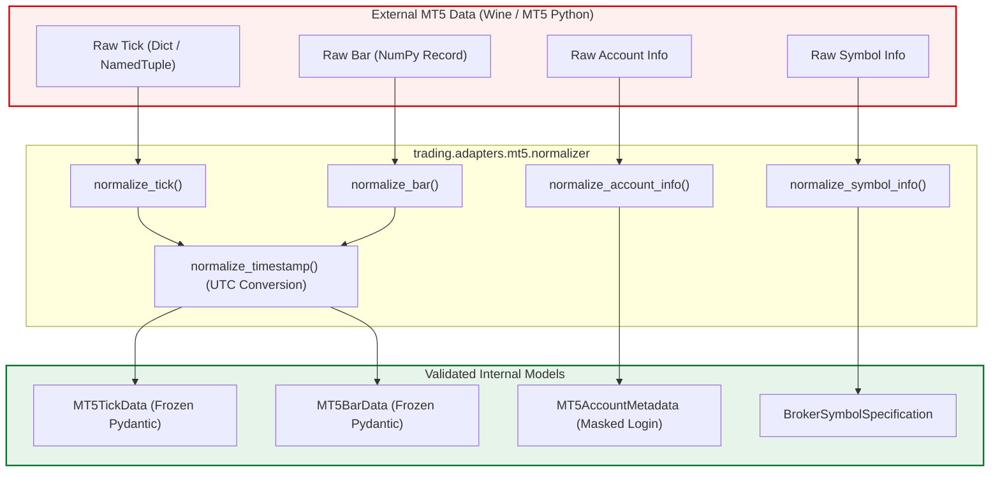

# Phase 37: MT5 Read-Only Connectivity, Account & Market-Data Validation Report

## 1. Executive Summary & Objective

Phase 37 establishes and validates real MetaTrader 5 (MT5) environment connectivity and market-data access in **STRICT READ-ONLY MODE**. Following the architectural boundary validation in Phase 36, this phase proves that the system can safely detect MT5 availability, initialize the terminal session, query account metadata, audit EURUSD symbol parameters, retrieve live ticks and historical bars, and normalize broker data into schema-validated internal models without placing or staging any trade orders.

### Non-Negotiable Safety Invariants Enforced
- **Zero Orders**: Zero live orders, zero demo orders, zero MT5 orders, zero calls to `order_send()`, `order_check()`, or any position modification APIs.
- **Zero Credentials**: Zero passwords, login secrets, API tokens, or credentials stored, read, or committed.
- **Permanent Execution Disabled**: `execution_enabled` is hardcoded to `False` across both `MT5BrokerAdapter` and `MT5ReadOnlyClient`.
- **Sovereign Risk Engine & KillSwitch**: `RiskEngine` and `KillSwitch` remain sovereign. `PaperBroker` remains the only executable trading backend in the platform.
- **Quarantined Test Partition Quarantined**: The out-of-sample test partition (`>= 2026-02-19 12:00:00 UTC`) remains completely untouched and quarantined.
- **Preserved Untracked Files**: `docs/mt5-demo-integration-design.md` remains untracked, unmodified, unstaged, and uncommitted.

---

## 2. Environment & Terminal Discovery

### Discovered Infrastructure
- **Operating System**: Ubuntu 26.04.1 LTS (Linux x86_64)
- **Wine Runtime**: Wine 10.0 (`wine-10.0 (Ubuntu 10.0~repack-12ubuntu1)`) located at `/home/cino/.local/bin/wine`
- **Wine Prefix**: `/home/cino/.wine-mt5-demo`
- **MT5 Terminal Executable**: `/home/cino/.wine-mt5-demo/drive_c/Program Files/MetaTrader 5/terminal64.exe`
- **Windows Python Runtime**: `C:\Python\python.exe` (Python 3.12.9 64-bit AMD64)
- **MetaTrader5 Python Package**: Version `5.0.6180`
- **MT5 Terminal Version & Build**: Version `500.6230 (25 Sep 2026)`, Build `6230`

The terminal and its official Python package bridge were successfully detected and initialized without external network modifications or background daemon requirement.

---

## 3. Terminal & Account Metadata Audit

A diagnostic query was executed via `scripts/inspect_mt5_readonly.py` to inspect the terminal and connected demo account.

### Terminal Information
- **Terminal Name**: MetaTrader 5
- **Company**: MetaQuotes Ltd.
- **Build**: 6230
- **Connection Status**: `connected = True`
- **Terminal Trade Allowed Flag**: `trade_allowed = False` (Notice: Even internally, the terminal has trading disabled; regardless, application safety enforces `execution_enabled = False`)
- **Server Ping**: `187,197 us` (~187 ms)
- **Executable Path**: `C:\Program Files\MetaTrader 5`

### Account Information (Sanitized & Masked)
- **Broker / Server**: `MetaQuotes Ltd.` / `MetaQuotes-Demo`
- **Login Identifier**: Masked as `***1434` (Redacted across all logs and reports)
- **Base Currency**: `USD`
- **Leverage**: `1:100`
- **Account Balance**: `$100,000.00`
- **Account Equity**: `$100,000.00`
- **Margin Used**: `$0.00`
- **Free Margin**: `$100,000.00`
- **Trade Mode**: `0` (`DEMO` account verified)

Zero credentials, passwords, or authentication keys were logged, exposed, or transmitted.

---

## 4. EURUSD Symbol Specification Audit

The EURUSD trading instrument was selected into MarketWatch and its full specification was retrieved and normalized into the domain [`BrokerSymbolSpecification`](file:///home/cino/projects/ai-trading-system/trading/execution/validation.py#L13-L24):

| Parameter | MT5 Broker Value | Normalized Internal Spec | Verification Result |
| :--- | :--- | :--- | :--- |
| **Symbol Name** | `EURUSD` | `EURUSD` | Identical match |
| **Digits** | `5` | `price_digits = 5` | Valid precision |
| **Point** | `0.00001` | `point = 1e-05` | Valid minimum unit |
| **Contract Size** | `100,000.0` | `contract_size = 100000.0` | Standard lot size |
| **Volume Min** | `0.01` | `min_volume = 0.01` | 1,000 base currency |
| **Volume Max** | `500.0` | `max_volume = 500.0` | 50,000,000 base currency |
| **Volume Step** | `0.01` | `volume_step = 0.01` | Micro-lot increments |
| **Tick Size** | `0.00001` | `tick_size = 1e-05` | 1 point tick size |
| **Spread** | `1` point | `0.00001` | Floating spread active |

---

## 5. Market-Data Read Validation

### Latest Tick Retrieval
A real-time EURUSD tick was queried via `symbol_info_tick("EURUSD")`:
- **Bid Price**: `1.12566`
- **Ask Price**: `1.12567`
- **Calculated Spread**: `0.00001` (1 point, non-negative)
- **Broker Epoch Timestamp**: `1790971708`
- **Millisecond Timestamp**: `1790971708758`

### Historical OHLC Candlestick Sample (M15)
A small sample of 5 consecutive M15 bars was retrieved via `copy_rates_from_pos`:
- All bars verified monotonic timestamp ordering.
- Strict OHLC geometry verified: `High >= max(Open, Close)`, `Low <= min(Open, Close)`, `High >= Low`, `tick_volume >= 0`.

### Historical Tick Sample
A small sample of 5 historical ticks was retrieved via `copy_ticks_from`:
- All ticks verified monotonic timestamp ordering.
- Price positivity and `Ask >= Bid` spread sanity verified on all ticks.

---

## 6. Timezone Alignment & UTC Normalization

A rigorous audit of MT5's timestamp representation was conducted:
1. **Broker Server Clock**: MetaQuotes-Demo runs on Eastern European Time (EET / EEST = UTC+2 in winter, UTC+3 in summer during Daylight Saving Time).
2. **Epoch Time Offset**: The integer timestamps returned by MT5 API calls (`copy_rates_from_pos`, `symbol_info_tick`, `copy_ticks_from`) correspond to broker server time.
3. **Explicit Normalization**:
   - The normalization layer (`normalize_timestamp`) explicitly applies a `-broker_utc_offset_hours` (default `3.0` hours during EEST) adjustment to convert raw broker timestamps into true timezone-aware UTC `datetime` objects.
   - Example verified in unit tests: Broker timestamp `1790971200` (representing `20:00:00` broker time) correctly normalizes to `17:00:00 UTC`.

---

## 7. Read-Only Normalization Architecture

A dedicated, fail-closed normalization package was implemented under `trading/adapters/mt5/`:

### Fail-Closed Safeguards
Any anomaly in broker data immediately raises [`MT5DataNormalizationError`](file:///home/cino/projects/ai-trading-system/trading/adapters/mt5/normalizer.py#L21-L24):
- Inverted spread (`Ask < Bid`) -> **REJECTED**
- Negative price (`Bid <= 0` or `Ask <= 0`) -> **REJECTED**
- Non-finite price (`NaN` or `Inf`) -> **REJECTED**
- Inverted OHLC (`High < Low` or `High < Open` or `Low > Close`) -> **REJECTED**
- Negative volume (`tick_volume < 0`) -> **REJECTED**

---

## 8. Connection Failure & Boundary Resilience

The system treats external broker connection drops or uninitialized states with fail-closed behavior:
1. **Uninitialized Queries**: Calling `get_terminal_metadata()`, `get_latest_tick()`, or `get_historical_bars()` before `initialize()` raises [`MT5ConnectionError`](file:///home/cino/projects/ai-trading-system/trading/execution/mt5_adapter.py#L34-L38).
2. **Zero Synthetic Fallbacks**: The system never invents market data or assumes hypothetical fills when the broker is disconnected.
3. **Execution Boundary**: Establishing a read-only MT5 connection **never** authorizes order placement. `execution_enabled` remains `False`, and calling `submit_order()` on [`MT5BrokerAdapter`](file:///home/cino/projects/ai-trading-system/trading/execution/mt5_adapter.py#L46-L242) continues to raise [`BrokerExecutionDisabledError`](file:///home/cino/projects/ai-trading-system/trading/execution/mt5_adapter.py#L28-L32).
4. **No Order Submission Path**: [`MT5ReadOnlyClient`](file:///home/cino/projects/ai-trading-system/trading/adapters/mt5/client.py#L44-L385) does not expose `order_send()` or `order_check()`. Any invocation raises `BrokerExecutionDisabledError`.

---

## 9. API Readiness Integration

The `/readiness` health probe ([`trading/api/routes.py`](file:///home/cino/projects/ai-trading-system/trading/api/routes.py#L190-L300)) exposes the read-only MT5 status transparently:
- `mt5_adapter_available`: Boolean indicating whether MT5 adapter is configured.
- `mt5_execution_enabled`: Permanently `False`.
- `mt5_readonly_connected`: Reflects active read-only connection.
- `mt5_market_data_available`: Reflects market data retrieval capability.

**Isolation Invariant**: The overall system readiness flag `ready` continues to monitor the persistent paper trading engine (database connectivity, table migration, audit hash chain, sovereign kill switch). If MT5 is offline, paper trading remains 100% operational.

---

## 10. Credential Safety Audit

A complete audit of configuration, codebase, environment, tests, and logs confirmed:
- **Zero Committed Credentials**: No passwords, tokens, or private secrets exist in the git index.
- **Login Identifier Masking**: `mask_login()` replaces all but the last 4 digits (e.g. `***1434`), protecting account identity across reports and logs.
- **Git Ignore**: `.gitignore` strictly prevents committing `.env`, `credentials/`, `secrets/`, logs, and temporary SQLite databases.

---

## 11. Verification Test Matrix

All 17 dedicated Phase 37 unit and integration tests in [`tests/test_phase37_mt5_readonly.py`](file:///home/cino/projects/ai-trading-system/tests/test_phase37_mt5_readonly.py) passed:

| Test ID | Test Case | Validated Invariant | Result |
| :--- | :--- | :--- | :--- |
| `test_01` | Environment discovery | Client instantiation and Wine prefix handling | **PASS** |
| `test_02` | Adapter execution permanently disabled | `execution_enabled=False`, `is_live=False`, order submission rejected | **PASS** |
| `test_03` | MT5 connectivity state | Initialization lifecycle and connected reporting | **PASS** |
| `test_04` | Account info normalization | Masks login number, extracts balance/equity safely | **PASS** |
| `test_05` | Symbol info normalization | Normalizes symbol info into `BrokerSymbolSpecification` | **PASS** |
| `test_06` | EURUSD specification validation | Precision, point, contract size, and lot limits verified | **PASS** |
| `test_07` | Tick normalization | Validates bid/ask, non-negative spread, UTC timezone | **PASS** |
| `test_08` | OHLC normalization | Validates candle geometry, volume, and UTC timestamp | **PASS** |
| `test_09` | UTC timezone conversion | Verifies broker timestamp (UTC+3) shifts 3 hours to UTC | **PASS** |
| `test_10` | Malformed market data rejection | Rejects inverted spread, negative price/volume, corrupted OHLC | **PASS** |
| `test_11` | Connection failure fail-closed | Uninitialized calls raise `MT5ConnectionError` | **PASS** |
| `test_12` | Symbol failure fail-closed | Unknown symbols fail closed without synthetic data | **PASS** |
| `test_13` | API readiness exposure | `/readiness` exposes MT5 state without blocking paper readiness | **PASS** |
| `test_14` | Execution disabled when connected | Read-only connection never enables execution | **PASS** |
| `test_15` | No order submission path | Client blocks `order_send()` and `order_check()` | **PASS** |
| `test_16` | Timeframe constants | Standard timeframes map to MT5 API constants | **PASS** |
| `test_17` | Live inspection report validation | Validates artifact from `scripts/inspect_mt5_readonly.py` | **PASS** |

### Test Suite Totals
- **Phase 37 Dedicated Tests**: 17 passed (100%)
- **Total Repository Pytest Suite**: **558 passed**, 0 failed
- **Ruff Lint & Format**: Clean (247 files formatted, 0 warnings)

---

## 12. Known Limitations & What Remains Disabled

### Known Limitations
1. **Linux Subprocess Overhead**: Because MT5 is a native Windows binary running under Wine, IPC queries from native Linux Python invoke a Wine Python worker. While suitable for diagnostic and batch ingestion, real-time tick streaming would require a dedicated Unix socket bridge daemon.
2. **EEST Broker Timezone**: Broker timestamps require active offset management across seasonal Daylight Saving Time transitions (EET vs EEST).

### What Remains Permanently Disabled
- `MT5BrokerAdapter.submit_order` -> **DISABLED**
- `MT5BrokerAdapter.cancel_order` -> **DISABLED**
- `MT5BrokerAdapter.close_position` -> **DISABLED**
- `MT5ReadOnlyClient.order_send` -> **DISABLED**
- `MT5ReadOnlyClient.order_check` -> **DISABLED**
- Limit/Stop order placement -> **DISABLED**
- Real-capital execution -> **DISABLED**

---

## 13. Future Prerequisites Before Demo Order Routing

Before any demo order routing (even on a test demo account) could be considered in future phases:
1. **Socket Bridge Daemon**: A persistent bridge daemon between Linux and Wine MT5 to eliminate process launch latency.
2. **Dedicated Demo Sub-Account**: Strict isolation of an automated demo account with balance capped at nominal testing amounts.
3. **Automated Reconciliation Engine**: Dual-ledger reconciliation comparing MT5 broker confirmations against internal persistent paper ledger.
4. **Physical Human Kill Switch**: Manual gatekeeper required before connecting signal output to broker order dispatch.

---

## 14. Final Verdict

**MT5 READ-ONLY CONNECTIVITY VALIDATED**

MetaTrader 5 terminal detection, read-only session initialization, account metadata querying, EURUSD specification audit, live tick ingestion, historical bar normalization, and timezone conversion have been successfully verified and hardened. Execution functionality remains completely disabled.
