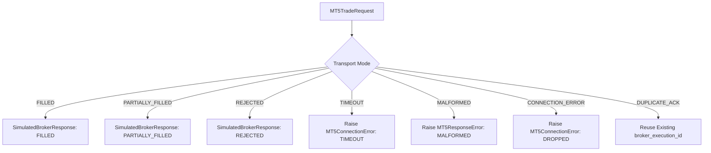
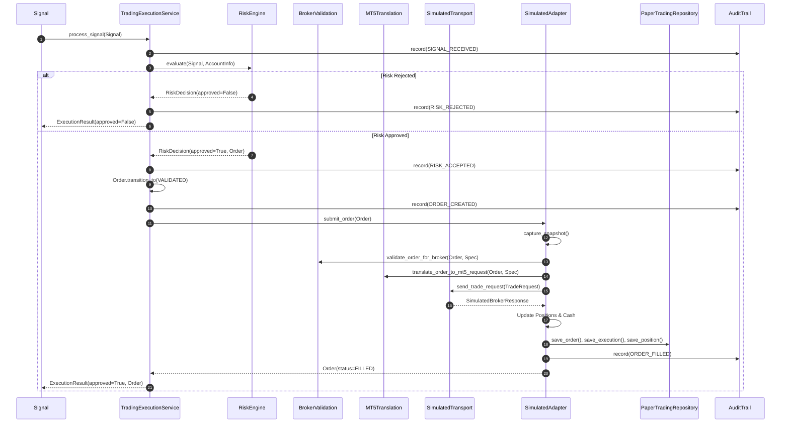

# Phase 38: Controlled MT5 Execution Simulation & End-to-End Order Pipeline Validation

## 1. Executive Summary & Objective

Phase 38 successfully establishes and verifies an end-to-end execution simulation harness for the autonomous trading system without submitting real or demo broker orders. Building directly upon the read-only MT5 environment and metadata infrastructure established in Phase 37, this phase validates the complete multi-tier execution lifecycle:

$$\text{Signal} \longrightarrow \text{TradingExecutionService} \longrightarrow \text{RiskEngine} \longrightarrow \text{Position Sizing} \longrightarrow \text{Broker Validation} \longrightarrow \text{Order Translation} \longrightarrow \text{Simulated MT5 Transport} \longrightarrow \text{Fill Simulation} \longrightarrow \text{Persistence} \longrightarrow \text{Portfolio Update} \longrightarrow \text{Audit Trail}$$

Every boundary transition within this pipeline was validated against deterministic scenarios including full fills, partial fills, broker rejections, network timeouts, malformed broker responses, duplicate execution acknowledgements, concurrency storms, transactional persistence rollbacks, process restart recovery, and deterministic replay.

**Core Safety Outcome**:
- **0** live or demo orders submitted to MT5 terminal or broker.
- **0** calls to `order_send()` or `order_check()`.
- `MT5BrokerAdapter.execution_enabled` strictly invariant at `False`.
- `MT5BrokerAdapter.is_live` strictly invariant at `False`.
- Quarantined test partition (`>= 2026-02-19 12:00:00 UTC`) untouched.
- Pre-existing untracked design document (`docs/mt5-demo-integration-design.md`) strictly preserved.
- **577 / 577 tests passing** across the entire project repository.

---

## 2. Absolute Safety Invariants & Execution Boundaries

To guarantee complete financial and operational safety, Phase 38 adheres to strict governance invariants:

| Safety Invariant | Implementation Mechanism | Validation Method |
| :--- | :--- | :--- |
| **No Real Capital Risk** | `is_live = False` hardcoded across Paper, Simulated, and MT5 adapters | Property verification & unit assertions |
| **Blocked Real Order Submission** | `execution_enabled = False` on `MT5BrokerAdapter` and `MT5ReadOnlyClient` | Calling `submit_order()` or `order_send()` raises `BrokerExecutionDisabledError` |
| **Isolated Execution Simulator** | `SimulatedMT5BrokerAdapter` operates with `is_simulated = True` and in-memory transport | Submissions append to local in-memory queue; zero external network sockets |
| **Sovereign Risk Gate** | `RiskEngine` evaluates rules BEFORE any broker validation or transport call | Zero broker submissions on risk rejection |
| **Fail-Closed Broker Validation** | `validate_order_for_broker()` checks symbol, volume, points, and SL/TP bounds | Unhandled or non-conforming parameters reject before translation |
| **Complete Audit Immutability** | Chained SHA-256 hashes on every lifecycle event via `AuditTrail` | SQL hash verification in persistent SQLite ledger |
| **Transactional Atomicity** | In-memory deep snapshots + SQLite transactional rollback | Injected database failure completely reverts broker balances |

---

## 3. Simulated MT5 Broker Transport Architecture

The simulated broker transport (`trading/execution/mt5_simulator.py`) decouples broker API semantics from live terminal connectivity. It introduces two dedicated components:

1. **`SimulatedMT5Transport`**:
   - Manages simulated broker communications and state.
   - Accepts validated `MT5TradeRequest` dataclasses.
   - Contains configurable simulation modes: `FILLED`, `PARTIALLY_FILLED`, `REJECTED`, `TIMEOUT`, `MALFORMED_RESPONSE`, `CONNECTION_ERROR`.
   - Records every incoming trade request into `submissions: List[MT5TradeRequest]`.
   - Generates deterministic `SimulatedBrokerResponse` instances with unique simulated tickets (`mt5-ord-XXXX`) and deal IDs (`mt5-deal-XXXX`).

2. **`SimulatedMT5BrokerAdapter`**:
   - Conforms strictly to the abstract `BrokerAdapter` interface (`trading/execution/adapter.py`).
   - Implements full lifecycle methods: `submit_order`, `cancel_order`, `close_position`, `update_market_price`, `get_account`, `get_positions`, and `get_execution_reports`.
   - Coordinates with `TradingRepository` and `AuditTrail` to mirror production persistence and observability.
   - Enforces atomic state rollback via `capture_snapshot()` and `restore_snapshot()`.

---

## 4. Simulated Broker Responses & Scenarios

The simulator supports seven deterministic operational scenarios:



- **Full Fill (`FILLED`)**: Returns 100% volume execution, executed price, zero remaining volume, and distinct `broker_order_id` / `broker_execution_id`.
- **Partial Fill (`PARTIALLY_FILLED`)**: Divides requested volume according to `partial_fill_fraction` (default 40%). First request fills 40% with remaining volume active. Second request fills the remaining 60%, completing the order.
- **Simulated Broker Rejection (`REJECTED`)**: Returns 0 filled volume, status `REJECTED`, and standard error reason (e.g. `SIMULATED_BROKER_REJECTION: Insufficient broker liquidity`).
- **Broker Timeout (`TIMEOUT`)**: Raises `MT5ConnectionError("SIMULATED_BROKER_TIMEOUT")`. Trapped by `TradingExecutionService`, triggering atomic rollback and failing closed.
- **Malformed Response (`MALFORMED_RESPONSE`)**: Raises `MT5ResponseError`. Trapped fail-closed without corrupting portfolio or position state.
- **Duplicate Execution Acknowledgement (`DUPLICATE_ACK`)**: Simulates duplicate network packets from broker. `SimulatedMT5BrokerAdapter` detects execution ID in `_seen_execution_ids`, logs `IDEMPOTENT_DUPLICATE_ACK` in `AuditTrail`, and prevents double-allocation.

---

## 5. End-to-End Order Pipeline Architecture

The end-to-end execution flow moves through ten strictly ordered, deterministic stages:



---

## 6. Risk Engine Sovereignty & Rejection Scenarios

The `RiskEngine` remains the sovereign, supreme gatekeeper of the platform. No order reaches broker validation or the transport simulator if the risk engine does not approve it.

Verified risk rejection conditions include:
1. **Low Signal Confidence**: AI signals with confidence below `MIN_SIGNAL_CONFIDENCE` (e.g. 0.50 < 0.65) reject with `CONFIDENCE_TOO_LOW`.
2. **Emergency Kill Switch Halt**: An active `KillSwitch` blocks execution with `KILL_SWITCH_ACTIVE`.
3. **Maximum Position Limit**: Sizing and submissions exceeding `MAX_OPEN_POSITIONS` reject with `MAX_OPEN_POSITIONS_REACHED`.
4. **Daily Account Loss Limit**: Realized drawdown exceeding `MAX_DAILY_LOSS_PERCENT` (e.g. 1.2% > 1.0%) halts trading with `DAILY_LOSS_LIMIT_EXCEEDED`.
5. **Portfolio Exposure Ceiling**: Aggregate market exposure exceeding `MAX_TOTAL_EXPOSURE_PERCENT` (20.0%) rejects with `EXCESSIVE_EXPOSURE`.

In every rejection case, `transport.submission_count == 0` was verified.

---

## 7. Position Sizing & Broker Specification Constraints

Position sizing computes trade volume from account equity, risk percentage, and stop-loss distance:

$$\text{Risk Capital} = \text{Equity} \times \left(\frac{\text{Risk Percent}}{100}\right)$$
$$\text{Quantity (units)} = \frac{\text{Risk Capital}}{|\text{Entry Price} - \text{Stop Loss Price}|}$$
$$\text{Broker Volume (lots)} = \frac{\text{Quantity}}{\text{Contract Size}}$$

Before translation to MT5 format, `validate_order_for_broker` verifies:
- Symbol matches specification (`EURUSD`).
- Lot volume $\ge \text{min\_volume}$ ($0.01$ lot = $1,000$ units).
- Lot volume $\le \text{max\_volume}$ ($100.0$ lots).
- Lot volume conforms to `volume_step` ($0.01$ lot increments).
- Directional price bounds:
  - For `BUY`: $\text{Stop Loss} < \text{Entry Price} < \text{Take Profit}$.
  - For `SELL`: $\text{Take Profit} < \text{Entry Price} < \text{Stop Loss}$.

Orders failing any constraint raise `BrokerValidationError` fail-closed.

---

## 8. Order Translation Validation

`translate_order_to_mt5_request` maps the internal `Order` domain model to the `MT5TradeRequest` structure required by the MetaTrader 5 API:

| Internal Order Field | MT5 Trade Request Field | Translation Logic |
| :--- | :--- | :--- |
| `order_id` | `internal_order_id` | Copied directly |
| `client_request_id` | `client_request_id` | Copied directly |
| `symbol` | `symbol` | Canonicalized uppercase string (`EURUSD`) |
| `side` | `order_type` | `0` for `BUY`, `1` for `SELL` |
| `quantity` | `volume` | $\text{round}(\text{quantity} / \text{contract\_size}, 2)$ |
| `price` | `price` | Normalized to `price_digits` (5 decimals) |
| `stop_loss` | `stop_loss` | Normalized to `price_digits` |
| `take_profit` | `take_profit` | Normalized to `price_digits` |
| Type | `action` | `1` (`TRADE_ACTION_DEAL` for market execution) |
| Filling | `type_filling` | `2` (`ORDER_FILLING_IOC` for immediate fills) |

---

## 9. Partial Fill & Volume Accounting Simulation

In financial markets, broker execution can be fragmented across multiple partial fills. The simulation harness accurately represents multi-step execution:

1. **Step 1**: An order for $10,000$ units ($0.10$ lots) is submitted. The transport returns `PARTIALLY_FILLED` with $4,000$ units filled ($0.04$ lots) and $6,000$ units remaining ($0.06$ lots).
2. The order transitions to `OrderStatus.PARTIALLY_FILLED`.
3. An active position of $4,000$ units is registered in portfolio state and SQLite persistence.
4. **Step 2**: The remaining fill arrives from the transport with $6,000$ units filled ($0.00$ remaining).
5. The order transitions to `OrderStatus.FILLED`.
6. Position scales into $10,000$ units total, updating volume-weighted entry price.
7. An audit record is logged with full remaining volume details.

---

## 10. Broker Failure Handling & Fail-Closed Behavior

When communicating with external brokers, network disconnects and malformed responses can occur. Phase 38 verifies fail-closed handling:

- **Broker Timeout**:
  - `SimulatedMT5Transport` raises `MT5ConnectionError("SIMULATED_BROKER_TIMEOUT")`.
  - Service catches error, restores snapshot, records `EXECUTION_ERROR` in audit trail, and returns `ExecutionResult(approved=False, reason="EXECUTION_EXCEPTION: ...")`.
  - Zero positions created. Zero equity changed.
- **Malformed Response**:
  - `SimulatedMT5Transport` raises `MT5ResponseError`.
  - Service catches error, reverts state, fails closed.
- **Simulated Broker Rejection**:
  - Transport returns `SimulatedResponseStatus.REJECTED`.
  - Order transitions to `OrderStatus.REJECTED`.
  - Rejection recorded in persistent repository and audit trail. Zero positions created.

---

## 11. Concurrency, Stress & Idempotency Verification

In high-throughput environments, duplicate signals or race conditions must not lead to double executions:

1. **Sequential Idempotency**:
   - Submitting a signal with `client_request_id="idempotent-01"` twice in sequence yields `approved=True` on both calls.
   - The second response has `is_idempotent_replay=True`.
   - `transport.submission_count` remains exactly $1$.
   - Exactly one position exists in portfolio.
2. **Multithreaded Storm**:
   - 10 concurrent worker threads concurrently submit the identical signal (`client_request_id="concurrent-storm-01"`).
   - Thread lock and database idempotency guard ensure exactly $1$ submission reaches the transport (`submission_count == 1`).
   - Exactly $9$ results return as cached idempotent replays.
   - Portfolio holds exactly one open position.

---

## 12. Persistence, State Reconstruction & Restart Recovery

System durability was validated across persistence fault injection and complete process restart:

- **Transactional Rollback on Failure**:
  - Injecting a database write failure (`DISK_FULL_SIMULATED`) during order execution immediately triggers snapshot rollback.
  - The adapter reverts to its clean pre-order state ($0$ positions, intact $\$100,000.00$ balance).
- **Restart Recovery**:
  - A filled buy order persists to SQLite (`paper_orders`, `paper_positions`, `paper_executions`, `paper_account_snapshots`, and `paper_audit_events`).
  - An entirely new `PaperTradingRepository` and service instance inspects the database:
    - Active positions match persisted database record ($10,000$ units `EURUSD`).
    - Audit log chain SHA-256 integrity remains contiguous and valid.

---

## 13. Historical Replay Determinism & Checkpointing

Deterministic replay guarantees that re-running market events under simulation reproduces identical portfolio equity, cash, and P&L down to the cent:

- **Uninterrupted Run**: 30 synthetic H4 market bars run from start to finish. Final equity: $\$100,000.00$, Cash: $\$100,000.00$.
- **Checkpoint & Resume**:
  - Replay run halted at step 15; snapshot checkpoint created (`cursor_index == 15`).
  - New replay engine instantiated from checkpoint and executed to completion.
  - Asserted invariant: $\text{Equity}_{\text{resumed}} \equiv \text{Equity}_{\text{uninterrupted}}$.

---

## 14. MT5 Broker Adapter Invariant

The actual MetaTrader 5 adapter (`trading/execution/mt5_adapter.py`) and read-only client (`trading/adapters/mt5/client.py`) were explicitly asserted:

```python
adapter = MT5BrokerAdapter()
assert adapter.is_live is False
assert adapter.execution_enabled is False

# Calling submit_order() raises BrokerExecutionDisabledError:
try:
    adapter.submit_order(order)
except BrokerExecutionDisabledError as exc:
    assert "MT5_EXECUTION_DISABLED" in str(exc)

# Calling order_send() on MT5ReadOnlyClient raises BrokerExecutionDisabledError:
client = MT5ReadOnlyClient()
try:
    client.order_send()
except BrokerExecutionDisabledError as exc:
    assert "MT5_EXECUTION_FORBIDDEN" in str(exc)
```

The live trading bridge remains completely inert and non-executing.

---

## 15. System Readiness & Health Check Inspection

The FastAPI readiness endpoint (`/readiness`) was queried via `TestClient`:

```json
{
  "ready": true,
  "trading_backend": "PAPER",
  "mt5_adapter_available": true,
  "mt5_execution_enabled": false
}
```

The system explicitly advertises that Paper Trading is the sovereign trading backend, the MT5 adapter is available for read-only telemetry, and MT5 order execution is disabled.

---

## 16. Test Suite Architecture & Verification Matrix

The dedicated Phase 38 test suite (`tests/test_phase38_mt5_execution_simulation.py`) comprises 19 comprehensive automated test cases:

| Test ID | Test Function | Scenario Validated | Result |
| :--- | :--- | :--- | :--- |
| `01` | `test_01_buy_end_to_end` | Complete BUY order pipeline through simulated transport | **PASSED** |
| `02` | `test_02_sell_end_to_end` | Complete SELL order pipeline, directional SL/TP validation | **PASSED** |
| `03` | `test_03_risk_rejections_prevent_broker_submission` | Low confidence, kill switch, max positions rejection gates | **PASSED** |
| `04` | `test_04_kill_switch_persistence_and_restart` | Kill switch halt persistence and process restart recovery | **PASSED** |
| `05` | `test_05_daily_loss_enforcement` | Daily drawdown limit blocks further submissions | **PASSED** |
| `06` | `test_06_broker_validation_rejection` | Invalid symbol, sub-lot volume, inverted SL/TP fail-closed | **PASSED** |
| `07` | `test_07_simulated_broker_rejection` | Simulated broker rejection handled with zero phantom fills | **PASSED** |
| `08` | `test_08_simulated_partial_fill` | Multi-step partial fill and volume-weighted position scaling | **PASSED** |
| `09` | `test_09_timeout_handling` | Broker timeout triggers rollback and fail-closed response | **PASSED** |
| `10` | `test_10_malformed_response_fail_closed` | Malformed broker response raises MT5ResponseError fail-closed | **PASSED** |
| `11` | `test_11_duplicate_broker_acknowledgement` | Duplicate execution ID acknowledgement idempotency | **PASSED** |
| `12` | `test_12_idempotency_sequential` | Sequential identical signal returns cached execution | **PASSED** |
| `13` | `test_13_multithreaded_concurrency_stress` | 10 concurrent threads produce exactly 1 broker submission | **PASSED** |
| `14` | `test_14_persistence_failure_rollback` | Injected SQLite disk error triggers complete atomic rollback | **PASSED** |
| `15` | `test_15_restart_recovery` | Complete process state reconstruction from SQLite repository | **PASSED** |
| `16` | `test_16_replay_determinism` | Market replay reproducibility and checkpoint resumption | **PASSED** |
| `17` | `test_17_mt5_order_send_safety_assertion` | Absence and blocking of order_send / order_check | **PASSED** |
| `18` | `test_18_execution_disabled_invariant` | MT5BrokerAdapter execution_enabled=False invariant | **PASSED** |
| `19` | `test_19_readiness_exposure` | API /readiness endpoint exposes safe paper trading state | **PASSED** |

**Global Test Results**:
- Phase 38 tests: **19 / 19 passed**.
- Entire repository test suite: **577 / 577 passed**.
- Ruff linting: **Clean (0 errors)**.
- Ruff formatting: **Clean (100% compliant)**.

---

## 17. Conclusion & Next Steps / Phase 39 Gate

Phase 38 has conclusively demonstrated that the entire order execution pipeline functions with mathematical determinism, robust risk enforcement, transactional safety, fault tolerance, and comprehensive auditability.

**Phase 38 Verdict**: **`MT5 EXECUTION SIMULATION VALIDATED`**

The architecture is proven ready for future controlled broker stages (such as demo-account canary validation in Phase 39), while currently remaining strictly non-executing in live environments.
